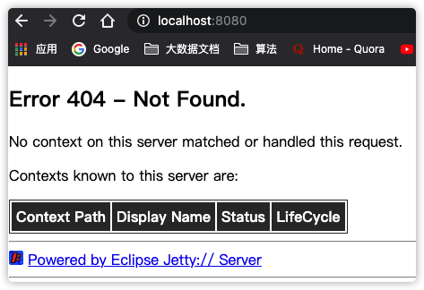
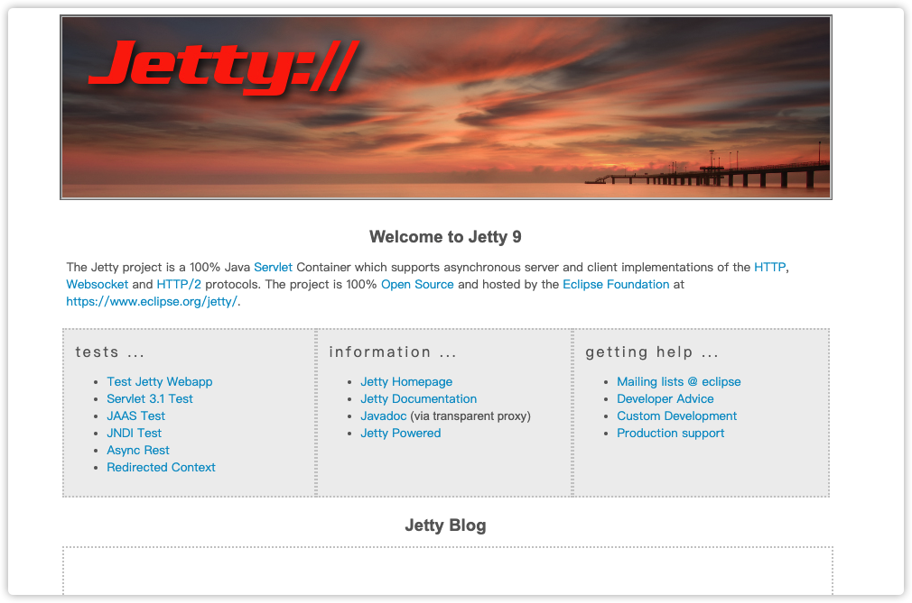

# Jetty简介

## 1.1什么是Jetty

Jetty是一个提供HTTP服务器、HTTP客户端和javax.servlet容器的开源项目。

| 版本 | Year |  Home   | JVM  |                             协议                             | Servlet | JSP  |   状态   |
| :--: | :--: | :-----: | :--: | :----------------------------------------------------------: | :-----: | :--: | :------: |
| 9.3  | 2015 | Eclipse | 1.8  | HTTP/1.1 (RFC 7230), HTTP/2 (RFC 7540), WebSocket (RFC 6455, JSR 356), FastCGI |   3.1   | 2.3  | 稳定版本 |

## 1.2Maven坐标

Jetty的POM坐标如下

```
<dependency>
  <groupId>org.eclipse.jetty</groupId>
  <artifactId>jetty-project</artifactId>
  <version>${project.version}</version>
</dependency>
```

# Jetty使用

可以通过多种方式将Jetty植入使用的程序中，在不同的系统中使用它，或者做为一个独立的服务器来使用，这一节介绍了后者，即作为一个单独的服务器来部署web应用。

Jetty的下载网页为：https://www.eclipse.org/jetty/download.html

Jetty所有顶级目录简介：

**表格 2.1. Contents**

| Location                   | Description                                       |
| -------------------------- | ------------------------------------------------- |
| license-eplv10-aslv20.html | Jetty的许可文件                                   |
| README.txt                 | 有用的开始信息                                    |
| VERSION.txt                | 版本信息                                          |
| bin/                       | 存放在Unix系统下运行的shell脚本                   |
| demo-base/                 | 一个可运行包含示例web应用的Jetty服务器基目录      |
| etc/                       | Jetty的配置文件                                   |
| lib/                       | Jetty运行所必须的jar文件                          |
| logs/                      | 日志                                              |
| modules/                   | 各个模块                                          |
| notice.html                | 许可信息等                                        |
| resources/                 | 包含新增到classpath配置文件夹，如log4j.properties |
| start.ini                  | 存放启动信息                                      |
| start.jar                  | 运行Jetty的jar                                    |
| webapps/                   | 一个用来存放运行在默认配置下的Jetty Web应用目录   |

## 2.1运行Jetty

　　执行以下代码，Jetty会在默认8080端口运行

```
cd $JETTY_HOME
java -jar start.jar
```

 　若执行成功会输出以下信息

```shell
2015-06-04 10:50:44.806:INFO::main: Logging initialized @334ms
2015-06-04 10:50:44.858:WARN:oejs.HomeBaseWarning:main: This instance of Jetty is not running from a separate {jetty.base} directory, this is not recommended. See documentation at http://www.eclipse.org/jetty/documentation/current/startup.html
2015-06-04 10:50:44.995:INFO:oejs.Server:main: jetty-9.3.0.v20150601
2015-06-04 10:50:45.012:INFO:oejdp.ScanningAppProvider:main: Deployment monitor [file:///opt/jetty-distribution-9.3.0.v20150601/webapps/] at interval 1
2015-06-04 10:50:45.030:INFO:oejs.ServerConnector:main: Started ServerConnector@19dfb72a{HTTP/1.1,[http/1.1]}{0.0.0.0:8080}
2015-06-04 10:50:45.030:INFO:oejs.Server:main: Started @558ms
```

你可以通过浏览器访问http://localhost:8080.。然而在\$JETTY_HOME/webapps目录下并没有部署任何web应用，所以你将会看到一个Jetty提供的404错误页面，并不推荐在\$JETTY_HOME下运行Jetty，而是建议运行一个Jetty基础应用。错误页面如下



### 基础应用例子

　　标准的Jetty应用，有一个demo-base的文件夹，可以不在$JETTY_HOME下运行Jetty，在demo-base文件夹下执行以下命令：

```shell
> cd $JETTY_HOME/demo-base/
> java -jar $JETTY_HOME/start.jar
```



通过以下命令查看示例应用的配置信息 

```shell
> cd $JETTY_HOME/demo-base/
> java -jar $JETTY_HOME/start.jar --list-modules
...
 
> java -jar %JETTY_HOME/start.jar --list-config
...
```

**--list-modules**：此命令将返回当前服务所有可用的模块，同时也会显示本地的模块，信息包括模块实现的顺序，依赖模块以及相应的jar信息

**--list-config**：显示运行环境和配置文件等信息 

### 创建一个新的Jetty基目录

demo-base目录是jetty.base的一个基目录，在Jetty9.1版本中新增加的。

一个Jetty基目录允许配置和web应用分开部署，可以方便升级系统。

<u>**Jetty默认的配置基于两个属性：**</u>

**jetty.home**：这个属性定义了Jetty的路径，jar包，默认模块和默认xml配置（典型有 start.jar，lib等）

**jetty.base**：这个属性表示一个特殊Jetty服务应用的路径，包括它的日志，配置和web应用（典型有 start.ini，start.d，logs和webapps）


**以下命令用于创建一个新的根路径，同时激活HTTP connector和web 应用部署模块**

<u>创建一个JETTY_BASE环境变量，并创建指定的文件夹，在此文件夹下运行start.jar时提示没有可以启动的东西，系统退出</u>

```shell
 zhangyanbo@YberdeMacBook-Pro  ~/apps/jetty-9.4/demo-base  JETTY_HOME=~/apps/jetty-9.4
 zhangyanbo@YberdeMacBook-Pro  ~/apps/jetty-9.4/demo-base  JETTY_BASE=/tmp/mybase
 zhangyanbo@YberdeMacBook-Pro  ~/apps/jetty-9.4/demo-base  mkdir $JETTY_BASE
 zhangyanbo@YberdeMacBook-Pro  ~/apps/jetty-9.4/demo-base  cd $JETTY_BASE
 
 zhangyanbo@YberdeMacBook-Pro  /tmp/mybase  java -jar $JETTY_HOME/start.jar
ERROR : Nothing to start, exiting ...

Usage: java -jar $JETTY_HOME/start.jar [options] [properties] [configs]
       java -jar $JETTY_HOME/start.jar --help  # for more information
       
```

<u>输入java -jar $JETTY_HOME/start.jar --add-to-startd=http,deploy命令为当前基目录添加标准文件及文件夹</u>

```shell
java -jar $JETTY_HOME/start.jar --add-to-startd=http,deploy
WARN  : --add-to-startd is deprecated! Instead use: --create-startd --add-to-start=http,deploy
MKDIR : ${jetty.base}/start.d
INFO  : webapp          transitively enabled, ini template available with --add-to-start=webapp
INFO  : server          transitively enabled, ini template available with --add-to-start=server
INFO  : security        transitively enabled
INFO  : servlet         transitively enabled
INFO  : http            initialized in ${jetty.base}/start.d/http.ini
INFO  : threadpool      transitively enabled, ini template available with --add-to-start=threadpool
INFO  : bytebufferpool  transitively enabled, ini template available with --add-to-start=bytebufferpool
INFO  : deploy          initialized in ${jetty.base}/start.d/deploy.ini
MKDIR : ${jetty.base}/webapps
INFO  : Base directory was modified


zhangyanbo@YberdeMacBook-Pro  /tmp/mybase  ll
total 0
drwxr-xr-x  4 zhangyanbo  wheel   128B Feb 20 07:51 start.d
drwxr-xr-x  2 zhangyanbo  wheel    64B Feb 20 07:51 webapps

```

<u>然后java -jar $JETTY_HOME/start.jar运行即可运行成功。启动后，会同样看到404页面.</u>

```shell
 zhangyanbo@YberdeMacBook-Pro  /tmp/mybase  java -jar $JETTY_HOME/start.jar
2021-02-20 07:51:22.392:INFO::main: Logging initialized @338ms to org.eclipse.jetty.util.log.StdErrLog
2021-02-20 07:51:22.556:INFO:oejs.Server:main: jetty-9.4.36.v20210114; built: 2021-01-14T16:44:28.689Z; git: 238ec6997c7806b055319a6d11f8ae7564adc0de; jvm 1.8.0_211-b12
2021-02-20 07:51:22.569:INFO:oejdp.ScanningAppProvider:main: Deployment monitor [file:///private/tmp/mybase/webapps/] at interval 1
2021-02-20 07:51:22.589:INFO:oejs.AbstractConnector:main: Started ServerConnector@5039ccbf{HTTP/1.1, (http/1.1)}{0.0.0.0:8080}
2021-02-20 07:51:22.591:INFO:oejs.Server:main: Started @537ms
2021-02-20 07:53:23.192:WARN::Scanner-0: async-rest webapp is deployed. DO NOT USE IN PRODUCTION!
2021-02-20 07:53:23.196:INFO:oejw.StandardDescriptorProcessor:Scanner-0: NO JSP Support for /, did not find org.eclipse.jetty.jsp.JettyJspServlet
2021-02-20 07:53:23.203:INFO:oejs.session:Scanner-0: DefaultSessionIdManager workerName=node0
2021-02-20 07:53:23.203:INFO:oejs.session:Scanner-0: No SessionScavenger set, using defaults
2021-02-20 07:53:23.204:INFO:oejs.session:Scanner-0: node0 Scavenging every 600000ms
```

