## 一、判断

### 1.图形推理

#### a.位置规律

1、图形特征？

2、考点（3）

3、平移的规律？

4、旋转的规律？

5、翻转的规律？

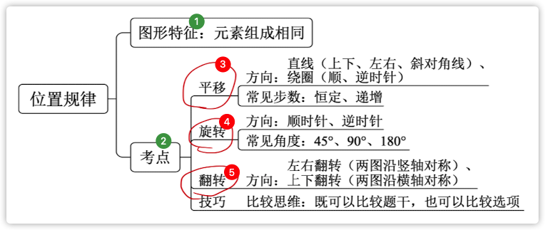

6、宫格图形方向判定？

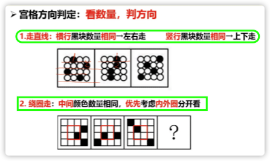

7、钟表类图形注意什么？

钟表类，选择就近方向。

#### b.样式规律

1、图形特征？

元素组成**相似**。

2、考点（3）

遍历、加减同异、黑白运算。

3、遍历的规律？

- 图形特征？

  元素重复出现。

- 解题技巧？

  缺啥补啥

4、加减同异的规律？

- 图形特征？

  相同线条重复出现。

- 解题技巧？

  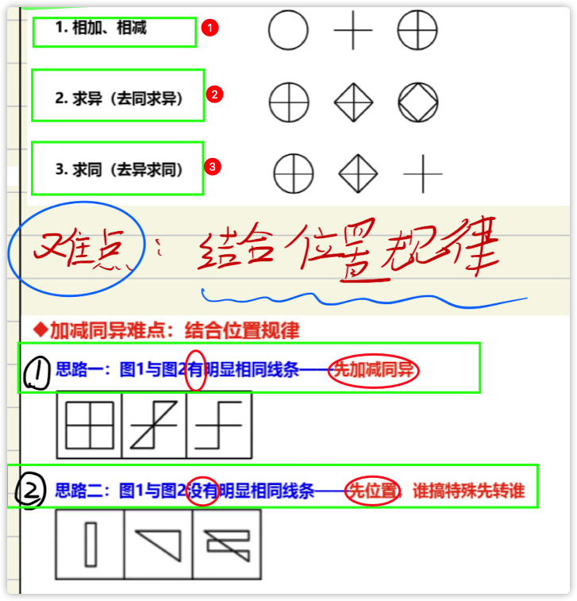

5、黑白运算的规律？

- 图形特征？
- 解题技巧？

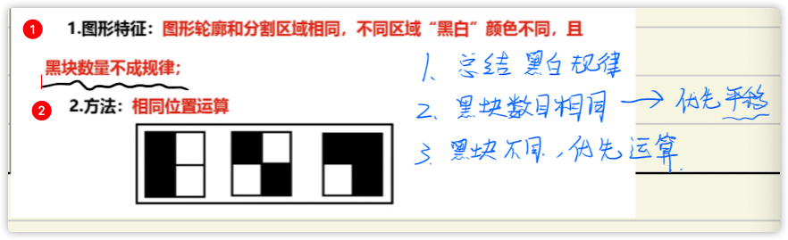

#### c.属性规律

1、图形特征？

2、考点（3）？


3、对称性的规律。

- 包括几种对称性规律？

- 轴对称判定、常见图形？

- 中心对称判定、常见图形？

- 轴对称+中心对称 判定、常见图形？

  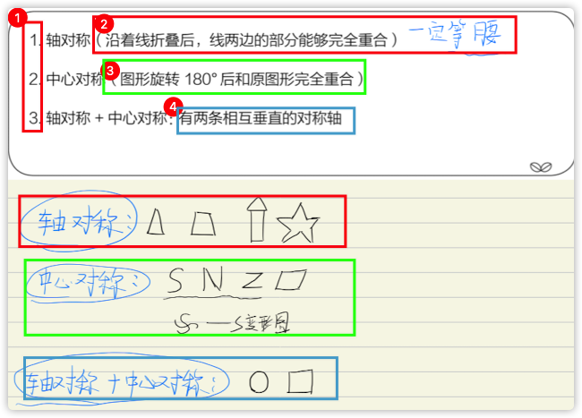

- 对称性考法？（4）

  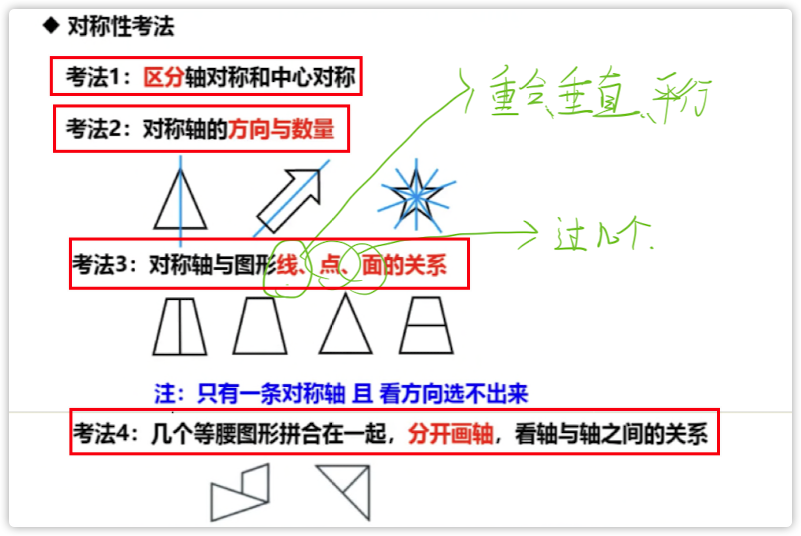

4、曲直性的规律。

- 曲直性图形特征？

- 曲直性有几种情况？

  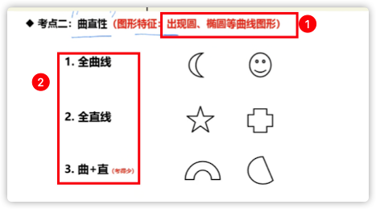

5、开闭性的规律。

- 开闭性图形特征？

- 几种情况？

  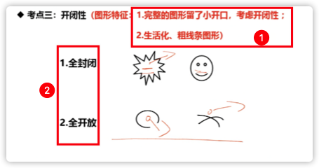

#### d.特殊规律（图形间关系）

1、图形间关系的图形特征？

2、考点？（2）

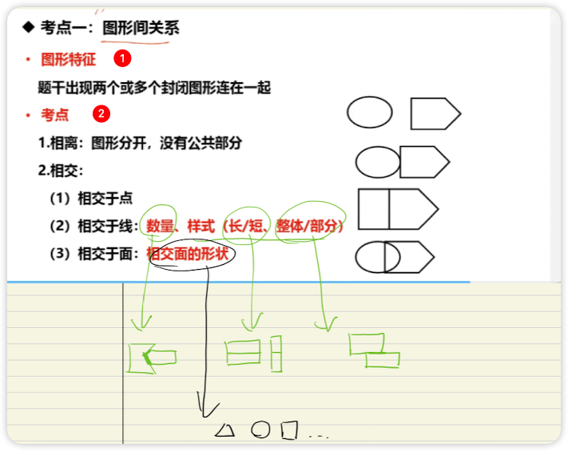

3、相交于线有哪些考点？（3）

4、相交于面考点？（1）

#### e.特殊规律（功能元素）

1、功能元素图形特征？

2、考点？（4）

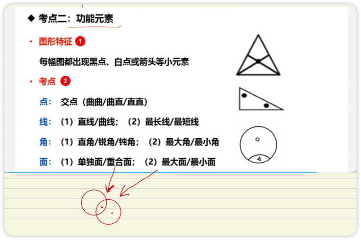

3、点考点？（1）

4、线考点？（2）

5、角考点？（2）

6、面考点？（2）

#### f.数量规律

1、图形特征？

2、考点？


- 面数量

1、什么是面？

2、元素组成不同，什么时候数面？

3、面的数量规律考法？（3）

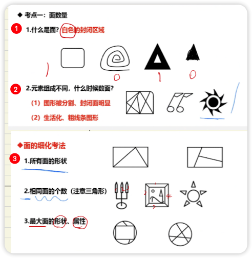

- 线数量

1、什么是线？

2、元素组成不同，什么时候数直线？

3、元素组成不同，什么时候数曲线？

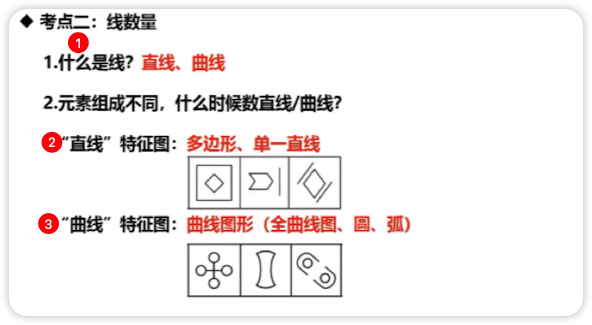

##### 笔画

1、什么是奇点？

2、常见奇点？

3、什么是一笔画？

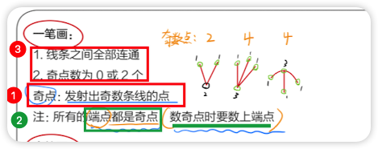

4、什么是多笔画？

5、连通图形的笔画数规律？

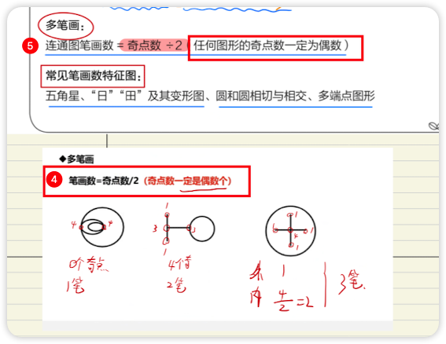

6、笔画数常见特征图？

一笔画：“五角星”与变形、“日”与变形

两笔画：“田”与变形


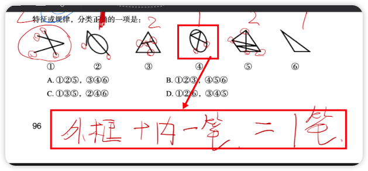

- 点数量

1、什么是点？什么不是点？

2、元素组成不同，什么时候数点？

3、点的数量规律考法？（2）

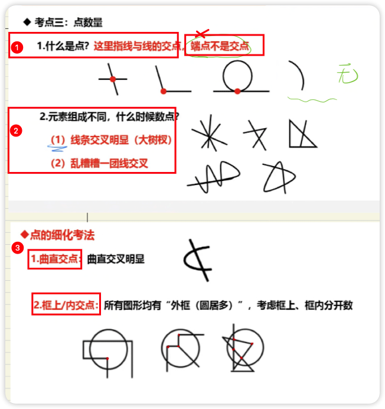

- 素数量

1、什么是素？

2、出现小元素，做题思路？

3、什么时候考虑部分数？

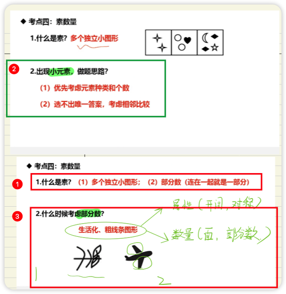

4、生活化粗线条考法有哪些？（3）

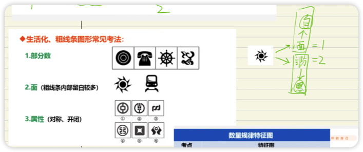

#### g.空间重构

##### 相对面

1、快速识别向对面？（2）

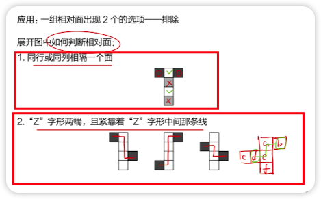

2、相对面应用？

一组<u>向对面</u>**同时出现**的选项，**排除掉**！

##### 相邻面（公共边）

1、如何确定公共边？（3）

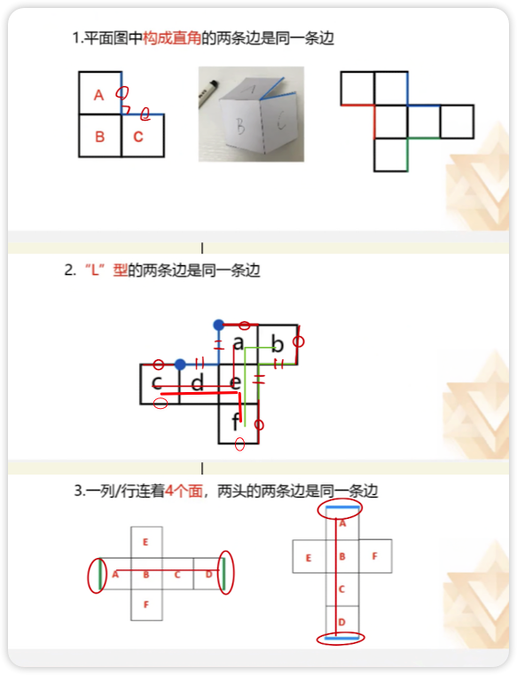

##### 相邻面（公共点）

1、如何确定公共点？

2、公共点特点？

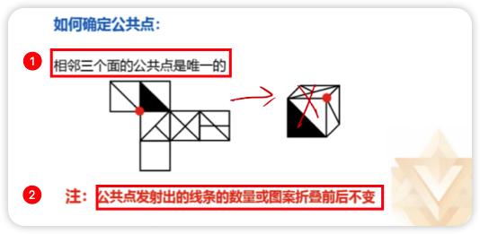

##### 相邻面（画边法）

1、如何操作画边法？

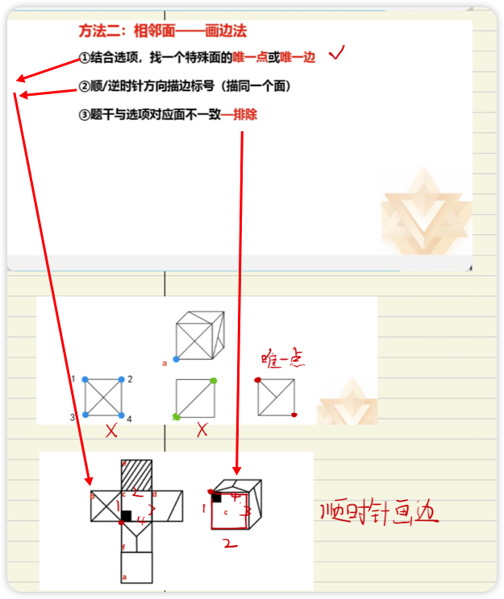

### 2.类比推理

1、类比推理解题思维？什么时候拆？（3）

2、类比推理考点？

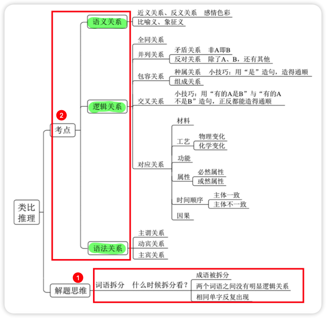

3、类比**比喻象征**常识积累：

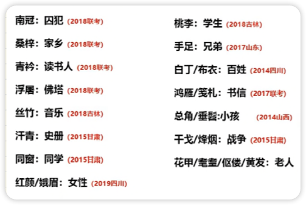

#### a.语义关系

重视成语！！！

##### 近义、反义关系

1、近义反义如何做？

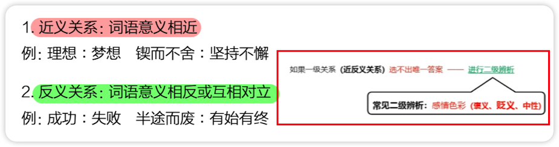

##### 比喻、象征义

1、常识积累：

2、什么是比喻义、象征义？

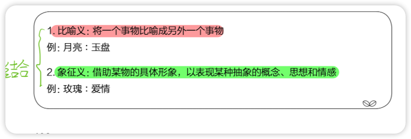

#### b.逻辑关系

##### 全同关系

1、什么是全同关系？

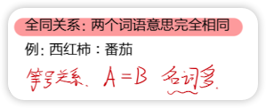

##### 并列关系

1、并列关系包含那两种？

2、如何区分矛盾关系、反对关系？

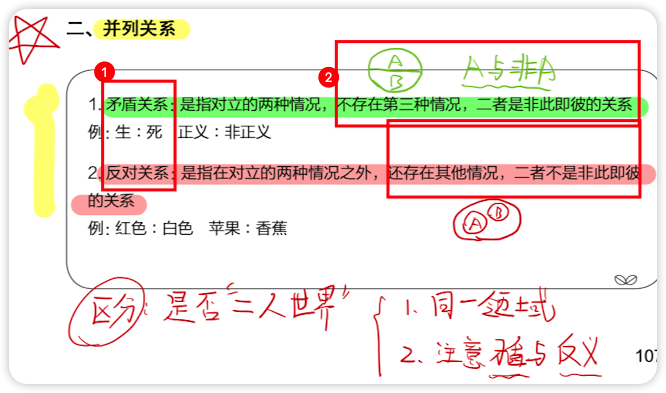

##### 包容关系

1、包容关系有哪些？

2、区分种属关系、组成关系？


##### 交叉关系

1、什么是交叉关系？

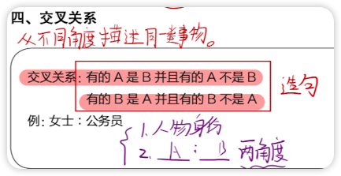

##### 对应关系

1、高频对应关系有哪些？

2、工艺二级辨析什么？

3、功能二级辨析？

4、属性二级辨析？

5、时间二级辨析？

6、因果二级辨析？

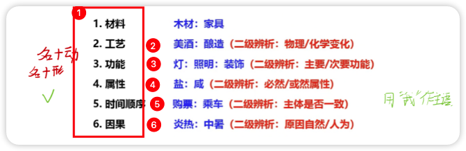

7、物理变化工艺有哪些？

8、化学变化工艺有哪些？

9、如何区分物理化学变化？

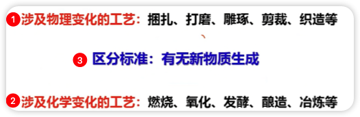

#### c.语法关系

1、语法关系如何做？

2、造句子原则？

3、语法关系的三种？

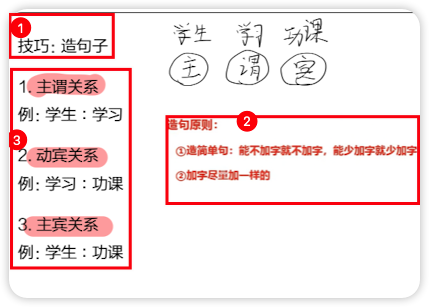

#### d.拆词

1、什么时候拆词？

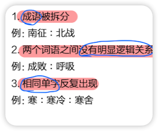

**常识积累（因果关系）：**

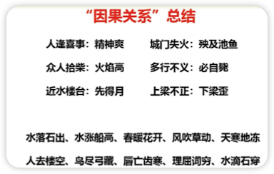

**常识积累（成语拆词）：**

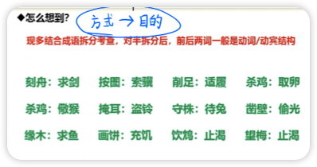

### 3.定义判断

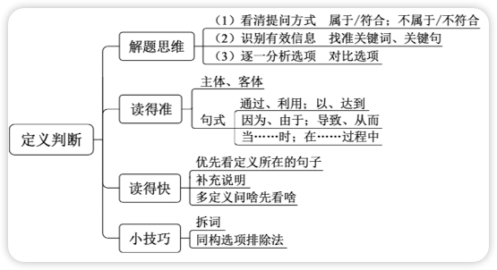

1、定义判断提问方式？

2、做题三步骤？

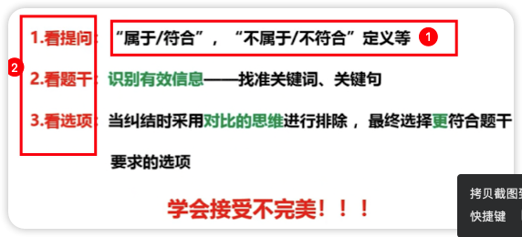

3、如何读的准？（2）

主客体错误，排除！！！

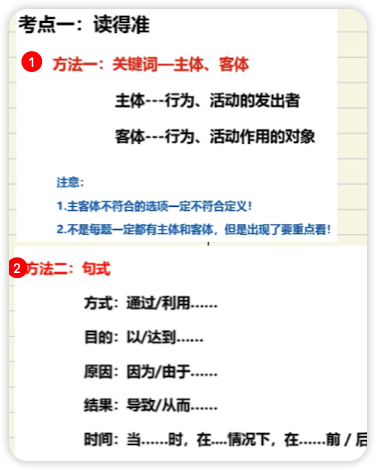

4、如何读的快？（3）

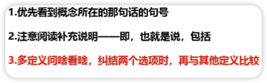

5、定义判读小技巧？（2）

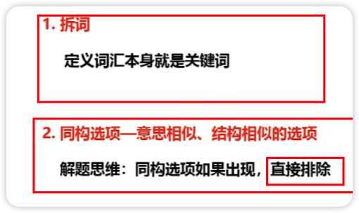

### 4.逻辑判断


## 二、言语

### 1、中心理解题

1、提问方式？

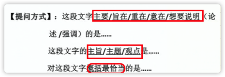

2、解题思路？

寻找中心句。（两种情况）

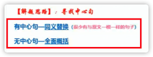

3、解题技巧？

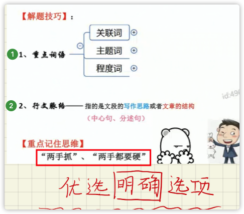

#### 重点词语（关联词）

##### 转折关系

1、转折关系，___是重点？

2、转折关系，标志词有哪些？（典型、非典型）

3、转折关系，错误选项特征是？

4、略读句子特征？


##### 因果关系

1、因果关系，___是重点？

2、因果关系，典型格式？

3、因果关系，引导结论的标志词有哪些？

4、因果关系，结论句的文段特征分情况讨论：（3种）

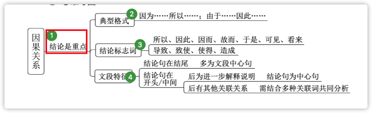

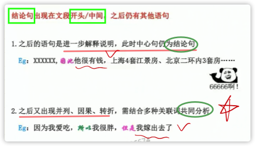

##### 必要条件关系

1、典型格式？

只有...才。但是有时候会省略“只有”。

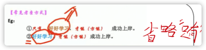

2、对策标志词？

3、文段特征（行文脉络）？

4、反面论证？

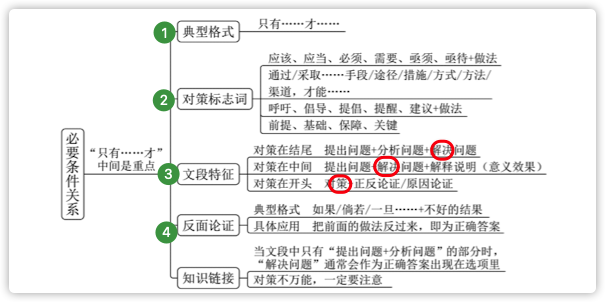

5、错误选项特征：

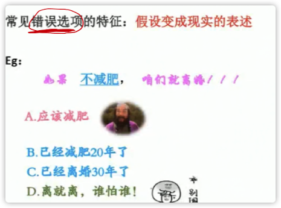

##### 并列关系

1、并列关系的概括要___?

2、并列关系文段特征？

3、选项特征有哪些？

4、错误选项？

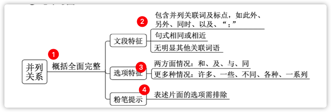

5、区分`并列`和`古今对比`

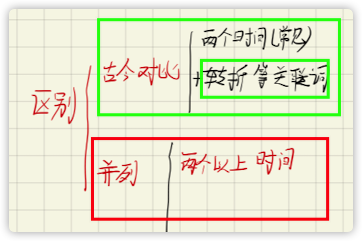

#### 重点词语（主题词）

1、主题词特征？

2、主题词如何用（理论要点）？

3、主题词干扰选项？


（范围扩大缩小？、偷换概念？举例）

#### 重点词语（程度词）

1、程度词的标志词：

2、程度词重点在___？


#### 行文脉络

1、行文脉络把握什么？

2、中心句特征是？

3、分述句特征？

4、错误选项有？


5、总分结构：


6、分总结构：


### 2、细节判断题

1、提问方式？

2、错误选项特征？

3、快速解题技巧？

4、什么是细节主旨化？


5、并列偷换是什么？


6、对比项标志词：


7、相对绝对项有哪些？如何侧重？


### 3、语句排序题

1、提问方式？

2、解题步骤？

几个步骤同时进行。


#### 确定首句

1、确定首句的方法？

- 下定义：xx是什么...
- 背景引入：
  - 随着... 
  - 近年来... 
  - 在...大环境/大背景下


- 非首句特征：
  - 关联词后半部分：因此...
  - 指代词：她、他、它；这、那

#### 确定捆绑集团

注意：捆绑集团是紧紧捆绑，中间不插入第三者。

- 指代词捆绑：这、那、他、该、其


- 关联词捆绑：
  - 配套出现：不但...而且...
  - 单独一个：但（转折）、同时（并列）

#### 确定顺序

- 时间顺序（不考虑插叙、倒叙）：

  - 年份：2011、2020年
  - 朝代：商周秦汉，隋唐宋，元明清后再民国。
  - 时间提示词：过去、现在、未来

- 逻辑顺序：

  - 观点 + 解释说明：

    

  - A和B：

    

#### 确定尾句

- 结论：因此、所以、看来、于是、这...
- 对策：应该、需要

### 4、语句填空题

1、提问方式？

2、横线在结尾时，aaaa___ ?

3、横线在开头时，___zzzz ？

4、横线在中间时，aaaa___zzzz ？


### 5、接语选择题

1、提问方式？

2、理论要点？


3、干扰选项？

4、注意紧紧依托文段，不能___？


### 6、词的辨析

1、词的辨析有几种方式？

- 词义侧重
- 固定搭配
- 程度轻重
- 感情色彩

2、词义侧重如何做？


3、固定搭配如何做？

- 常用词、热点词：


- 搭配一个词：
  - 瞻前顾后找准搭配对象。
- 搭配多个词：


4、程度轻重如何做？


5、感情色彩如何做？


### 7、语境分析

1、语境分析有几种情况？

- 关联关系：

  - 转折：

  前后相反，但不能矛盾。

  

  - 递进：

  相近、前轻后重。

  

  - 并列：

    - 同义并列：

    

    - 反义并列：

    

    

- 对应关系：

  - 解释类对应：

    

  - 重点词语对应：

    - 指代词：

    

    - 主题词：

    

    - 形象表达：

      

    - 中心句：

    


## 三、资料

### 截位直除

1、如何截位直除？

看下一位，四舍五入。


2、截位直除截几位？


3、什么是选项差距大？小？


4、截位直除注意什么？

注意选项存在10、100差距。要判断。

5、选项存在10倍、100倍差距时如何判断？


6、截位直除三步骤：


7、灵活速算，微调技巧：


### 分数比较

1、两种基本方法是什么？


2、一大一小如何比较？

分子变大，分母没有变或者变大。


3、同大同小如何比较？

纵向直接除；

横向看倍数，谁大谁牛皮，小的看成一。


4、多个分数方法？

观察排除（一大一小），然后比较（同大同小）。


### 资料分析题型分析

1、题目有哪些类型？


2、纯文字材料如何阅读？


3、图表类如何阅读？

- 表头三要素（时间、主题、单位）、注释
- 不要找差行（用直尺）
- 横纵坐标定位、首字定位。
- 数据太大，截三位。

4、图表类有哪些坑？

时间段（提问与文段部分对应）


同比环比（提问同比，文段环比）


5、综合材料如何阅读？


这里文本与图表区别是：文本给收入、图表给支出。


### 基期与现期

1、什么是基期、现期？


### 基期

2、基期与现期解题步骤？


3、增长量与增长率有何不同？


4、基期计算公式？（注意什么？）


5、同比和环比是什么？


### 化除为整

1、化除为整用在哪里？


2、化除为整公式？


3、化除为整步骤、注意？


步骤：先乘积，再加减。

注意：乘积时估算，加减时根据公式变号。

4、顺差、逆差如何区分？


### 基期差值

1、基期差值方法？


### 现期

1、现期计算公式？


### 特殊数字速算技巧

1、A * 1.5 

本身 + 本身一半

2、A * 1.1

错位相加


3、A * 0.9

错位相减


4、A * 1.25

本身 / 0.8


5、A / 1.1

错位相减

6、精确加减法，选项末尾都不同时


### 百分数与百分点

1、什么是百分数？

反应量之间的比例关系。

2、什么是百分点？

百分数的变化。（两个百分数做差）

3、百分数求百分点方法？

高减低加

### 倍数与增长率

1、倍数的定义？

两个数的比值。（A是B的两倍，即，A/B=2）

2、增长率的定义？

比**基数**多出的比率。

3、增长率公式：

（现期-基期）/ 基期 = 现期/基期 - 1


4、增长率与倍数的关系？

现期是基期的几倍（2020是2019的几倍） = 增长率 + 1


### 成数

1、什么是成数？

十分之几，即，百分之几十。（3成 = 30%）

2、成数的易错点？

超过三成 = 大于30%；

三成多 = 30%-40%；

### 番数

1、番数题如何做？

遇番数，化倍数。番N倍，变为原来2的N次方。

2、番数与倍数的关系？

一番 = 2的N次幂。


### 增幅、降幅、变化幅度

增幅注意什么？计算比较原则？

有正有负，计算比较**带负号**。

降幅注意什么？计算比较原则？

必须为负，计算比较不带负号。

变化幅度注意什么？计算比较原则？

有正有负，计算比较不带负号


### 降幅扩大与降幅收窄

1、降幅扩大表示：低（↘️）

2、降幅收窄表示：高（↗️）

### 增长率计算

1、给百分点，如何计算？

**高减**低加。

2、给具体量，如何计算？

套公式。

3、增长率计算公式？


4、多个年份增长率 > 10% 技巧？ /  > 50%技巧？ 

基期*1.1（基期错位相加）


### 增长率比较

1、增长率比较题目关键字：

增速..最快最慢、 增长幅度..最大最小

2、增长率比较方法？（已知现期、基期）


3、增长率比较三步骤：

​	1.找现期、基期

​	2.比较现期/基期，看是否明显

​	3.明显，直接答案；不明显比较`（现期-基期）/基期`


4、增长率比较方法？（已知现期、增长量）

增长量/现期 大，增长率大。


### 增长量

1、什么是增长量？

2、已知现期、基期，求增长量：


3、已知现期、增长率，求增长量：

​	1.基期 = 现期 /（1+增长率）

​	2.基期 * 增长率 = 增长量

​	3.1⃣️、2⃣️得出公式二。


4、已知基期、增长率，求增长量：

基期 * 增长率。

5、总体增长量 = ？

各个分增长量之和。

### 年均增长量

1、年均增长量公式？


2、年份差如何计算？

​	1.一般：现期 - 基期 （2015-2011 = 4）

​	2.五年规划：现期 - 基期的前一年（2015-2011的前一年 = 2015-2010=5）


### 百化分（百分比 —> 分数）

1、必记：


2、百化分的一些方法：

​	3⃣️、4⃣️、5⃣️

3、百化分--放缩法：


4、百化分--取中法：


5、百化分--公式法：


### 增长量比较

1、已知现期、基期，比较方法？（2种）

​	1.现期 - 基期

​	2.柱形图的高度差

2、已知现期、增长率，比较方法？


```
同增同减，大大则大。（直接比）「现期大，增长率大，则增长量大」
有增有减，比较变化量。（用百分化）
一大一小，现期*增长率。（估算、百分化）
	首位不同，现期*增长率；
	首位相同，百分化。
```
