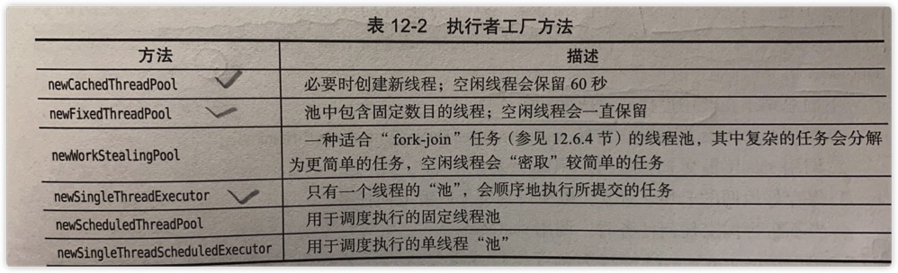

# 并发

## 什么是线程

如果**一个程序**可以**同时**运行**<u>多个线程</u>**，则称这个程序是`多线程`的（multithreaded）。


`多线程` & 多进程

- 本质区别在于每个进程都拥有一套变量，而**线程则共享数据**。


**单独线程运行任务的简单过程**：

1. 将代码放入一个类的run方法中，这个类要实现Runnable接口。
   - Runnable接口只有一个方法：void run() 。
   - 由于Runnable是一个函数式接口，可以用一个lambda表达式创建一个实例。
     - `Runnable r = () -> { task code }`
2. 通过Runnable 构造一个Thread对象。
3. 启动线程。

```java

```


```java

```


```java

```


还可以通过 建立一个Thread类的一个子类来定义线程。（不推荐！！！）

1. 创建Thread的一个子类，实现run方法。
2. 构造子类对象，并调用start方法，启动。


<u>不要直接调用Thread或Runnable接口的run方法</u>。**应该调用Thread.start方法**。


## 线程状态

### 线程有6种状态。

1. New（新建）
2. Runnable（可运行）
3. Blocked（阻塞）
4. Waiting（等待）
5. Timed wating（计时等待）
6. Terminated（终止）


**通过`getState`方法确定一个线程的当前状态。**


- 新建线程

  当使用new操作符创建一个线程时，如new Thread(r)。这个线程还没有开始运行，它的状态是`新建（New）`

- 可运行线程

  调用start方法，线程就处于**可运行**状态。

  一个可运行状态的线程可能正在运行也可能没有运行。（由操作系统为线程提供具体的运行时间）

  一旦一个线程开始运行，它不一定始终保持运行。

- 阻塞和等待线程

  它暂时不是活动的。不运行任何代码，消耗最少的资源。（要由线程调度器重新激活这个线程）

  1. 当一个线程试图获取一个内部的对象锁，锁目前被其它线程占有，线程就会被阻塞。
  2. 当一个线程等待另一个线程通知调度器出现一个条件时，这个线程就会进入等待状态。
     - 阻塞和等待没有多大区别。
  3. 有几个方法有超时参数，调用这些方法会让线程进入计时等待。这一状态将一直保持到超时期满或者接收到适当通知。


### 线程状态转换图


### 终止线程

- run方法正常退出。
- 因为一个没有捕获的异常终止了run方法，使线程意外终止。

能够通过`stop方法`杀死一个线程。该方法抛出一个ThreadDeath错误对象，这会杀死线程。（stop已废弃，不要使用！！！）


## 线程属性

### 中断线程

<u>终止线程的三个途径</u>：

1. run方法执行方法体中最后一条语句后在执行return返回时。
2. 出现了方法中没有捕获的异常时。
3. （**已废弃**）stop方法：其它线程调用这个方法来终止一个线程。


除了已废弃的stop方法，没有办法可以**强制**线程终止。

**interrupt方法**：用来**请求**终止一个线程 。

对一个线程调用interupt方法时，就会设置线程的中断状态。（这是一个每个线程都有的boolean标志）

- 每个线程都应该不时的检查这个标志，以判断线程是否被中断。

`Thread.currentThread.isInterrupted()方法`判断线程是否设置了中断状态。

```java
while(!Thread.currentThread().isInterrupted() && more work to do){
  do more work
}
```

```java
      /**
       * 设置线程中断状态，并检查中断状态，如果监测到中断状态退出循环。
       */
    Runnable r1 = () -> {
            for(int i=0;i<=9 && !Thread.currentThread().isInterrupted();i++){
              System.out.println( i + " From r1.");
              if(i == 2){
                Thread.currentThread().interrupt();
              }
            }
    };
          new Thread(r1).start();
/*
输出：
0 From r1.
1 From r1.
2 From r1.
*/
```


<u>如果线程被阻塞，就无法检查中断状态。</u>

- `InterruptedException异常`：当一个被sleep或wait调用阻塞的线程上调用interrupt方法时，那个阻塞调用（sleep或wait）将被一个InterruptedException异常中断。
  - 有一些阻塞I/O不能被中断，对此应该考虑选择可中断的调用。

```java
      /**
       * 在线程休眠sleep期间，调用线程中断，sleep会被一个interruptException异常中断。
       */
      Runnable r4 = () -> {
          try {
              for (int i = 0; i <= 10 && !Thread.currentThread().isInterrupted(); i++) {
                  System.out.println( i + " From r4.");
                  Thread.sleep(3000);
              }
          } catch (InterruptedException e) {
              System.out.println("执行catch代码");
          }
      };

          Thread thread4 = new Thread(r4);
          thread4.start();
          //主线程休眠7秒让thread4运行
          try {
              Thread.sleep(7000);
          } catch (InterruptedException e) {
              e.printStackTrace();
          }
          //中断thread4
          thread4.interrupt();
/*
输出：
0 From r4.
1 From r4.
2 From r4.
执行catch代码
*/
```


<u>设置中断状态之后，调用sleep方法，不会休眠！</u>

1. 首先会清除已设置的中断状态。
2. 然后抛出InterruptException异常。

**因此，如果你循环调用了sleep，不要检测中断状态，而应当捕获InterruptException异常**。

```java
    Runnable r3 =
        () -> {
          try {
            for (int i = 0; i <= 9 && !Thread.currentThread().isInterrupted(); i++) {
              System.out.println(i + " From r3.");
              if(i==3){
                  //设置中断状态,会在循环检查处退出循环
                  Thread.currentThread().interrupt();
              }
            }
            //输出当前的线程中断状态。 输出为 true
              System.out.println(Thread.currentThread().isInterrupted());
            //*** 此时调用sleep ***
              Thread.sleep(2000);
          } catch (InterruptedException e) {
              //输出当前的线程中断状态。 输出为 catch : false 也就是说，中断状态被清除。
              System.out.print("catch : ");
              System.out.println(Thread.currentThread().isInterrupted());
          } finally {
              //输出当前的线程中断状态。 输出为 finally : false 也就是说，中断状态被清除。
              System.out.print("final : ");
              System.out.println(Thread.currentThread().isInterrupted());
          }
        };

      new Thread(r3).start();
```


中断一个线程只是为了引起它的注意，**线程可以决定如何响应中断**。

1. 某些线程很重要，应该处理异常，然后继续执行。
2. 更普遍的是，线程希望将中断解释为一个终止请求。


| 检测线程是否被中断 |          |                                                  |                                                              |
| ------------------ | -------- | ------------------------------------------------ | ------------------------------------------------------------ |
| isInterrupted()    | 实例方法 | 检查是否有线程被中断，但是不会改变中断状态。     | Thread.currentThread().isInterrupted()<br />或者<br />Thread thread6 = new Thread(r6);<br />thread6.isInterrupted() |
| interrupted()      | 静态方法 | 检查当前线程是否被中断，并清除该线程的中断状态。 | Thread.interrupted()                                         |

```java
    Runnable r5 =
        () -> {
          int i = 0;
          while (!Thread.currentThread().isInterrupted()) {
            System.out.println("hello i am here " + i);
            i++;
            if (i == 10) {
              Thread.currentThread().interrupt();
                // 静态方法interrupted ,检测当前线程是否被中断，同时清除线程中断状态。
                // 意味着 在输出语句中调用后，循环处就检测不到了（因为被清除了）。
              System.out.println(Thread.interrupted());
            }
            if (i == 20) {
              Thread.currentThread().interrupt();
                //实例方法isInterrupted ,检测线程是否被中断，不会改变线程中断状态。
                //循环处，依然能够监测到。
              System.out.println(Thread.currentThread().isInterrupted());
            }
          }
        };
     new Thread(r5).start();
```


尽可能的避免在底层代码抑制InterruptException异常。有两个推荐的方式：

1. 捕获异常，并在catch中设置它的中断状态。

   ```java
       public static void b(){
           try {
               System.out.println("休眠前");
               Thread.sleep(30000);
               System.out.println("休眠前");
           } catch (InterruptedException e) {
               // 2- 在catch中设置中断状态，让调用者可以捕捉到。
               Thread.currentThread().interrupt();
               System.out.println(" catch: "+Thread.currentThread().isInterrupted());//catch: true
           }
       }
   ```

2. 抛出异常，给调用者捕获。（throws InterruptException）

   ```java
       public static void c() throws InterruptedException {
           System.out.println("休眠前");
           Thread.sleep(30000);
           System.out.println("休眠前");
       }
   ```

3. 不要这样做！！！抑制异常。

   ```java
     public static void a(){
         try {
             System.out.println("休眠前");
             Thread.sleep(30000);
             System.out.println("休眠前");
         } catch (InterruptedException e) {
             // 1- 忽略中断异常，同时调用者没有中断状态 不推荐！！！
              System.out.println(" catch: "+Thread.currentThread().isInterrupted());
         }
     }
   ```

   


### 守护线程

通过调用`t.setDaemon(true)` 将一个线程转化为守护线程。

- 守护线程的作用是**给其它线程提供服务**。
- 当只剩下守护线程的时候，虚拟机就会退出。
- 必须在**线程启动前调用**。

```java
      /**
       * 设置线程中断状态，并检查中断状态，如果监测到中断状态退出循环。
       */
    Runnable r1 = () -> {
            for(int i=0;i<=9 && !Thread.currentThread().isInterrupted();i++){
              System.out.println( i + " From r1.");
              if(i == 2){
                Thread.currentThread().interrupt();
              }
            }
    };
      new Thread(r1).setDaemon(true);
      new Thread(r1).start();
```


### 线程名

通过`t.setNam("MyThread")`为线程设置名字。


### 未捕获异常处理器


### 线程优先级

每个线程都有一个优先级。

- 默认，一个线程会继承构造 它的那个线程的优先级。
- 通过setPriority方法提高或降低一个线程的优先级。
- 优先级介于MIN_PRIORITY ～ MAX_PRIORITY之间。
- 线程优先级高度依赖于系统。
- 现在**不要使用线程优先级**！！！


## 同步

### 竟态条件

**竟态条件**：两个或两个以上的线程需要共享对同一数据的存取，可能会发生对象被破坏。这就是竟态条件（race condition）。

### 竟态条件的一个示例：

```java
```


## 任务和线程池

如果你的程序创建了<u>大量生命期很短的线程</u>，那么不应该把每个任务映射到一个单独的线程，而**应该使用线程池**。（thread pool）。

### Callable 与 Future

**Runnalbe** 封装一个<u>异步运行的任务</u>。（想像成：没有参数和返回值的异步方法）。

**Callable** 与 Runnable 类似。但是<u>有返回值</u>。Callable接口是一个参数化的类型，只有一个方法call。

```java
public interface Callable<V>{
  V call() throws Exception;
}
//Callable<Integer> 返回Integer对象的异步计算。
```

**Future** 保存异步计算的结果。

- 可以启动一个计算，将Future对象交给某个线程，然后忘掉它。这个Future 对象的所有者在结果计算好之后就可以获得结果。

```java
// Future<V> 接口有如下方法：
V get()
  //调用会阻塞，直到计算完成。
V get(long timeout, TimeUnit unit)
  //调用也会阻塞，不过如果在计算完成前调用超时，会抛出一个TimeoutException异常。
//如果运行该计算的线程被中断，都会[get()、get(long timeout, TimeUnit unit)]抛出InterruptedException异常。
//如果计算已经完成，get方法会立即返回。
void cancel(boolean mayInterrupt)
  //取消计算：如果计算还没有开始，会被取消不再开始；如果计算正在运行，同时mayInterrupt参数为true，那么会被中断。
boolean isCanceled()
boolean isDone()
```


**取消一个任务涉及两个步骤：**

1. 必须找到并中断底层线程。
2. 任务实现（在call方法中）必须感知到中断，并放弃它的工作。


**执行Callable：**

- 一种方法是：FutureTask，它实现了Future和Runnable接口，所以可以构造一个线程来运行任务。

  - ```java
    Callable<Integer> task = ...;
    var futureTask = new FutureTask<Integer>(task);
    var t = new Thread(futureTask);
    t.start;
    ...
    Integer result = task.get();
    ```

    ```java
      public static void main(String[] args) throws ExecutionException, InterruptedException {
        //
        Callable<Integer> r =
            () -> {
            int sum = 0;
              for (int i = 0; i <= 3; i++) {
                System.out.println(i);
                sum += i;
              }
              return sum;
            };
    
        FutureTask<Integer> integerFutureTask = new FutureTask<>(r);
        Thread thread = new Thread(integerFutureTask);
        thread.start();
    
        Integer integer = integerFutureTask.get();
        System.out.println("----> " + integer);
      }
    //结果：
    //0
    //1
    //2
    //3
    //----> 6
    ```

- 另一个种方法（更常见的）：Callable传递到一个执行器。


## 执行器

Executors类有许多静态工厂方法，用来构造线程池。



### 三个重要的工厂方法

- newCachedThreadPool：

构造一个线程池，会立即执行各个任务，如果有空余线程，就是用空余线程来执行任务；<u>如果没有可用空闲线程，就创建一个新线程</u>。

- newFixedThreadPool：

构造<u>一个固定大小的线程池</u>。如果提交任务多于空闲线程数，就把未得到服务的任务放到队列中。当其他任务完成后，再运行这些排队的任务。

- newSingleThreadExecutor：

构造一个<u>大小为1的线程池，由一个线程顺序的执行提交的任务</u>（一个接着一个运行）。

**这三个方法都返回<u>实现了ExecutorService接口的</u>`ThreadPoolExecutor类`的对象。**


### 一些常用规则

1. 如果线程生存期很短或大量时间都在阻塞，那么可以使用一个缓存线程池；
2. 如果工作量大且并不阻塞，你肯定不希望运行太多线程，可以使用固定线程池。
3. 单线程执行器对性能分析很有作用。


### 提交作业（Runnable/Callable对象）ExecutorService的几个方法

- Future\<T\> submit(Callable\<T\> task)
  - 调用时，会得到一个Future对象，可以用来得到结果或取消任务。
- Future\<?\> submit(Runnable task)
  - 方法返回一个Future\<?\> ，可以isDone、cancel或isCancelled。但是get方法只能简单的返回null。
- Future\<T\> submit(Runnable task,T result)
  - 生成一个Future，它的get方法返回指定的result对象。


### 关闭

使用完一个线程池时，需要调用shutdown。这个方法启动线程池的关闭序列。

- 被关闭的线程不再接受新的任务。
- 当所有任务都被完成后，线程池中的线程死亡。

另一种是调用shutdownNow。

- 会取消所有尚未开始的工作。


### 使用线程池的工作

1. 调用Executors类的静态方法newCachedThreadPool 或 newFixedThreadPool。
2. 调用submit提交Runnable 或 Callable对象。
3. 保存好返回的Future对象，以便得到结果或取消任务。
4. 当不再想提交任何任务时，调用shutdown。


### 重复 & 调度

ScheduledExecutorService接口为调度执行 或 重复执行提供了一些方法。

Executors类的`newScheduledThreadPool `和 `newSingleThreadScheduledExecutor`返回实现ScheduledExecutorService接口的对象。


## 控制任务组

**invokeAny**方法提交一个Callable对象集合中的所有对象，并返回**某个**已经完成的任务的结果。

- 我们不知道返回哪个对象，往往是最快完成的那个。

**invokAll**方法提交一个Callable对象集合中的所有对象，这个方法会<u>阻塞，直到所有任务都完成，并返回所有任务答案的一个Future对象列表</u>。

- 得到任务结果后，可以这样处理：

  ```java
  List<Callable<T>> tasks = ...;
  List<Future<T>> results = executor.invokeAll(tasks);
  for(Future<T> result : results){
    //处理逻辑。
    processFurther(result.get());
  }
  ```


如果<u>想按照计算出结果的**顺序**得到结果</u>。可以利用`ExecutorCompletionService`来管理。

1. 通常方式得到一个执行器。
2. 使用执行器executor构造一个ExecutorCompletionService。
3. 将任务提交到这个完成服务（ExecutorCompletionService）。

- 该服务会管理Future对象的一个阻塞队列，其中包含所提交任务的结果（一旦结果可用，就会放入队列）。

```java
//1 、2
var service = new ExecutorCompletionservice<T>(executor);
for(Callable<T> task:tasks){
	//3
  service.submit(task);
}
for(int i = 0;i< tasks.size();i++){
  //处理逻辑
  processFurther(service.take().get());
}
```


## 异步计算

### 可完成Future

`CompletableFuture类`实现了Future接口，你要注册一个回调，一旦结果可用，就会在（某个线程中）利用该结果，调用这个回调。

- 有一些API会返回CompletableFuture对象。

- 大多数情况下，需要自己实现建立自己的CompletableFuture。

  - **想要异步的运行任务并得到CompletableFuture**，不要直接提供给执行器，而是调用静态方法`CompletableFuture.supplyAsync`

    ```java
      public static void main(String[] args) {
        ExecutorService executorService = Executors.newFixedThreadPool(3);
        CompletableFuture<String> future =
            CompletableFuture.supplyAsync(
                () -> {
                  try {
                    Thread.sleep(5000);
                  } catch (InterruptedException e) {
                    e.printStackTrace();
                  }
                  return new String("hello 异步计算");
                },//第一个参数：Supplier<T> 不是 Callable<T>
                executorService //第二个参数 执行器（如果省略，会在默认执行器上执行）
        );
        
    
        try {
          String s1 = future.get();
          System.out.println(s1);
        } catch (InterruptedException e) {
          e.printStackTrace();
        } catch (ExecutionException e) {
          e.printStackTrace();
        }
    
        executorService.shutdown();
      }
    ```

- CompletableFuture可以采用**两种方式完成**：

  - 得到一个结果；
  - 有一个未捕获的异常。

  **可以使用`whenComplete方法`处理这两种情况**

  ```java
    public static void main(String[] args) {
      ExecutorService executorService = Executors.newFixedThreadPool(3);
      CompletableFuture<String> future =
          CompletableFuture.supplyAsync(
              () -> {
                try {
                  Thread.sleep(5000);
                } catch (InterruptedException e) {
                  e.printStackTrace();
                }
                return new String("hello 异步计算");
              },
              executorService);
  
      //s 代表结果 ， t 代表异常。
      future.whenComplete((s, t) -> {
          //如果无异常
            if (t == null) {
                System.out.println(s);
            } else {
                System.out.println("no");
            }
          });
  
      executorService.shutdown();
    }
  ```

  

- CompletableFuture被称为是可完成的，你**可以手动设置一个完成值**。这样的对象被称为**承诺**。

  - 显式的设置结果，将得到更大的灵活性。

  ```java
    public static void main(String[] args) {
      ExecutorService executorService = Executors.newFixedThreadPool(3);
      CompletableFuture<String> future = new CompletableFuture<String>();
  
      executorService.execute(
          () -> {
            try {
              System.out.println("run 111");
              Thread.sleep(5000);
              // 得到其中一个结果后，可以利用这个信息(isDown)停止另一个工作。
              boolean done = future.isDone();
              if (done) {
                // 如果工作已经完成，什么都不做即可
              } else {
                System.out.println("end 111");
              }
            } catch (InterruptedException e) {
              e.printStackTrace();
            }
            future.complete("need 5 second!!!");
          });
      executorService.execute(
          () -> {
            try {
              System.out.println("run 222");
              Thread.sleep(2000);
              // 得到其中一个结果后，可以利用这个信息(isDown)停止另一个工作。
              boolean done = future.isDone();
              if (done) {
                // 如果工作已经完成，什么都不做即可
              } else {
                System.out.println("end 222");
              }
            } catch (InterruptedException e) {
              e.printStackTrace();
            }
            future.complete("only 2 second.");
          });
  
      try {
        // 得到最快的结果，同时，慢的将执行到底，非停止！
        System.out.println(future.get());
      } catch (InterruptedException e) {
        e.printStackTrace();
      } catch (ExecutionException e) {
        e.printStackTrace();
      }
  
      executorService.shutdown();
    }
  /** OUT:
  run 111
  run 222
  end 222
  only 2 second.
  end 111
  */
  ```

- 要对一个异常完成Future，需要调用completeExceptionally。


**可以在<u>多个线程中在同一个future上</u>安全的调用complete或者completeExceptionally。如果future已经完成，这些调用就不会起作用**。


- CompletableFuture在**调用cancel方法时，计算不会中断。取消只会把这个Future设置为已异常的方式完成**。（CancellationException异常。）这与普通的Future不同。


### 组合可完成Future

- **将异步组合为一个处理管线。**

- `thenApply(f)方法`，f是一个函数 。

  - 该方法不会阻塞。它会返回另一个future。当第一个future完成时，其结果会提供给f，这个函数f会返回最终结果。

  - f接受类型为T的值，返回类型为U的值。

    ```java
    CompletableFuture<U> future.thenApply(f);
    CompletableFuture<U> future.thenApplyAsync(f);//该调用会在另一个线程中调用f。
    //都会返回一个future。
    //结果可用时，会对future的结果应用f。
    ```

    ```java
      public static void main(String[] args) {
        //
        ExecutorService executorService = Executors.newFixedThreadPool(3);
    
        CompletableFuture<String> f1 =
            CompletableFuture.supplyAsync(
                () -> {
                  try {
                    Thread.sleep(5000);
                  } catch (InterruptedException e) {
                    e.printStackTrace();
                  }
                  System.out.println("A is OK");
                  return "A";
                },
                executorService);
    
        CompletableFuture<Integer> f2 =
            f1.thenApply(
                //这个就是函数f，此处接受T为String，返回U为Integer。
                (f1Value) -> {
                  try {
                    Thread.sleep(3000);
                  } catch (InterruptedException e) {
                    e.printStackTrace();
                  }
                  if (f1Value.equalsIgnoreCase("a")) {
                    System.out.println("is A/a");
                    return 1;
                  } else {
                    System.out.println("not Is A/a");
                    return 0;
                  }
                });
    
        try {
          System.out.println(f2.get());
        } catch (InterruptedException e) {
          e.printStackTrace();
        } catch (ExecutionException e) {
          e.printStackTrace();
        }
    
    ```

- `thenCompose方法`<u>没有取将T映射到U</u>，而是接受一个<u>从T映射到CompletableFuture\<U\></u>的函数。

  ```java
    public static void main(String[] args) {
      ExecutorService executorService = Executors.newFixedThreadPool(3);
  
      // 异步计算，得到ABCD
      CompletableFuture<String> f1 =
          CompletableFuture.supplyAsync(
              () -> {
                return "ABCD";
              });
  
      // 异步计算f1结束后，根据得到的值value，返回V类型CompletableFuture<V>类型。
      CompletableFuture<Integer> f3 =
          f1.thenCompose(
              (value) -> {
                return CompletableFuture.supplyAsync(
                    () -> {
                      if (value.equalsIgnoreCase("abc")) {
                        return 123;
                      } else {
                        return 100;
                      }
                    });
              });
  
      try {
        System.out.println(f3.get());
      } catch (InterruptedException e) {
        e.printStackTrace();
      } catch (ExecutionException e) {
        e.printStackTrace();
      }
    }
  ```

- `handle方法` 需要一个函数处理结果或异常，并计算一个新结果。

  ```java
    public static void main(String[] args) {
      ExecutorService executorService = Executors.newFixedThreadPool(3);
  
      // 异步计算，得到ABCD
      CompletableFuture<String> f1 =
          CompletableFuture.supplyAsync(
              () -> {
                return "ABCD";
              });
  
      //        异步计算f1结束后，根据得到的值value，返回V类型CompletableFuture<V>类型。
      CompletableFuture<Serializable> handle =
          f1.handle(
              (value, ex) -> {
                if (ex != null) {
                  System.out.println("exception:" + ex);
                  return ex;
                } else {
                  System.out.println("value:" + value);
                  return value;
                }
              });
  
      try {
        System.out.println(handle.get());
      } catch (InterruptedException e) {
        e.printStackTrace();
      } catch (ExecutionException e) {
        e.printStackTrace();
      }
    }
  ```

- `exceptionally方法` 出现一个异常时，这个方法会计算一个假值。

  ```java
    public static void main(String[] args) {
      ExecutorService executorService = Executors.newFixedThreadPool(3);
  
      // 异步计算，得到ABCD
      CompletableFuture<String> f1 =
          CompletableFuture.supplyAsync(
              () -> {
                return "ABCD";
              });
  
      //        异步计算f1结束后，如果出现异常，则得到一个假值abcd。
      CompletableFuture<String> f2 =
          f1.exceptionally(
              (ex) -> {
                return "abcd";
              });
  
      try {
        //如果exceptionally出现异常，这里会返回abcd。
        System.out.println(f2.get());
      } catch (InterruptedException e) {
        e.printStackTrace();
      } catch (ExecutionException e) {
        e.printStackTrace();
      }
    }
  ```

- 两个来自JDK 9 的方法。`completeOnTimeout(T,long,TimeUnit)`  ， `orTimeout(long,TimeUnit)`

  - `completeOnTimeout(T,long,TimeUnit)` 

    ```java
      /**
       * in Java 9!!!
       *
       * @param args
       */
      public static void main(String[] args) {
        ExecutorService executorService = Executors.newFixedThreadPool(3);
    
        // 异步计算，得到ABCD 这里等待4秒
        CompletableFuture<String> f1 =
            CompletableFuture.supplyAsync(
                () -> {
                  try {
                    Thread.sleep(4000);
                  } catch (InterruptedException e) {
                    e.printStackTrace();
                  }
                  return "ABCD";
                });
    
        CompletableFuture<String> f2 =
          //这里设置3秒就会超时。因此会得到超时结果xyz
            f1.completeOnTimeout("xyz", 3, TimeUnit.SECONDS)
                .thenApply(
                    (value) -> {
                      return value;
                    });
        try {
          System.out.println(f2.get());
        } catch (InterruptedException e) {
          e.printStackTrace();
        } catch (ExecutionException e) {
          e.printStackTrace();
        }
      }
    ```

  -  `orTimeout(long,TimeUnit)`

    ```java
      /**
       * in Java 9!!!
       *
       * @param args
       */
      public static void main(String[] args) {
        ExecutorService executorService = Executors.newFixedThreadPool(3);
    
        // 异步计算，得到ABC
        CompletableFuture<String> f1 =
            CompletableFuture.supplyAsync(
                () -> {
                  try {
                    Thread.sleep(4000);
                  } catch (InterruptedException e) {
                    e.printStackTrace();
                  }
                  return "ABCD";
                });
    
        // 超时，抛出TimeoutException异常.
        CompletableFuture<String> f2 =
            f1.orTimeout(3, TimeUnit.SECONDS)
                .thenApply(
                    (value) -> {
                      return value;
                    });
    
        try {
          System.out.println(f2.get());
        } catch (InterruptedException e) {
          e.printStackTrace();
        } catch (ExecutionException e) {
          e.printStackTrace();
        }
      }
    ```

### 组合多个组合对象

- 并发的运行一个CompletableFuture\<T\> 和一个 CompletableFuture\<U\>动作，组合结果。

  - thenCombine

    - 执行**两个动作**，并用<u>给定函数</u>**组合结果**。

    ```java
      public static void main(String[] args) {
        ExecutorService executorService = Executors.newFixedThreadPool(3);
    
        // 异步计算，得到ABCD
        CompletableFuture<String> f1 =
            CompletableFuture.supplyAsync(
                () -> {
                  try {
                    Thread.sleep(4000);
                  } catch (InterruptedException e) {
                    e.printStackTrace();
                  }
                  return "ABCD";
                });
    
        CompletableFuture<String> f2 =
            CompletableFuture.supplyAsync(
                () -> {
                  try {
                    Thread.sleep(2000);
                  } catch (InterruptedException e) {
                    e.printStackTrace();
                  }
                  return "-XYZ";
                });
    
        CompletableFuture<String> f3 =
            f1.thenCombine(
                f2,
                (value1, value2) -> {
                  return value1 + value2;
                });
    
        try {
          System.out.println(f3.get());
        } catch (InterruptedException e) {
          e.printStackTrace();
        } catch (ExecutionException e) {
          e.printStackTrace();
        }
      }
    ```

  - thenAcceptBoth

    - 执行**两个动作**，并用<u>给定函数</u>**组合结果**。返回值时void。

    ```java
      public static void main(String[] args) {
        ExecutorService executorService = Executors.newFixedThreadPool(3);
    
        // 异步计算，得到ABCD
        CompletableFuture<String> f1 =
            CompletableFuture.supplyAsync(
                () -> {
                  try {
                    Thread.sleep(4000);
                  } catch (InterruptedException e) {
                    e.printStackTrace();
                  }
                  return "ABCD";
                });
    
        CompletableFuture<String> f2 =
            CompletableFuture.supplyAsync(
                () -> {
                  try {
                    Thread.sleep(2000);
                  } catch (InterruptedException e) {
                    e.printStackTrace();
                  }
                  return "-XYZ";
                });
    
        try {
          f1.thenAcceptBoth(
                  f2,
                  (value1, value2) -> {
                    System.out.println(value1);
                    System.out.println(value2);
                  })
              .get(); // 此处的get很重要。获取执行的结果。如果没有，则可能造成没有输出。
        } catch (InterruptedException e) {
          e.printStackTrace();
        } catch (ExecutionException e) {
          e.printStackTrace();
        }
      }
    ```

  - runAfterBoth

    - <u>两个都执行后，执行runnable</u>。

    ```java
      public static void main(String[] args) {
        ExecutorService executorService = Executors.newFixedThreadPool(3);
    
        // 异步计算，得到ABCD
        CompletableFuture<String> f1 =
            CompletableFuture.supplyAsync(
                () -> {
                  try {
                    Thread.sleep(4000);
                  } catch (InterruptedException e) {
                    e.printStackTrace();
                  }
                  return "ABCD";
                });
    
        CompletableFuture<String> f2 =
            CompletableFuture.supplyAsync(
                () -> {
                  try {
                    Thread.sleep(2000);
                  } catch (InterruptedException e) {
                    e.printStackTrace();
                  }
                  return "-XYZ";
                });
    
        try {
          f1.runAfterBoth(
                  f2,
                  () -> {
                    System.out.println("hello");
                  })
              .get(); // 此处的get很重要。获取执行的结果。如果没有，则可能造成没有输出。
        } catch (InterruptedException e) {
          e.printStackTrace();
        } catch (ExecutionException e) {
          e.printStackTrace();
        }
      }
    ```

- 并发的运行**两个**CompletableFuture\<T\>，其中一个动作完成，就 传递它的结果，并忽略另一个结果。

  - applyToEither

    - 得到**其中一个**结果时，传入给定函数。

    ```java
      public static void main(String[] args) {
        ExecutorService executorService = Executors.newFixedThreadPool(3);
    
        // 异步计算，得到ABCD
        CompletableFuture<String> f1 =
            CompletableFuture.supplyAsync(
                () -> {
                  try {
                    Thread.sleep(4000);
                  } catch (InterruptedException e) {
                    e.printStackTrace();
                  }
                  return "ABCD";
                });
    
        CompletableFuture<String> f2 =
            CompletableFuture.supplyAsync(
                () -> {
                  try {
                    Thread.sleep(2000);
                  } catch (InterruptedException e) {
                    e.printStackTrace();
                  }
                  return "-XYZ";
                });
    
        CompletableFuture<String> f3 =
            f1.applyToEither(
                f2,
                (value) -> {
                  return "is :" + value;
                });
    
        try {
          System.out.println(f3.get());
        } catch (InterruptedException e) {
          e.printStackTrace();
        } catch (ExecutionException e) {
          e.printStackTrace();
        }
      }
    ```

  - acceptEither

    - 得到**其中一个**结果时，传入给定函数。返回值时void

    ```java
      public static void main(String[] args) {
        ExecutorService executorService = Executors.newFixedThreadPool(3);
    
        // 异步计算，得到ABCD
        CompletableFuture<String> f1 =
            CompletableFuture.supplyAsync(
                () -> {
                  try {
                    Thread.sleep(4000);
                  } catch (InterruptedException e) {
                    e.printStackTrace();
                  }
                  return "ABCD";
                });
    
        CompletableFuture<String> f2 =
            CompletableFuture.supplyAsync(
                () -> {
                  try {
                    Thread.sleep(2000);
                  } catch (InterruptedException e) {
                    e.printStackTrace();
                  }
                  return "-XYZ";
                });
    
        CompletableFuture<Void> voidF3 =
            f1.acceptEither(
                f2,
                (value) -> {
                  System.out.println(value);
                });
        try {
          voidF3.get(); // 此处的get很重要。获取执行的结果。如果没有，则可能造成没有输出。
        } catch (InterruptedException e) {
          e.printStackTrace();
        } catch (ExecutionException e) {
          e.printStackTrace();
        }
      }
    ```

  - runAfterEither

    - 其中一个完成后，执行Runnable。

    ```java
      public static void main(String[] args) {
        ExecutorService executorService = Executors.newFixedThreadPool(3);
    
        // 异步计算，得到ABCD
        CompletableFuture<String> f1 =
            CompletableFuture.supplyAsync(
                () -> {
                  try {
                    Thread.sleep(4000);
                  } catch (InterruptedException e) {
                    e.printStackTrace();
                  }
                  return "ABCD";
                });
    
        CompletableFuture<String> f2 =
            CompletableFuture.supplyAsync(
                () -> {
                  try {
                    Thread.sleep(2000);
                  } catch (InterruptedException e) {
                    e.printStackTrace();
                  }
                  return "-XYZ";
                });
    
        CompletableFuture<Void> voidF3 =
            f1.runAfterEither(
                f2,
                () -> {
                  System.out.println("hello,i get someOne");
                });
    
        try {
          voidF3.get();
        } catch (InterruptedException e) {
          e.printStackTrace();
        } catch (ExecutionException e) {
          e.printStackTrace();
        }
      }
    ```

- 静态方法allOf 和 anyOf 取一组可完成future（数目可变），并生成一个CompletableFuture\<void\>。

  - allOf **所有**future都完成时结束。不会生成任何结果。

    ```java
      public static void main(String[] args) {
        ExecutorService executorService = Executors.newFixedThreadPool(3);
    
        // 异步计算，得到ABCD
        CompletableFuture<String> f1 =
            CompletableFuture.supplyAsync(
                () -> {
                  try {
                    Thread.sleep(4000);
                  } catch (InterruptedException e) {
                    e.printStackTrace();
                  }
                  System.out.println("f3 is down");
                  return "ABCD";
                });
    
        CompletableFuture<String> f2 =
            CompletableFuture.supplyAsync(
                () -> {
                  try {
                    Thread.sleep(2000);
                  } catch (InterruptedException e) {
                    e.printStackTrace();
                  }
                  System.out.println("f2 is down");
                  return "-XYZ";
                });
    
        CompletableFuture<Void> voidAllF3 = CompletableFuture.allOf(f1, f2);
    
        try {
          voidAllF3.get();
        } catch (InterruptedException e) {
          e.printStackTrace();
        } catch (ExecutionException e) {
          e.printStackTrace();
        }
      }
    ```

  - anyOf <u>任意一个</u>future完成时结束。anyOf不会终止其余任何方法。

    ```java
      public static void main(String[] args) {
        ExecutorService executorService = Executors.newFixedThreadPool(3);
    
        // 异步计算，得到ABCD
        CompletableFuture<String> f1 =
            CompletableFuture.supplyAsync(
                () -> {
                  try {
                    Thread.sleep(4000);
                  } catch (InterruptedException e) {
                    e.printStackTrace();
                  }
                  System.out.println("f3 is down");
                  return "ABCD";
                });
    
        CompletableFuture<String> f2 =
            CompletableFuture.supplyAsync(
                () -> {
                  try {
                    Thread.sleep(2000);
                  } catch (InterruptedException e) {
                    e.printStackTrace();
                  }
                  System.out.println("f2 is down");
                  return "-XYZ";
                });
    
        CompletableFuture<Object> voidAllF3 = CompletableFuture.anyOf(f1, f2);
    
        try {
          voidAllF3.get();
        } catch (InterruptedException e) {
          e.printStackTrace();
        } catch (ExecutionException e) {
          e.printStackTrace();
        }
      }
    ```

    
