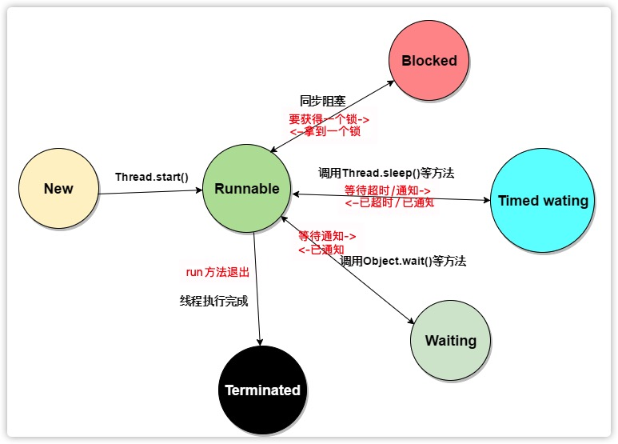

# 并发

## 什么是线程

如果**一个程序**可以**同时**运行**<u>多个线程</u>**，则称这个程序是`多线程`的（multithreaded）。


`多线程` & 多进程

- 本质区别在于每个进程都拥有一套变量，而**线程则共享数据**。


**单独线程运行任务的简单过程**：

1. 将代码放入一个类的run方法中，这个类要实现Runnable接口。
   - Runnable接口只有一个方法：void run() 。
   - 由于Runnable是一个函数式接口，可以用一个lambda表达式创建一个实例。
     - `Runnable r = () -> { task code }`
2. 通过Runnable 构造一个Thread对象。
3. 启动线程。

```java

```


```java

```


```java

```


还可以通过 建立一个Thread类的一个子类来定义线程。（不推荐！！！）

1. 创建Thread的一个子类，实现run方法。
2. 构造子类对象，并调用start方法，启动。


<u>不要直接调用Thread或Runnable接口的run方法</u>。**应该调用Thread.start方法**。


## 线程状态

### 线程有6种状态。

1. New（新建）
2. Runnable（可运行）
3. Blocked（阻塞）
4. Waiting（等待）
5. Timed wating（计时等待）
6. Terminated（终止）


**通过`getState`方法确定一个线程的当前状态。**


- 新建线程

  当使用new操作符创建一个线程时，如new Thread(r)。这个线程还没有开始运行，它的状态是`新建（New）`

- 可运行线程

  调用start方法，线程就处于**可运行**状态。

  一个可运行状态的线程可能正在运行也可能没有运行。（由操作系统为线程提供具体的运行时间）

  一旦一个线程开始运行，它不一定始终保持运行。

- 阻塞和等待线程

  它暂时不是活动的。不运行任何代码，消耗最少的资源。（要由线程调度器重新激活这个线程）

  1. 当一个线程试图获取一个内部的对象锁，锁目前被其它线程占有，线程就会被阻塞。
  2. 当一个线程等待另一个线程通知调度器出现一个条件时，这个线程就会进入等待状态。
     - 阻塞和等待没有多大区别。
  3. 有几个方法有超时参数，调用这些方法会让线程进入计时等待。这一状态将一直保持到超时期满或者接收到适当通知。


### 线程状态转换图




### 终止线程

- run方法正常退出。
- 因为一个没有捕获的异常终止了run方法，使线程意外终止。

能够通过`stop方法`杀死一个线程。该方法抛出一个ThreadDeath错误对象，这会杀死线程。（stop已废弃，不要使用！！！）


## 线程属性

### 中断线程

<u>终止线程的三个途径</u>：

1. run方法执行方法体中最后一条语句后在执行return返回时。
2. 出现了方法中没有捕获的异常时。
3. （**已废弃**）stop方法：其它线程调用这个方法来终止一个线程。


除了已废弃的stop方法，没有办法可以**强制**线程终止。

**interrupt方法**：用来**请求**终止一个线程 。

对一个线程调用interupt方法时，就会设置线程的中断状态。（这是一个每个线程都有的boolean标志）

- 每个线程都应该不时的检查这个标志，以判断线程是否被中断。

`Thread.currentThread.isInterrupted()方法`判断线程是否设置了中断状态。

```java
while(!Thread.currentThread().isInterrupted() && more work to do){
  do more work
}
```

```java
      /**
       * 设置线程中断状态，并检查中断状态，如果监测到中断状态退出循环。
       */
    Runnable r1 = () -> {
            for(int i=0;i<=9 && !Thread.currentThread().isInterrupted();i++){
              System.out.println( i + " From r1.");
              if(i == 2){
                Thread.currentThread().interrupt();
              }
            }
    };
          new Thread(r1).start();
/*
输出：
0 From r1.
1 From r1.
2 From r1.
*/
```


<u>如果线程被阻塞，就无法检查中断状态。</u>

- `InterruptedException异常`：当一个被sleep或wait调用阻塞的线程上调用interrupt方法时，那个阻塞调用（sleep或wait）将被一个InterruptedException异常中断。
  - 有一些阻塞I/O不能被中断，对此应该考虑选择可中断的调用。

```java
      /**
       * 在线程休眠sleep期间，调用线程中断，sleep会被一个interruptException异常中断。
       */
      Runnable r4 = () -> {
          try {
              for (int i = 0; i <= 10 && !Thread.currentThread().isInterrupted(); i++) {
                  System.out.println( i + " From r4.");
                  Thread.sleep(3000);
              }
          } catch (InterruptedException e) {
              System.out.println("执行catch代码");
          }
      };

          Thread thread4 = new Thread(r4);
          thread4.start();
          //主线程休眠7秒让thread4运行
          try {
              Thread.sleep(7000);
          } catch (InterruptedException e) {
              e.printStackTrace();
          }
          //中断thread4
          thread4.interrupt();
/*
输出：
0 From r4.
1 From r4.
2 From r4.
执行catch代码
*/
```


<u>设置中断状态之后，调用sleep方法，不会休眠！</u>

1. 首先会清除已设置的中断状态。
2. 然后抛出InterruptException异常。

**因此，如果你循环调用了sleep，不要检测中断状态，而应当捕获InterruptException异常**。

```java
    Runnable r3 =
        () -> {
          try {
            for (int i = 0; i <= 9 && !Thread.currentThread().isInterrupted(); i++) {
              System.out.println(i + " From r3.");
              if(i==3){
                  //设置中断状态,会在循环检查处退出循环
                  Thread.currentThread().interrupt();
              }
            }
            //输出当前的线程中断状态。 输出为 true
              System.out.println(Thread.currentThread().isInterrupted());
            //*** 此时调用sleep ***
              Thread.sleep(2000);
          } catch (InterruptedException e) {
              //输出当前的线程中断状态。 输出为 catch : false 也就是说，中断状态被清除。
              System.out.print("catch : ");
              System.out.println(Thread.currentThread().isInterrupted());
          } finally {
              //输出当前的线程中断状态。 输出为 finally : false 也就是说，中断状态被清除。
              System.out.print("final : ");
              System.out.println(Thread.currentThread().isInterrupted());
          }
        };

      new Thread(r3).start();
```


中断一个线程只是为了引起它的注意，**线程可以决定如何响应中断**。

1. 某些线程很重要，应该处理异常，然后继续执行。
2. 更普遍的是，线程希望将中断解释为一个终止请求。


| 检测线程是否被中断 |          |                                                  |                                                              |
| ------------------ | -------- | ------------------------------------------------ | ------------------------------------------------------------ |
| isInterrupted()    | 实例方法 | 检查是否有线程被中断，但是不会改变中断状态。     | Thread.currentThread().isInterrupted()<br />或者<br />Thread thread6 = new Thread(r6);<br />thread6.isInterrupted() |
| interrupted()      | 静态方法 | 检查当前线程是否被中断，并清除该线程的中断状态。 | Thread.interrupted()                                         |

```java
    Runnable r5 =
        () -> {
          int i = 0;
          while (!Thread.currentThread().isInterrupted()) {
            System.out.println("hello i am here " + i);
            i++;
            if (i == 10) {
              Thread.currentThread().interrupt();
                // 静态方法interrupted ,检测当前线程是否被中断，同时清除线程中断状态。
                // 意味着 在输出语句中调用后，循环处就检测不到了（因为被清除了）。
              System.out.println(Thread.interrupted());
            }
            if (i == 20) {
              Thread.currentThread().interrupt();
                //实例方法isInterrupted ,检测线程是否被中断，不会改变线程中断状态。
                //循环处，依然能够监测到。
              System.out.println(Thread.currentThread().isInterrupted());
            }
          }
        };
     new Thread(r5).start();
```


尽可能的避免在底层代码抑制InterruptException异常。有两个推荐的方式：

1. 捕获异常，并在catch中设置它的中断状态。

   ```java
       public static void b(){
           try {
               System.out.println("休眠前");
               Thread.sleep(30000);
               System.out.println("休眠前");
           } catch (InterruptedException e) {
               // 2- 在catch中设置中断状态，让调用者可以捕捉到。
               Thread.currentThread().interrupt();
               System.out.println(" catch: "+Thread.currentThread().isInterrupted());//catch: true
           }
       }
   ```

2. 抛出异常，给调用者捕获。（throws InterruptException）

   ```java
       public static void c() throws InterruptedException {
           System.out.println("休眠前");
           Thread.sleep(30000);
           System.out.println("休眠前");
       }
   ```

3. 不要这样做！！！抑制异常。

   ```java
     public static void a(){
         try {
             System.out.println("休眠前");
             Thread.sleep(30000);
             System.out.println("休眠前");
         } catch (InterruptedException e) {
             // 1- 忽略中断异常，同时调用者没有中断状态 不推荐！！！
              System.out.println(" catch: "+Thread.currentThread().isInterrupted());
         }
     }
   ```

   


### 守护线程

通过调用`t.setDaemon(true)` 将一个线程转化为守护线程。

- 守护线程的作用是**给其它线程提供服务**。
- 当只剩下守护线程的时候，虚拟机就会退出。
- 必须在**线程启动前调用**。

```java
      /**
       * 设置线程中断状态，并检查中断状态，如果监测到中断状态退出循环。
       */
    Runnable r1 = () -> {
            for(int i=0;i<=9 && !Thread.currentThread().isInterrupted();i++){
              System.out.println( i + " From r1.");
              if(i == 2){
                Thread.currentThread().interrupt();
              }
            }
    };
      new Thread(r1).setDaemon(true);
      new Thread(r1).start();
```


### 线程名

通过`t.setNam("MyThread")`为线程设置名字。


### 未捕获异常处理器


### 线程优先级

每个线程都有一个优先级。

- 默认，一个线程会继承构造 它的那个线程的优先级。
- 通过setPriority方法提高或降低一个线程的优先级。
- 优先级介于MIN_PRIORITY ～ MAX_PRIORITY之间。
- 线程优先级高度依赖于系统。
- 现在**不要使用线程优先级**！！！


## 同步

