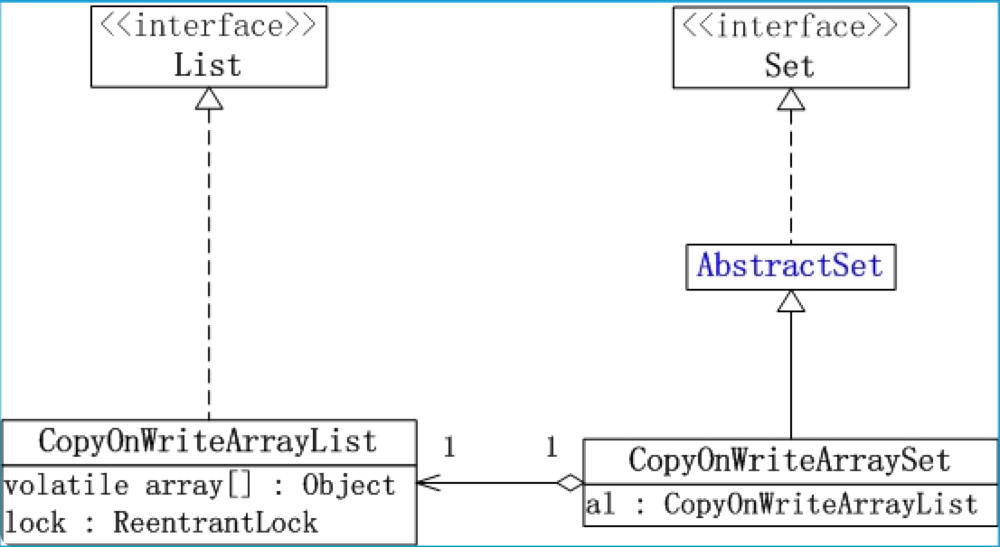
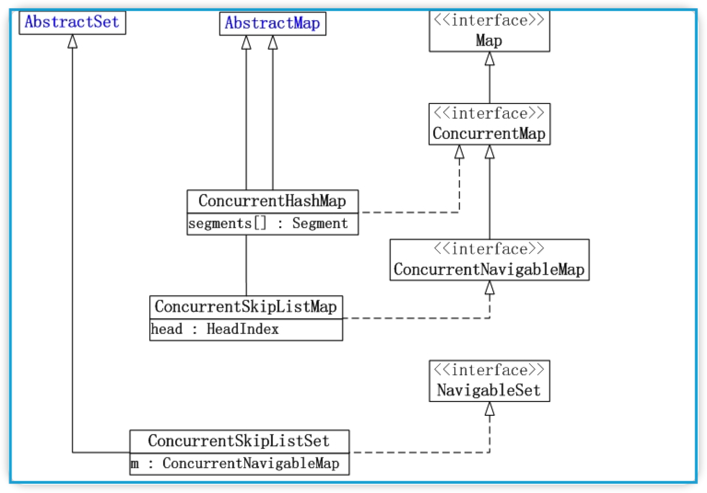
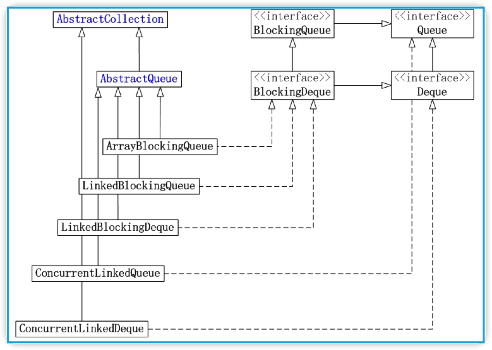

# Java并发集合

## 并发容器大纲

### List和Set

JUC (java.util.concurrent) 集合包中的List和Set实现类包括: 

- `CopyOnWriteArrayList`
  - 相当于<u>线程安全的ArrayList</u>,它实现了List接口。<u>支持高并发</u>的。 
- `CopyOnWriteArraySet`
  - 相当于<u>线程安全的HashSet</u>,它继承于AbstractSet类。CopyOnWriteArraySet内部包含一个CopyOnWriteArrayList对象，它是<u>通过CopyOnWriteArrayList实现</u>的。
- `ConcurrentSkipListSet`
  - ConcurrentSkipListSet是线程安全的有序的集合(相当于<u>线程安全的TreeSet</u>)；它继承于AbstractSet，并实现了NavigableSet接口。ConcurrentSkipListSet是<u>通过ConcurrentSkipListMap实现的，它也支持并发</u>。

CopyOnWriteArrayList和CopyOnWriteArraySet的框架如下图所示：（ConcurrentSkipListSet在Map框架图中）

### Map

JUC集合包中Map的实现类包括: 

- `ConcurrentHashMap`
  - 线程安全的哈希表(相当于<u>线程安全的HashMap</u>)；它继承于AbstractMap类，并且实现ConcurrentMap接口。ConcurrentHashMap是<u>通过“锁分段”来实现的，它支持并发</u>。
- `ConcurrentSkipListMap`
  - 线程安全的**有序**的哈希表(相当于<u>线程安全的TreeMap</u>); 它继承于AbstractMap类，并且实现ConcurrentNavigableMap接口。ConcurrentSkipListMap是<u>通过“跳表”来实现的，它支持并发</u>。

它们的框架如下图所示：

### Queue

JUC集合包中Queue的实现类包括: 

- `ArrayBlockingQueue`
  - **数组**实现的**线程安全的**<u>有界的阻塞队列</u>。
- `LinkedBlockingQueue`
  - **单向链表**实现的<u>(指定大小)阻塞队列</u>，该队列按 <u>FIFO（先进先出）排序元素</u>。
- `LinkedBlockingDeque`
  - **双向链表**实现的<u>(指定大小)双向并发阻塞队列</u>，该阻塞队列同时<u>支持FIFO和FILO</u>两种操作方式。
- `ConcurrentLinkedQueue`
  - **单向链表**实现的<u>无界队列</u>，该队列按 <u>FIFO（先进先出）</u>排序元素。
- `ConcurrentLinkedDeque`
  - **双向链表**实现的<u>无界队列</u>，该队列同时支持<u>FIFO和FILO</u>两种操作方式。

它们的框架如下图所示：

