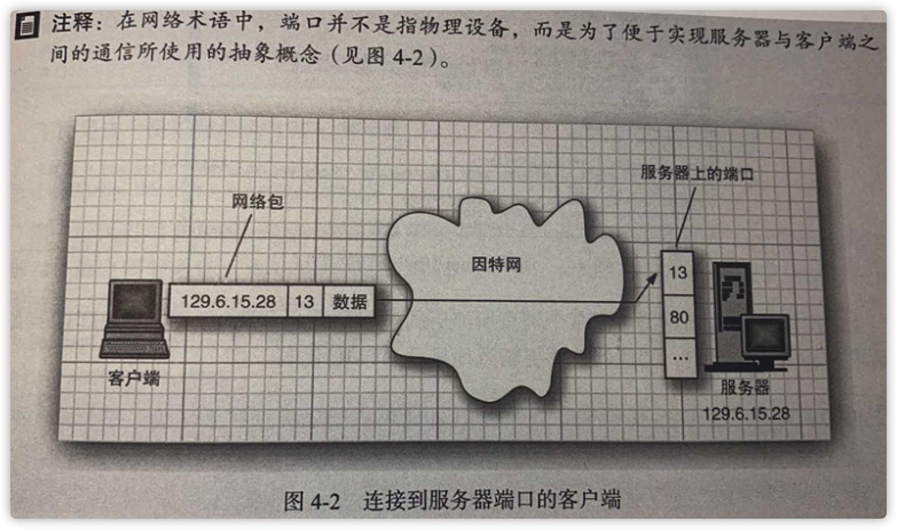

# Java 网络

## 连接到服务器

- telnet命令

  - 用于网络编程的调试工具。

  ```shell
  telnet localhost 7788
  ```



1. 运行在远程计算机上的服务器软件不停地等待着那些希望和端口13连接的网络请求。
2. 当远程计算机上操作系统接收到一个请求与端口13连接的网络数据包时，它便唤醒正在监听网络连接请求的服务器进程，并为两者建立连接。
3. 这种连接将一直保持下去，直到其中任何一方终止。
