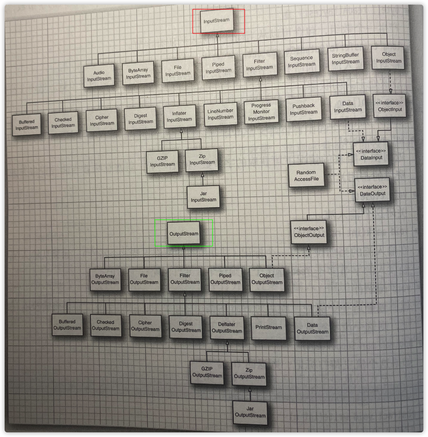

# 输入与输出

## 完整的流家族




## 输入/输出流

`输入流（I）`：可以从其中**读取**一个字节序列的对象。

`输出流（O）`：可以向其中**写入**一个字节序列的对象。


- 抽象类 InputStream和OutputStream 构成了输入输出（I/O）类层次结构的基础。
- 抽象类Reader和Writer中继承出来了一个专门用于<u>处理Unicode字符的</u>单独的类层次结构。
  - 基于两个字节的Char值的（Unicode码元），而不是byte值。


### 读写字节

- `InputStream`类有一个抽象方法：

```java
abstract int read()
//读入一个字节，并返回读入的字节，或者在遇到输入源结尾时返回-1。
```

- `OutputStream`类的一个抽象方法：

```java
abstract void write(int b)
//向某个输出位置写出一个字节。

//如果有一个字节数组，也可以一次性的输出它们。
byte[] values = ...;
out.write(values);
```

- read 和 write 方法在执行时将被阻塞，直至字节确实被读入或写出。

- **available**方法可以检查当前可读入的字节数量。

  ```java
  public int available() throws IOException
  返回可以从此输入流读取（或跳过）的字节数的估计值，而不会因下一次调用此输入流的方法而阻塞。下一次调用可能是同一个线程或另一个线程。单次读取或跳过这么多字节不会阻塞，但可能读取或跳过更少的字节。
  请注意，虽然 InputStream 的某些实现会返回流中的总字节数，但许多不会。使用此方法的返回值来分配用于保存此流中所有数据的缓冲区永远是不正确的。
  
  如果此输入流已通过调用 close() 方法关闭，则此方法的子类实现可能会选择抛出 IOException。
  
  The available method for class InputStream always returns 0.
  InputStream 类的可用方法始终返回 0。
  
  这个方法应该被子类覆盖。
  
  Returns:
  估计可以从此输入流读取（或跳过）而不会阻塞的字节数，或者在到达输入流末尾时为 0。
  Throws:
  IOException - if an I/O error occurs.
  ```

  ```java
  //不会被阻塞的读取！！！
  int bytesAvailable = in.available();
  if(bytesAvailable > 0){
    var data = new bytes[bytesAvailable];
    in.read(data);
  }
  ```

- close方法会关闭输入输出流来释放掉十分有限的系统资源。

  - 同时还会冲刷该输出流的缓冲区：所有临时置于缓冲区中，以便更大的包的形式传递的字节在关闭输出流时都将被送出。

- flush方法：人为的冲刷这些输出。


**InputStream 和 OutputStream 可以读写单个字节或字节数组。**

**Reader 和 Writer 的子类可以读写Unicode文本。**


## 组合输入输出流过滤器

- Java使用了一种非常灵巧的机制来分离职责：

  **某些输入流**可以从<u>文件或者其他更外部</u>的位置上获取字节；而**其它输入流**可以<u>将字节组装到更有用的数据结构</u>中。

```java
//读取文件中的流：
FileInputStream fin = new FileInputStream("out.txt");
//传递给DataInputStream
DataInputStream dis = new DataInputStream(fin);

int i = dis.readInt();
System.out.println(i);


//out.txt文件：1234567890
//输出：825373492
//readInt() 读取 4 个字节，但 1234 读取为 49、50、51、52 ，根据 DataInput.readInt() 规范产生 825373492 int。
```

- 通过嵌套过滤器来添加更多功能

```java
//例如：输入流默认不被缓冲区缓存，每对read调用都会请求操作系统发送一个字节。相比之下，请求一个数据块并置于缓冲区中更高效。
DataInputStream dis =
  new DataInputStream(
  new BufferedInputStream(
    new FileInputStream("out.txt"))
);
```

- 当有多个输入流链接在一起时，你需要跟踪各个中介输入流。
  - 读入和回推时可回推输入流仅有的方法，如果希望可以预览并且可以读入数字，那就需要一个即可回推输入流，又是一个数据数据流的引用。

```java
//读取输入时，预览下一个字节了解是否时需要的值。
PushbackInputStream pis = new PushbackInputStream(
  new BufferedInputStream(
    new FileInputStream("out.txt"))
);


System.out.println("原始输入可用字节：" + pis.available());
int read = pis.read();
System.out.println("读取到字节[pis.read()]：" + read);
System.out.println("读取后剩余可用字节：" + pis.available());
System.out.println("回推读取到的字节[pis.unread(read)]：" + read);
pis.unread(read);
System.out.println("回推后可用字节：" + pis.available());

//out.txt文件：1234
//原始输入可用字节：5
//读取到字节[pis.read()]：49
//读取后剩余可用字节：4
//回推读取到的字节[pis.unread(read)]：49
//回推后可用字节：5
```


## 文本输入与输出

- 保存数据时，可以选择<u>二进制格式</u>或<u>文本格式</u>。
  - 存储文本字符串时，需要考虑字符编码方式。Java内部使用 UTF-16 编码方式。
- `OutputStreamWriter`类 使用选定的字符编码方式，把<u>Unicode码元的输出流转换为字节流</u>。
- `InputStreamReader`类 将包含字节（用某种字符编码方式表示的字符）的输入流转换为可以产生Unicode的码元读入器。


## 写出文本输出

- 使用PrintWriter类。

  - 拥有文本格式打印字符串和数字的方法。

  ```java
  PrintWriter printWriter = new PrintWriter("writer.txt");
  printWriter.println("hello zyb.");
  printWriter.flush();
  printWriter.close();	
  ```

  - 可以使用另一个构造器方法[ PrintWriter(Writer writer, boolean autoFlush) ]设置自动冲刷机制：

  ```java
  PrintWriter printWriter = new PrintWriter(
    new OutputStreamWriter(
      new FileOutputStream("writer.txt")
    ),
    true
  );
  printWriter.println("auto flush");
  //        printWriter.flush();
  //        printWriter.close();
  ```

  

## 读入文本输入

- Scanner类：从任何输入流构建Scanner对象。

  ```java
  /**  源码
      /**
       * Constructs a new <code>Scanner</code> that produces values scanned
       * from the specified input stream. Bytes from the stream are converted
       * into characters using the underlying platform's
       * {@linkplain java.nio.charset.Charset#defaultCharset() default charset}.
       *
       * @param  source An input stream to be scanned
       */
      public Scanner(InputStream source) {
          this(new InputStreamReader(source), WHITESPACE_PATTERN);
      }
  */
  
    
  Scanner in = new Scanner(new FileInputStream("writer.txt"));
  
  while(in.hasNext()){
    System.out.println(in.next());
  }
  //writer.txt 内容：auto flush
  //输出：
  //auto
  //flush
  ```

  

- Files.readAllBytes方法：短小文本文件读入。

  ```java
  /**
      Reads all the bytes from a file. The method ensures that the file is closed when all bytes have been read or an I/O error, or other runtime exception, is thrown.
      Note that this method is intended for simple cases where it is convenient to read all bytes into a byte array. It is not intended for reading in large files.
      Params:
      path – the path to the file
      Returns:
      a byte array containing the bytes read from the file
      Throws:
      IOException – if an I/O error occurs reading from the stream
      OutOfMemoryError – if an array of the required size cannot be allocated, for example the file is larger that 2GB
      SecurityException – In the case of the default provider, and a security manager is installed, the checkRead method is invoked to check read access to the file.
    */
  
  String str = new String(
    Files.readAllBytes(Paths.get("/Users/zhangyanbo/writer.txt"))
  );
  System.out.println(str);
  ```

  