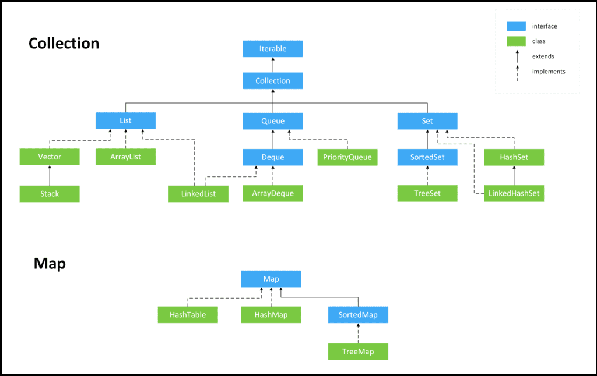
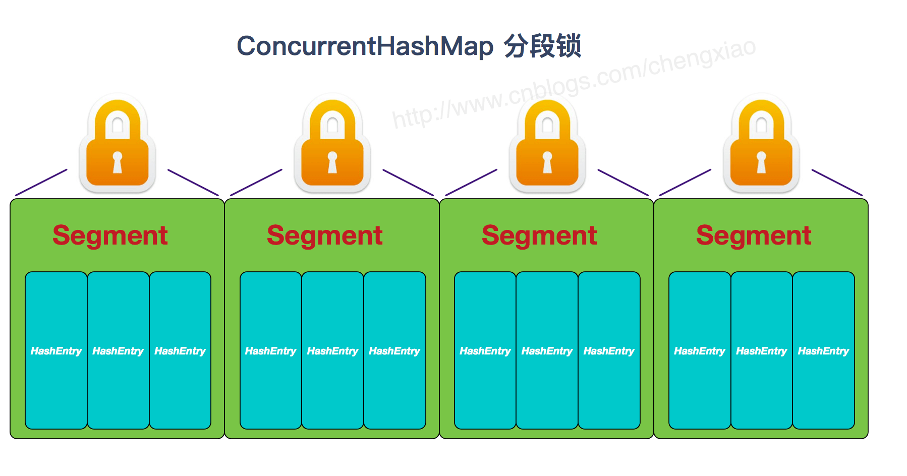

# Java集合

## 集合概述

### 为什么要使用集合？

当我们需要保存一组类型相同的数据的时候，我们应该是用一个容器来保存，这个容器就是数组，但是，使用数组存储对象具有一定的弊端， 因为我们在实际开发中，<u>存储的数据的类型是多种多样的，于是，就出现了“集合”</u>，集合同样也是用来存储多个数据的。

数组的缺点是一旦声明之后，长度就不可变了；同时，声明数组时的数据类型也决定了该数组存储的数据的类型；而且，数组存储的数据是有序的、可重复的，特点单一。 但是<u>集合提高了数据存储的灵活性，Java 集合不仅可以用来存储不同类型不同数量的对象，还可以保存具有映射关系的数据</u>。

### Java 集合框架图



###  List, Set, Queue, Map 四者的区别

- `List`(对付顺序的好帮手): 存储的元素是有序的、可重复的。

- `Set`(注重独一无二的性质): 存储的元素是无序的、不可重复的。
- `Queue`(实现排队功能的叫号机): 按特定的排队规则来确定先后顺序，存储的元素是有序的、可重复的。
- `Map`(用 key 来搜索的专家): 使用键值对（key-value）存储，类似于数学上的函数 y=f(x)，"x" 代表 key，"y" 代表 value，key 是无序的、不可重复的，value 是无序的、可重复的，每个键最多映射到一个值。

### 集合框架底层数据结构

先来看一下 `Collection` 接口下面的集合。

#### List

- `Arraylist`： `Object[]` 数组
- `Vector`：`Object[]` 数组
- `LinkedList`： 双向链表

#### Set

- `HashSet`(无序，唯一): 基于 `HashMap` 实现的，底层采用 `HashMap` 来保存元素
- `LinkedHashSet`: `LinkedHashSet` 是 `HashSet` 的子类，并且其内部是通过 `LinkedHashMap` 来实现的。有点类似于我们之前说的 `LinkedHashMap` 其内部是基于 `HashMap` 实现一样，不过还是有一点点区别的。
- `TreeSet`(有序，唯一): 红黑树(自平衡的排序二叉树)

#### Queue

- `PriorityQueue`: `Object[]` 数组来实现二叉堆
- `ArrayQueue`: `Object[]` 数组 + 双指针

再来看看 `Map` 接口下面的集合。

#### Map

- `HashMap`：
  - JDK1.8 之前 `HashMap` 由数组+链表组成的，数组是 `HashMap` 的主体，链表则是主要为了解决哈希冲突而存在的（“拉链法”解决冲突）。
  - JDK1.8 以后在解决哈希冲突时有了较大的变化，当链表长度大于阈值（默认为 8）（将链表转换成红黑树前会判断，如果当前数组的长度小于 64，那么会选择先进行数组扩容，而不是转换为红黑树）时，将链表转化为红黑树，以减少搜索时间
- `LinkedHashMap`：继承自 `HashMap`，所以它的底层仍然是基于拉链式散列结构即由数组和链表或红黑树组成。另外，`LinkedHashMap` 在上面结构的基础上，增加了一条双向链表，使得上面的结构可以保持键值对的插入顺序。同时通过对链表进行相应的操作，实现了访问顺序相关逻辑。
- `Hashtable`： 数组+链表组成的，数组是 `Hashtable` 的主体，链表则是主要为了解决哈希冲突而存在的
- `TreeMap`： 红黑树（自平衡的排序二叉树）


### 选用集合的方法

主要根据集合的特点来选用，比如我们需要根据键值获取到元素值时就选用 `Map` 接口下的集合，需要排序时选择 `TreeMap`,不需要排序时就选择 `HashMap`,需要保证线程安全就选用 `ConcurrentHashMap`。

当我们只需要存放元素值时，就选择实现`Collection` 接口的集合，需要保证元素唯一时选择实现 `Set` 接口的集合比如 `TreeSet` 或 `HashSet`，不需要就选择实现 `List` 接口的比如 `ArrayList` 或 `LinkedList`，然后再根据实现这些接口的集合的特点来选用。


### Collection 子接口之 List

#### Arraylist 和 Vector 的区别

- `ArrayList` 是 `List` 的主要实现类，底层使用 `Object[ ]`存储，适用于频繁的查找工作，线程不安全 ；
- `Vector` 是 `List` 的古老实现类，底层使用`Object[ ]` 存储，<u>线程安全的</u>。

#### Arraylist 与 LinkedList 的区别

1. **是否保证线程安全：** `ArrayList` 和 `LinkedList` 都是不同步的，也就是不保证线程安全；
2. **底层数据结构：** 
   - `Arraylist` 底层使用的是 **`Object[ ]`**；
   - `LinkedList` 底层使用的是 **双向链表** 数据结构（JDK1.6 之前为循环链表，JDK1.7 取消了循环。注意双向链表和双向循环链表的区别！）
3. 插入和删除是否受元素位置的影响：
   - `ArrayList` 采用数组存储，所以插入和删除元素的时间复杂度受元素位置的影响。 比如：执行`add(E e)`方法的时候， `ArrayList` 会默认在将指定的元素追加到此列表的末尾，这种情况时间复杂度就是 O(1)。但是如果要在指定位置 i 插入和删除元素的话（`add(int index, E element)`）时间复杂度就为 O(n-i)。因为在进行上述操作的时候集合中第 i 和第 i 个元素之后的(n-i)个元素都要执行向后位/向前移一位的操作。
   - `LinkedList` 采用链表存储，所以，如果是在头尾插入或者删除元素不受元素位置的影响（`add(E e)`、`addFirst(E e)`、`addLast(E e)`、`removeFirst()` 、 `removeLast()`），近似 O(1)，如果是要在指定位置 `i` 插入和删除元素的话（`add(int index, E element)`，`remove(Object o)`） 时间复杂度近似为 O(n) ，因为需要先移动到指定位置再插入。
4. **是否支持快速随机访问：** `LinkedList` 不支持高效的随机元素访问，而 `ArrayList` 支持。快速随机访问就是通过元素的序号快速获取元素对象(对应于`get(int index)`方法)。
5. **内存空间占用：** `ArrayList` 的空 间浪费主要体现在在 list <u>列表的结尾会预留一定的容量空间</u>，而 `LinkedList` 的空间花费则体现在它的每一个元素都需要消耗比 ArrayList 更多的空间（因为要存放直接后继和直接前驱以及数据）。

#### ArrayList 的扩容机制

```java
// to-do
```


### Collection 子接口之 Set

#### 无序性和不可重复性的含义是什么

1、什么是**无序性**？无序性<u>不等于随机性</u> ，无序性是指存储的数据在底层数组中并非按照数组索引的顺序添加 ，而是根据数据的哈希值决定的。

2、什么是**不可重复性**？不可重复性是指<u>添加的元素按照 equals()判断时 ，返回 false</u>，需要同时重写 equals()方法和 HashCode()方法。

#### 比较 HashSet、LinkedHashSet 和 TreeSet 三者的异同

- `HashSet`、`LinkedHashSet` 和 `TreeSet` 都是 `Set` 接口的实现类，都能保证元素唯一，并且都不是线程安全的。
- `HashSet`、`LinkedHashSet` 和 `TreeSet` 的主要区别在于底层数据结构不同。
  - `HashSet` 的底层数据结构是哈希表（基于 `HashMap` 实现）。
  - `LinkedHashSet` 的底层数据结构是链表和哈希表，元素的插入和取出顺序满足 FIFO。
  - `TreeSet` 底层数据结构是红黑树，元素是有序的，排序的方式有自然排序和定制排序。
- 底层数据结构不同决定了这三者的应用场景不同。`HashSet` 用于不需要保证元素插入和取出顺序的场景，`LinkedHashSet` 用于保证元素的插入和取出顺序满足 FIFO 的场景，`TreeSet` 用于支持对元素自定义排序规则的场景。


### Collection 子接口之 Queue

```java
// to-do
```


## Map 接口

#### HashMap 和 Hashtable 的区别

1. **线程是否安全：** 

   - `HashMap` 是非线程安全的；
   - `Hashtable` 是<u>线程安全的</u>,因为 `Hashtable` 内部的方法基本都经过`synchronized` 修饰。（如果你要保证线程安全的话就使用 `ConcurrentHashMap` 吧！）；

2. **效率：** 因为线程安全的问题，`HashMap` 要比 `Hashtable` 效率高一点。另外，**`Hashtable` 基本被淘汰，不要在代码中使用它**；

3. **对 Null key 和 Null value 的支持：** 

   - `HashMap` 可以存储 null 的 key 和 value，但 null 作为键只能有一个，null 作为值可以有多个；
   - Hashtable 不允许有 null 键和 null 值，否则会抛出 `NullPointerException`。

4. **初始容量大小和每次扩充容量大小的不同 ：** 

   - ① 创建时如果不指定容量初始值：

     - `Hashtable` 默认的初始大小为 11，之后每次扩充，容量变为原来的 2n+1。
     - `HashMap` 默认的初始化大小为 16。之后每次扩充，容量变为原来的 2 倍。

   - ② 创建时如果给定了容量初始值：

     - 那么 `Hashtable` 会直接使用你给定的大小。
     - 而 `HashMap` 会将其扩充为 2 的幂次方大小（`HashMap` 中的`tableSizeFor()`方法保证，下面给出了源代码）。也就是说 `HashMap` 总是使用 2 的幂作为哈希表的大小。

     ```java
     //后面会介绍到为什么是 2 的幂次方?
     ```

5. **底层数据结构：** JDK1.8 以后的 `HashMap` 在解决哈希冲突时有了较大的变化，当链表长度大于阈值（默认为 8）（将链表转换成红黑树前会判断，如果当前数组的长度小于 64，那么会选择先进行数组扩容，而不是转换为红黑树）时，将链表转化为红黑树，以减少搜索时间。Hashtable 没有这样的机制。


#### ConcurrentHashMap 和 Hashtable 的区别

`ConcurrentHashMap` 和 `Hashtable` 的区别主要体现在实现线程安全的方式上不同。

- **底层数据结构：**
  - JDK1.7 的 `ConcurrentHashMap` 底层采用 **分段的数组+链表** 实现，JDK1.8 采用的数据结构跟 `HashMap1.8` 的结构一样，数组+链表/红黑二叉树。
  - `Hashtable` 和 JDK1.8 之前的 `HashMap` 的底层数据结构类似都是采用 **数组+链表** 的形式，数组是 HashMap 的主体，链表则是主要为了解决哈希冲突而存在的；
- **实现线程安全的方式（重要）：** 
  - ① **在 JDK1.7 的时候，`ConcurrentHashMap`（分段锁）** 对整个桶数组进行了分割分段(`Segment`)，每一把锁只锁容器其中一部分数据，多线程访问容器里不同数据段的数据，就不会存在锁竞争，提高并发访问率。 **到了 JDK1.8 的时候已经摒弃了 `Segment` 的概念，而是直接用 `Node` 数组+链表+红黑树的数据结构来实现，并发控制使用 `synchronized` 和 CAS 来操作。（JDK1.6 以后 对 `synchronized` 锁做了很多优化）** 整个看起来就像是优化过且线程安全的 `HashMap`，虽然在 JDK1.8 中还能看到 `Segment` 的数据结构，但是已经简化了属性，只是为了兼容旧版本；
  - ② **`Hashtable`(同一把锁)** :使用 `synchronized` 来保证线程安全，效率非常低下。当一个线程访问同步方法时，其他线程也访问同步方法，可能会进入阻塞或轮询状态，如使用 put 添加元素，另一个线程不能使用 put 添加元素，也不能使用 get，竞争会越来越激烈效率越低。


