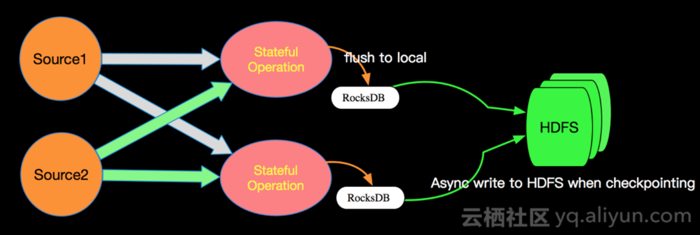
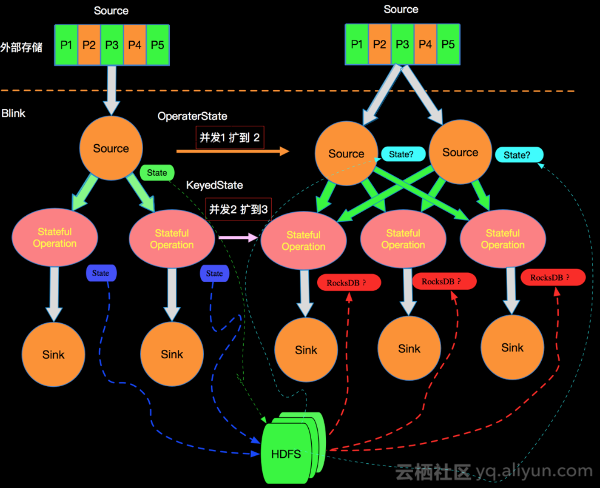
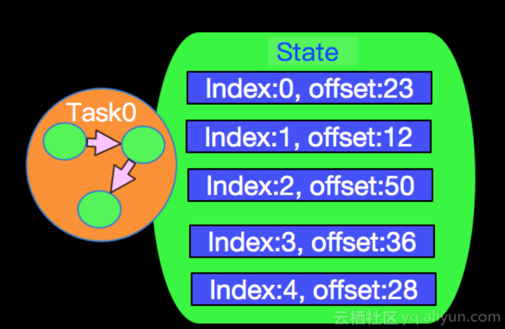
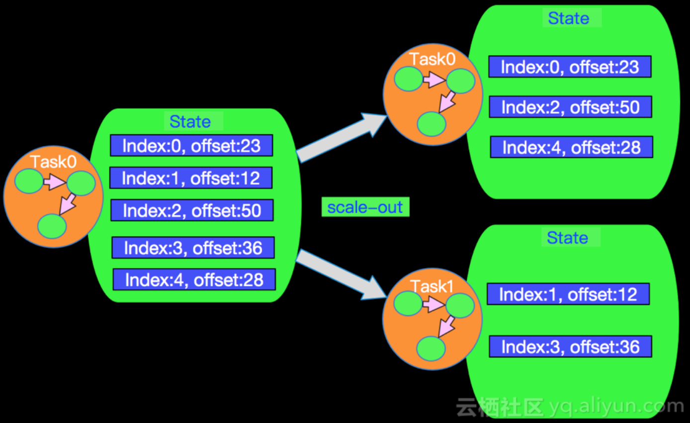
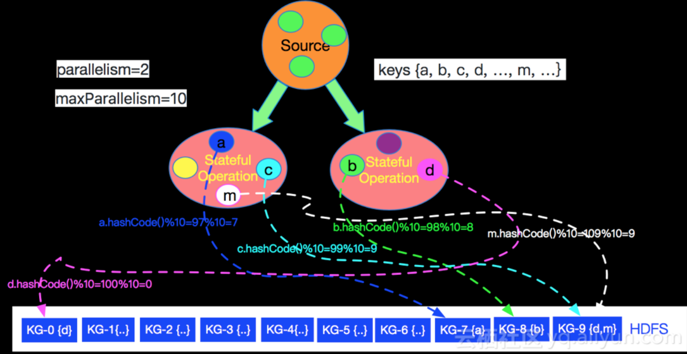
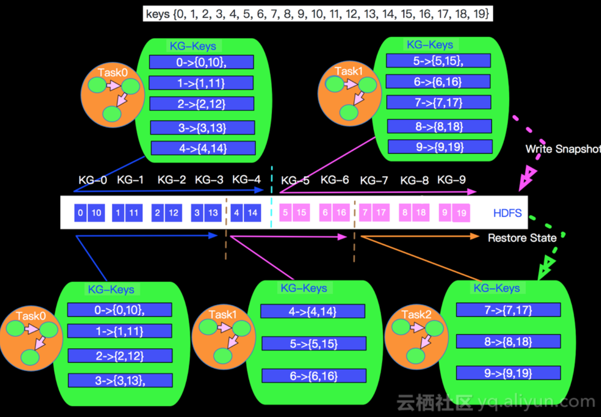

## 实际问题

在流计算场景中，数据会源源不断的流入Apache Flink系统，每条数据进入Apache Flink系统都会触发计算。如果我们想进行一个Count聚合计算，那么每次触发计算是将历史上所有流入的数据重新新计算一次，还是每次计算都是在上一次计算结果之上进行增量计算呢？答案是肯定的，Apache Flink是基于上一次的计算结果进行增量计算的。那么问题来了: "上一次的计算结果保存在哪里，保存在内存可以吗？"，答案是否定的，如果保存在内存，在由于网络，硬件等原因造成某个计算节点失败的情况下，上一次计算结果会丢失，在节点恢复的时候，就需要将历史上所有数据（可能十几天，上百天的数据）重新计算一次，所以为了避免这种灾难性的问题发生，Apache Flink 会利用State存储计算结果。本篇将会为大家介绍Apache Flink State的相关内容。

## 什么是State

这个问题似乎有些"弱智"？不管问题的答案是否显而易见，但我还是想简单说一下在Apache Flink里面什么是State？State是指流计算过程中计算节点的中间计算结果或元数据属性，比如 在aggregation过程中要在state中记录中间聚合结果，比如 Apache Kafka 作为数据源时候，我们也要记录已经读取记录的offset，这些State数据在计算过程中会进行持久化(插入或更新)。所以Apache Flink中的State就是与时间相关的，Apache Flink任务的内部数据（计算数据和元数据属性）的快照。

## 为什么需要State


与批计算相比，State是流计算特有的，批计算没有failover机制，要么成功，要么重新计算。流计算在 大多数场景 下是增量计算，数据逐条处理（大多数场景)，每次计算是在上一次计算结果之上进行处理的，这样的机制势必要将上一次的计算结果进行存储（生产模式要持久化），另外由于 机器，网络，脏数据等原因导致的程序错误，在重启job时候需要从成功的检查点(checkpoint，后面篇章会专门介绍)进行state的恢复。增量计算，Failover这些机制都需要state的支撑。

## State 实现

Apache Flink内部有四种state的存储实现，具体如下：

* 基于内存的HeapStateBackend - 在debug模式使用，不 建议在生产模式下应用；
* 基于HDFS的FsStateBackend - 分布式文件持久化，每次读写都产生网络IO，整体性能不佳；
* 基于RocksDB的RocksDBStateBackend - 本地文件+异步HDFS持久化；
* 还有一个是基于Niagara(Alibaba内部实现)NiagaraStateBackend - 分布式持久化- 在Alibaba生产环境应用；

## State 持久化逻辑

Apache Flink版本选择用RocksDB+HDFS的方式进行State的存储，State存储分两个阶段，首先本地存储到RocksDB，然后异步的同步到远程的HDFS。 这样而设计既消除了HeapStateBackend的局限（内存大小，机器坏掉丢失等），也减少了纯分布式存储的网络IO开销。



## State 分类
Apache Flink 内部按照算子和数据分组角度将State划分为如下两类：

* KeyedState - 这里面的key是我们在SQL语句中对应的GroupBy/PartitioneBy里面的字段，key的值就是groupby/PartitionBy字段组成的Row的字节数组，每一个key都有一个属于自己的State，key与key之间的State是不可见的；
* OperatorState - Apache Flink内部的Source Connector的实现中就会用OperatorState来记录source数据读取的offset。 

## 使用 Keyed State

keyed state 接口提供不同类型状态的访问接口，这些状态都作用于当前输入数据的 key 下。换句话说，这些状态仅可在 `KeyedStream`
上使用，可以通过 `stream.keyBy(...)` 得到 `KeyedStream`.

接下来，我们会介绍不同类型的状态，然后介绍如何使用他们。所有支持的状态类型如下所示：

* `ValueState<T>`: 保存一个可以更新和检索的值（如上所述，每个值都对应到当前的输入数据的 key，因此算子接收到的每个 key 都可能对应一个值）。
  这个值可以通过 `update(T)` 进行更新，通过 `T value()` 进行检索。


* `ListState<T>`: 保存一个元素的列表。可以往这个列表中追加数据，并在当前的列表上进行检索。可以通过
  `add(T)` 或者 `addAll(List<T>)` 进行添加元素，通过 `Iterable<T> get()` 获得整个列表。还可以通过 `update(List<T>)` 覆盖当前的列表。

* `ReducingState<T>`: 保存一个单值，表示添加到状态的所有值的聚合。接口与 `ListState` 类似，但使用 `add(T)` 增加元素，会使用提供的 `ReduceFunction` 进行聚合。

* `AggregatingState<IN, OUT>`: 保留一个单值，表示添加到状态的所有值的聚合。和 `ReducingState` 相反的是, 聚合类型可能与 添加到状态的元素的类型不同。
  接口与 `ListState` 类似，但使用 `add(IN)` 添加的元素会用指定的 `AggregateFunction` 进行聚合。

* `MapState<UK, UV>`: 维护了一个映射列表。 你可以添加键值对到状态中，也可以获得反映当前所有映射的迭代器。使用 `put(UK，UV)` 或者 `putAll(Map<UK，UV>)` 添加映射。
  使用 `get(UK)` 检索特定 key。 使用 `entries()`，`keys()` 和 `values()` 分别检索映射、键和值的可迭代视图。你还可以通过 `isEmpty()` 来判断是否包含任何键值对。

所有类型的状态还有一个`clear()` 方法，清除当前 key 下的状态数据，也就是当前输入元素的 key。

请牢记，这些状态对象仅用于与状态交互。状态本身不一定存储在内存中，还可能在磁盘或其他位置。
另外需要牢记的是从状态中获取的值取决于输入元素所代表的 key。 因此，在不同 key 上调用同一个接口，可能得到不同的值。

你必须创建一个 `StateDescriptor`，才能得到对应的状态句柄。 这保存了状态名称（正如我们稍后将看到的，你可以创建多个状态，并且它们必须具有唯一的名称以便可以引用它们），
状态所持有值的类型，并且可能包含用户指定的函数，例如`ReduceFunction`。 根据不同的状态类型，可以创建`ValueStateDescriptor`，`ListStateDescriptor`，
`ReducingStateDescriptor` 或 `MapStateDescriptor`。

状态通过 `RuntimeContext` 进行访问，因此只能在 *rich functions* 中使用。

`RichFunction` 中 `RuntimeContext` 提供如下方法：

* `ValueState<T> getState(ValueStateDescriptor<T>)`
* `ReducingState<T> getReducingState(ReducingStateDescriptor<T>)`
* `ListState<T> getListState(ListStateDescriptor<T>)`
* `AggregatingState<IN, OUT> getAggregatingState(AggregatingStateDescriptor<IN, ACC, OUT>)`
* `MapState<UK, UV> getMapState(MapStateDescriptor<UK, UV>)`

### 实例1

```scala
import org.apache.flink.api.common.functions.RichFlatMapFunction
import org.apache.flink.api.common.state.{ValueState, ValueStateDescriptor}
import org.apache.flink.configuration.Configuration
import org.apache.flink.streaming.api.scala.StreamExecutionEnvironment
import org.apache.flink.streaming.api.scala._
import org.apache.flink.util.Collector

/**
 * 一个简单的计数窗口。
 * 我们把元组的第一个元素当作 key（在示例中都 key 都是 "1"）。
 * 该函数将出现的次数以及总和存储在 "ValueState" 中。
 * 一旦出现次数达到 2，则将平均值发送到下游，并清除状态重新开始。
 * 请注意，我们会为每个不同的 key（元组中第一个元素）保存一个单独的值。
 */
object KeyedStateDemo1 {
  def main(args: Array[String]): Unit = {
    val env = StreamExecutionEnvironment.getExecutionEnvironment

    env.fromCollection(List(
        (1L,3L),
        (1L,5L),
        (1L,7L),
        (1L,4L),
        (1L,2L),
        (1L,4L),
        (1L,4L)
    )).keyBy(0)
      .flatMap(new CountWindowAverage())
      .print()

    env.execute("KeyedState")

  }
}

class CountWindowAverage extends RichFlatMapFunction[(Long,Long),(Long,Long)]{

  private var sum: ValueState[(Long,Long)] = _

  override def flatMap(in: (Long, Long), out: Collector[(Long, Long)]): Unit = {
    //获取状态值
    val tmpCurrentSum = sum.value()
    //如果状态之前未被使用，那么将是null
    val currentSum = if(tmpCurrentSum != null){
      tmpCurrentSum
    }else{
      (0L,0L)
    }
    //更新计数
    val newSum = (currentSum._1+1 , currentSum._2+in._2)
    //更新状态
    sum.update(newSum)
    
    //如果状态的次数达到3，就计算平均值发送出去并清除状态。
    if(newSum._1 >= 3){
      out.collect((in._1,newSum._2/newSum._1))
      sum.clear()
    }

  }

  //open方法中，通过getruntimecontext访问状态
  override def open(parameters: Configuration): Unit = {
    super.open(parameters)
    sum = getRuntimeContext.getState(
        new ValueStateDescriptor[(Long, Long)]
        (
          "average",
          createTypeInformation[(Long,Long)]
        )
    )
  }

}
```

### 实例2

```scala
import org.apache.flink.api.common.functions.RichFlatMapFunction
import org.apache.flink.api.common.state.{ValueState, ValueStateDescriptor}
import org.apache.flink.configuration.Configuration
import org.apache.flink.streaming.api.scala.StreamExecutionEnvironment
import org.apache.flink.streaming.api.scala._
import org.apache.flink.util.Collector

/**
 * 温度差告警：如果后来数据的温度比之前的相差一定数量，就发出警告。
 */
object KeyedStateStream1 {
  def main(args: Array[String]): Unit = {

    var hostname: String = "hw-bigdata1"
    var port: Int = 7777

    // get the execution environment
    val env: StreamExecutionEnvironment = StreamExecutionEnvironment.getExecutionEnvironment

    // get input data by connecting to the socket
    val text = env.socketTextStream(hostname, port)

    val keydeStream = text.map(
      v => {
        val strings = v.split(",")
        temperature(strings(0), strings(1).toDouble)
      }
    ).keyBy(0)

    keydeStream.flatMap(new TemperatureAlertFunction(4)).print()

    env.execute()
  }

}

class TemperatureAlertFunction(val value:Double) extends RichFlatMapFunction[temperature,(String,Double,Double)]{
  //定义状态引用对象
  private var tempvalue:ValueState[Double] = _

  //创建状态描述符 , 获得状态引用对象
  override def open(parameters: Configuration): Unit = {
    super.open(parameters)
    val tempdesc = new ValueStateDescriptor[Double]("lasttemp",classOf[Double])
    tempvalue = getRuntimeContext.getState(tempdesc)
  }

  //flatmap
  override def flatMap(in: temperature, out: Collector[(String, Double, Double)]): Unit = {
    //获取上一次温度值
    val temp = tempvalue.value()

    //检查温度差
    val diffvalue = if(temp != null){
      (in.l1-temp).abs
    }else{
      0
    }

    //温度变化是否超过阈值
    if(diffvalue > value){
      out.collect((in.id,in.l1,diffvalue))
    }

    //更新状态
    tempvalue.update(in.l1)

  }
}

case class temperature(id:String,l1:Double)

//输入：
//[root@hw - bigdata1 client] #nc - l 7777
//a, 100.00
//b, 101.05
//a, 102.00
//a, 107.20
//b, 90.00

//输出：
//(a,100.0,100.0)
//(b,101.05,101.05)
//(a,107.2,5.200000000000003)
//(b,90.0,11.049999999999997)
```


## 使用 Operator State

用户可以通过实现 `CheckpointedFunction` 接口来使用 operator state。

#### CheckpointedFunction

`CheckpointedFunction` 接口提供了访问 non-keyed state 的方法，需要实现如下两个方法：

```java
void snapshotState(FunctionSnapshotContext context) throws Exception;

void initializeState(FunctionInitializationContext context) throws Exception;
```

进行 checkpoint 时会调用 `snapshotState()`。 用户自定义函数初始化时会调用 `initializeState()`，初始化包括第一次自定义函数初始化和从之前的 checkpoint 恢复。
因此 `initializeState()` 不仅是定义不同状态类型初始化的地方，也需要包括状态恢复的逻辑。

当前 operator state 以 list 的形式存在。这些状态是一个 *可序列化* 对象的集合 `List`，彼此独立，方便在改变并发后进行状态的重新分派。
换句话说，这些对象是重新分配 non-keyed state 的最细粒度。根据状态的不同访问方式，有如下几种重新分配的模式：

  - **Even-split redistribution:** 每个算子都保存一个列表形式的状态集合，整个状态由所有的列表拼接而成。当作业恢复或重新分配的时候，整个状态会按照算子的并发度进行均匀分配。
    比如说，算子 A 的并发读为 1，包含两个元素 `element1` 和 `element2`，当并发读增加为 2 时，`element1` 会被分到并发 0 上，`element2` 则会被分到并发 1 上。

  - **Union redistribution:** 每个算子保存一个列表形式的状态集合。整个状态由所有的列表拼接而成。当作业恢复或重新分配时，每个算子都将获得所有的状态数据。
    Do not use this feature if your list may have high cardinality. 如果你的集合基数非常大，请不要使用这个特征。

    Checkpoint metadata will store an offset to each list entry, which could lead to RPC framesize or out-of-memory errors.检查点元数据将存储一份offset到每一个list中，这将导致rpc帧数过长或者内存溢出错误。

### 实例1

```scala

```


## State 扩容重新分配

Apache Flink是一个大规模并行分布式系统，允许大规模的有状态流处理。 为了可伸缩性，Apache Flink作业在逻辑上被分解成operator graph，并且每个operator的执行被物理地分解成多个并行运算符实例。 从概念上讲，Apache Flink中的每个并行运算符实例都是一个独立的任务，可以在自己的机器上调度到网络连接的其他机器运行。

Apache Flink的DAG图中只有边相连的节点🈶网络通信，也就是整个DAG在垂直方向有网络IO，在水平方向如下图的stateful节点之间没有网络通信，这种模型也保证了每个operator实例维护一份自己的state，并且保存在本地磁盘（远程异步同步）。通过这种设计，任务的所有状态数据都是本地的，并且状态访问不需要任务之间的网络通信。 避免这种流量对于像Apache Flink这样的大规模并行分布式系统的可扩展性至关重要。

如上我们知道Apache Flink中State有OperatorState和KeyedState，那么在进行扩容时候（增加并发）State如何分配呢？比如：外部Source有5个partition，在Apache Flink上面由Srouce的1个并发扩容到2个并发，中间Stateful Operation 节点由2个并发并扩容的3个并发，如下图所示:



在Apache Flink中对不同类型的State有不同的扩容方法，接下来我们分别介绍。


## OperatorState对扩容的处理

我们选取Apache Flink中某个具体Connector实现实例进行介绍，以MetaQ为例，MetaQ以topic方式订阅数据，每个topic会有N>0个分区，以上图为例，加上我们订阅的MetaQ的topic有5个分区，那么当我们source由1个并发调整为2个并发时候，State是怎么恢复的呢？
state 恢复的方式与Source中OperatorState的存储结构有必然关系，我们先看MetaQSource的实现是如何存储State的。首先MetaQSource 实现了ListCheckpointed<T extends Serializable>，其中的T是Tuple2<InputSplit,Long>，我们在看ListCheckpointed接口的内部定义如下：

```
public interface ListCheckpointed<T extends Serializable>; {
List<T> snapshotState(long var1, long var3) throws Exception;

void restoreState(List&lt;T&gt; var1) throws Exception;
}
```
我们发现 snapshotState方法的返回值是一个List<T>,T是Tuple2<InputSplit,Long>，也就是snapshotState方法返回List<Tuple2<InputSplit,Long>>,这个类型说明state的存储是一个包含partiton和offset信息的列表，InputSplit代表一个分区，Long代表当前partition读取的offset。InputSplit有一个方法如下：

```
public interface InputSplit extends Serializable {
    int getSplitNumber();
}
```

也就是说，InputSplit我们可以理解为是一个Partition索引，有了这个数据结构我们在看看上面图所示的case是如何工作的？当Source的并行度是1的时候，所有打partition数据都在同一个线程中读取，所有partition的state也在同一个state中维护，State存储信息格式如下：



如果我们现在将并发调整为2，那么我们5个分区的State将会在2个独立的任务（线程）中进行维护，在内部实现中我们有如下算法进行分配每个Task所处理和维护partition的State信息，如下：

```
List<Integer> assignedPartitions = new LinkedList<>();
for (int i = 0; i < partitions; i++) {
        if (i % consumerCount == consumerIndex) {
                assignedPartitions.add(i);
        }
}
```

这个求mod的算法，决定了每个并发所处理和维护partition的State信息，针对我们当前的case具体的存储情况如下：





那么到现在我们发现上面扩容后State得以很好的分配得益于OperatorState采用了List<T>的数据结构的设计。另外大家注意一个问题，相信大家已经发现上面分配partition的算法有一个限制，那就是Source的扩容（并发数）是否可以超过Source物理存储的partition数量呢？答案是否定的，不能。目前Apache Flink的做法是提前报错，即使不报错也是资源的浪费，因为超过partition数量的并发永远分配不到待管理的partition。

## KeyedState对扩容的处理
对于KeyedState最容易想到的是hash(key) mod parallelism(operator) 方式分配state，就和OperatorState一样，这种分配方式大多数情况是恢复的state不是本地已有的state，需要一次网络拷贝，这种效率比较低，OperatorState采用这种简单的方式进行处理是因为OperatorState的state一般都比较小，网络拉取的成本很小，对于KeyedState往往很大，我们会有更好的选择，在Apache Flink中采用的是Key-Groups方式进行分配。

## 什么是Key-Groups
Key-Groups 是Apache Flink中对keyed state按照key进行分组的方式，每个key-group中会包含N>0个key，一个key-group是State分配的原子单位。在Apache Flink中关于Key-Group的对象是 KeyGroupRange, 如下：

```
public class KeyGroupRange implements KeyGroupsList, Serializable {
        ...
        ...
        private final int startKeyGroup;
        private final int endKeyGroup;
        ...
        ...
}
```

KeyGroupRange两个重要的属性就是 startKeyGroup和endKeyGroup，定义了startKeyGroup和endKeyGroup属性后Operator上面的Key-Group的个数也就确定了。

## 什么决定Key-Groups的个数
key-group的数量在job启动前必须是确定的且运行中不能改变。由于key-group是state分配的原子单位，而每个operator并行实例至少包含一个key-group，因此operator的最大并行度不能超过设定的key-group的个数，那么在Apache Flink的内部实现上key-group的数量就是最大并行度的值。

GroupRange.of(0, maxParallelism)如何决定key属于哪个Key-Group
确定好GroupRange之后，如何决定每个Key属于哪个Key-Group呢？我们采取的是取mod的方式，在KeyGroupRangeAssignment中的assignToKeyGroup方法会将key划分到指定的key-group中，如下：

```
public static int assignToKeyGroup(Object key, int maxParallelism) {
  return computeKeyGroupForKeyHash(key.hashCode(), maxParallelism);
}

public static int computeKeyGroupForKeyHash(int keyHash, int maxParallelism) {
  return HashPartitioner.INSTANCE.partition(keyHash, maxParallelism);
}

@Override
public int partition(T key, int numPartitions) {
  return MathUtils.murmurHash(Objects.hashCode(key)) % numPartitions;
}
```

如上实现我们了解到分配Key到指定的key-group的逻辑是利用key的hashCode和maxParallelism进行取余操作来分配的。如下图当parallelism=2,maxParallelism=10的情况下流上key与key-group的对应关系如下图所示：



如上图key(a)的hashCode是97，与最大并发10取余后是7，被分配到了KG-7中，流上每个event都会分配到KG-0至KG-9其中一个Key-Group中。
每个Operator实例如何获取Key-Groups
 了解了Key-Groups概念和如何分配每个Key到指定的Key-Groups之后，我们看看如何计算每个Operator实例所处理的Key-Groups。 在KeyGroupRangeAssignment的computeKeyGroupRangeForOperatorIndex方法描述了分配算法：


```
public static KeyGroupRange computeKeyGroupRangeForOperatorIndex(
  int maxParallelism,
  int parallelism,
  int operatorIndex) {
    GroupRange splitRange = GroupRange.of(0, maxParallelism).getSplitRange(parallelism, operatorIndex);
    int startGroup = splitRange.getStartGroup();
    int endGroup = splitRange.getEndGroup();
return new KeyGroupRange(startGroup, endGroup - 1);
}

public GroupRange getSplitRange(int numSplits, int splitIndex) {
    ...
    final int numGroupsPerSplit = getNumGroups() / numSplits;
    final int numFatSplits = getNumGroups() % numSplits;

    int startGroupForThisSplit;
    int endGroupForThisSplit;
    if (splitIndex &lt; numFatSplits) {
        startGroupForThisSplit = getStartGroup() + splitIndex * (numGroupsPerSplit + 1);
        endGroupForThisSplit =   startGroupForThisSplit + numGroupsPerSplit + 1;
    } else {
        startGroupForThisSplit = getStartGroup() + splitIndex * numGroupsPerSplit + numFatSplits;
        endGroupForThisSplit =  startGroupForThisSplit + numGroupsPerSplit;
    }
    if (startGroupForThisSplit &gt;= endGroupForThisSplit) {
            return GroupRange.emptyGroupRange();
    } else {
            return new GroupRange(startGroupForThisSplit, endGroupForThisSplit);
    }
}
```

上面代码的核心逻辑是先计算每个Operator实例至少分配的Key-Group个数，将不能整除的部分N个，平均分给前N个实例。最终每个Operator实例管理的Key-Groups会在GroupRange中表示，本质是一个区间值；下面我们就上图的case，说明一下如何进行分配以及扩容后如何重新分配。
假设上面的Stateful Operation节点的最大并行度maxParallelism的值是10，也就是我们一共有10个Key-Group，当我们并发是2的时候和并发是3的时候分配的情况如下图：




如上算法我们发现在进行扩容时候，大部分state还是落到本地的，如Task0只有KG-4被分出去，其他的还是保持在本地。同时我们也发现，一个job如果修改了maxParallelism的值那么会直接影响到Key-Groups的数量和key的分配，也会打乱所有的Key-Group的分配，目前在Apache Flink系统中统一将maxParallelism的默认值调整到4096，最大程度的避免无法扩容的情况发生。

