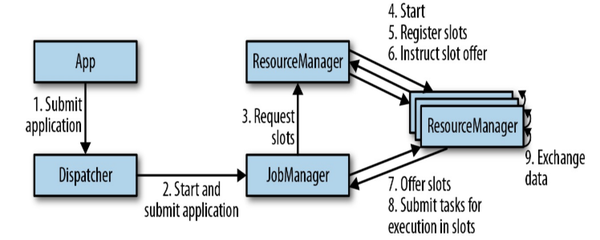
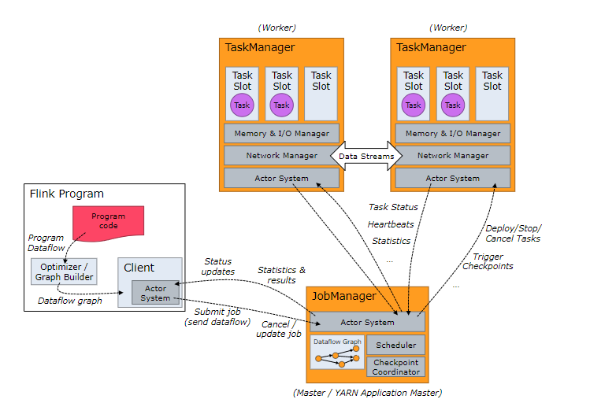

# Flink基本概念

## 一、flink核心概念

### 1. 简介

分布式流处理框架，能够对有界和无界的数据进行高效的处理。

流式 & 批式

### 2. 核心架构


- **api & libraries 层**

  ​	编程API，顶级类库。

- Runtime**核心层**

  ​	核心实现层，包括作业转换，任务调度，资源分配，任务执行等。

- 物理**部署层**

  ​	不同平台(本地、集群【standalone/yarn】、云【GCE/EC2】)部署flink应用。

### 3. flink集群架构

#### a) 核心组件：

**Runtime层**

采用标准的 **Master - Slave** 结构。



##### Master：

###### Dispatcher【调度员】

​	负责接收客户端提交的执行程序，并传递给JobManager。除此之外，还提供了WEB UI界面，用于监控作业执行情况。

###### ResourceManager【资源管理器】

​	负责管理 slots 并协调集群资源。ResourceManager 接收来自 JobManager 的资源请求，并将存在空闲 slots 的 TaskManagers 分配给 JobManager 执行任务。Flink 基于不同的部署平台，如 YARN , Mesos，K8s 等提供了不同的资源管理器，当 TaskManagers 没有足够的 slots 来执行任务时，它会向第三方平台发起会话来请求额外的资源。

###### JobManager【作业管理器】

​	称为masters。接收Dispatcher传递过来的<u>执行程序</u>（包含：作业图 (JobGraph)，逻辑数据流图 (logical dataflow graph) 及其所有的 classes 文件以及第三方类库 (libraries) 等等 ），紧接着 JobManagers 会将 JobGraph 转换为执行图 (ExecutionGraph)，然后向 ResourceManager 申请资源来执行该任务，一旦申请到资源，就将执行图分发给对应的 TaskManagers 。因此每个作业 (Job) 至少有一个 JobManager；高可用部署下可以有多个 JobManagers，其中一个作为 *leader*，其余的则处于 *standby* 状态。

##### Slave：

###### TaskManager【任务管理器】

​	称为workers。TaskManagers 负责实际的子任务 (subtasks) 的执行，每个 TaskManagers 都拥有一定数量的 slots。Slot 是一组固定大小的资源的合集 (如计算能力，存储空间)。TaskManagers 启动后，会将其所拥有的 slots 注册到 ResourceManager 上，由 ResourceManager 进行统一管理。

#### b) Task & SubTask

​	TaskManagers 实际执行的是`SubTask`，而不是 Task，这里解释一下两者的区别：

​	在执行分布式计算时，**Flink 将可以链接的操作 (operators) 链接到一起，这就是 Task**。之所以这样做， 是为了减少线程间切换和缓冲而导致的开销，在降低延迟的同时可以提高整体的吞吐量。 但不是所有的 operator 都可以被链接，如下 keyBy 等操作会导致网络 shuffle 和重分区，因此其就不能被链接，只能被单独作为一个 Task。 简单来说，一个 Task 就是一个可以链接的最小的操作链 (Operator Chains) 。如下图，source 和 map 算子被链接到一块，因此整个作业就只有三个 Task：


​	**SubTask，其准确的翻译是： *A subtask is one parallel slice of a task*，<u>即一个 Task 可以按照其并行度拆分为多个 SubTask</u>。**如上图，source & map 具有两个并行度，KeyBy 具有两个并行度，Sink 具有一个并行度，因此整个虽然只有 3 个 Task，但是却有 5 个 SubTask。Jobmanager 负责定义和拆分这些 SubTask，并将其交给 Taskmanagers 来执行，每个 SubTask 都是一个单独的线程。

#### c) 资源管理

理解了 SubTasks ，我们再来看看其与 **Slots** 的对应情况。一种可能的分配情况如下：


​	这时每个 SubTask 线程运行在一个独立的 <u>TaskSlot， 它们共享所属的 TaskManager 进程的TCP 连接（通过多路复用技术）和心跳信息 (heartbeat messages)，从而可以降低整体的性能开销。</u>此时看似是最好的情况，但是每个操作需要的资源都是不尽相同的，这里假设该作业 keyBy 操作所需资源的数量比 Sink 多很多 ，那么此时 Sink 所在 Slot 的资源就没有得到有效的利用。

基于这个原因，**Flink 允许多个 subtasks 共享 slots，即使它们是不同 tasks 的 subtasks，但只要它们来自同一个 Job 就可以。**

假设上面 souce & map 和 keyBy 的并行度调整为 6，而 Slot 的数量不变，此时情况如下：


​	可以看到一个 Task Slot 中运行了多个 SubTask 子任务，此时每个子任务仍然在一个独立的线程中执行，只不过共享一组 Sot 资源而已。

​	**那么 Flink 到底如何确定一个 Job 至少需要多少个 Slot 呢？Flink 对于这个问题的处理很简单，默认情况一个 Job 所需要的 Slot 的数量就等于其 Operation 操作的最高并行度。**如下， A，B，D 操作的并行度为 4，而 C，E 操作的并行度为 2，那么此时整个 Job 就需要至少四个 Slots 来完成。通过这个机制，Flink 就可以不必去关心一个 Job 到底会被拆分为多少个 Tasks 和 SubTasks。


#### d) 组件通讯

​	**Flink 的所有组件都基于 Actor System 来进行通讯。**Actor system是多种角色的 actor 的容器，它提供调度，配置，日志记录等多种服务，并包含一个可以启动所有 actor 的线程池，<u>如果 actor 是本地的，则消息通过共享内存进行共享，但如果 actor 是远程的，则通过 RPC 的调用来传递消息。</u>




## 二、状态化流处理

### 1. Flink 与 状态流

​	Flink采用分布式架构，因此<u>需要对本地状态予以保护，以避免应用或机器故障导致数据丢失</u>。Flink通过“定期将应用状态的一致性检查点`checkpoint`写入持久化存储”来实现该特性。

```shell
状态
状态一致性
检查点机制
```

### 2. 3种常见的状态化流处理应用

#### a) 事件驱动型应用

##### i. 概念

是一类通过**接收事件流触发特定应用业务逻辑**的<u>有状态的流式应用</u>。

##### ii. 典型场景

- 实时推荐（根据用户浏览数据实时进行产品推荐）
- 模式识别或复杂的事件处理（信用卡欺诈识别、反诈预警等）
- 异常检测（计算机网络入侵检测等）

##### iii. 与微服务对比

​	事件驱动型**本质是**<u>微服务的演变</u>。

【`微服务`通过REST调用进行通讯，利用事务型数据库或键值存储等外部系统存储数据。】

【`事件驱动型`利用事件日志进行通讯，其数据则以本地状态形式存储。】

​	优势：

1. 访问本地状态的性能必读写远程数据存储系统好。
2. 伸缩和容错由流式引擎完成。
3. 以事件日志（例如kafka）作为输入，不仅完整可靠，而且支持精准数据重放。
4. flink可以将应用状态重置到之前的某个检查点，从而允许应用在不丢失状态的前提下更新、扩缩容。

#### b) 数据管道

##### i. 概念

​	以低延迟的方式获取、转换并插入数据。（需要支持多样化的数据源、数据汇连接器，flink本身，及其衍生产品。）

##### ii. 典型场景

- 不同存储系统间同步数据。（使用事件日志系统分发更新。）【传统方式是定期执行ETL作业，但是延迟太高。】

#### c) 流式分析

##### i. 概念

​	为了应用能够实时收集并迅速相应。`流式分析`不需要等待周期性的触发。能够持续获取事件流，以极低的延迟整合最新事件，从而不断更新结果。（通常会把结果保存在某种支持高效更新的外部数据存储中，例如键值存储等）

##### ii. 典型场景

- 流处理（实时统计访问量，数据大屏等）【与之相对应的是**批处理**，批处理分析延迟高。】
  - 移动应用的用户分析。
  - 实时数据的即席分析。

##### iii. 与批处理相比

相较于批处理的优势：

1. 事件整合到分析结果的用时更短。
2. 流处理引擎会全面负责事件获取、维护状态的持续计算以及更新结果等步骤。
3. 精确一次的状态一致性保障进行故障恢复，调剂计算资源等。
