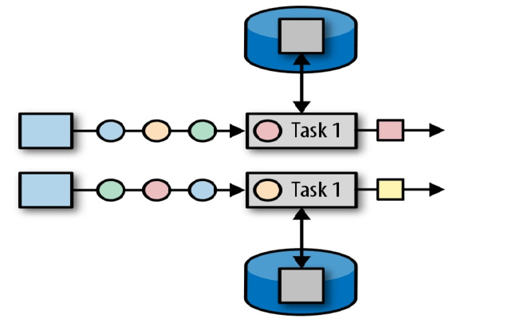
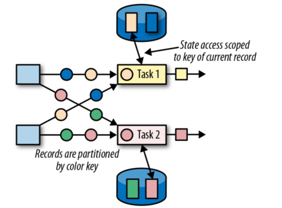
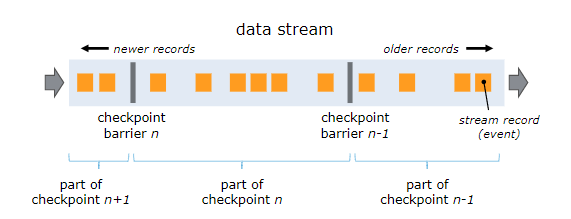
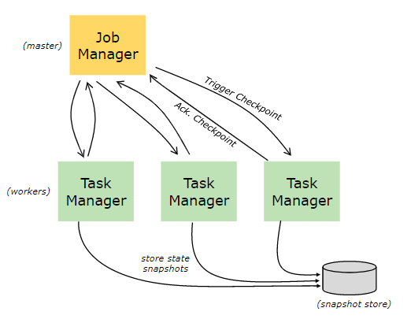

# Flink状态管理

## 一、状态分类

相对于其他流计算框架，Flink 一个比较重要的特性就是其支持有状态计算。即你可以将中间的计算结果进行保存，并提供给后续的计算使用：


具体而言，**Flink 又将状态 (State) 分为 (键控)Keyed State 与(算子)Operator State**：

### 算子状态

算子状态 (Operator State)：顾名思义，状态是和算子进行绑定的，一个算子的状态不能被其他算子所访问到。官方文档上对 Operator State 的解释是：*each operator state is bound to one parallel operator instance*，所以更为确切的说一个算子状态是与一个并发的算子实例所绑定的，即假设算子的并行度是 2，那么其应有两个对应的算子状态：



### 键控状态

键控状态 (Keyed State) ：是一种特殊的算子状态，即状态是根据 key 值进行区分的，Flink 会为每类键值维护一个状态实例。如下图所示，每个颜色代表不同 key 值，对应四个不同的状态实例。需要注意的是键控状态只能在 `KeyedStream` 上进行使用，我们可以通过 `stream.keyBy(...)` 来得到 `KeyedStream` 。



## 二、状态编程


## 三、检查点机制

### CheckPoints

为了使 Flink 的状态具有良好的容错性，Flink 提供了检查点机制 (CheckPoints) 。通过检查点机制，Flink 定期在数据流上生成 checkpoint barrier ，当某个算子收到 barrier 时，即会基于当前状态生成一份快照，然后再将该 barrier 传递到下游算子，下游算子接收到该 barrier 后，也基于当前状态生成一份快照，依次传递直至到最后的 Sink 算子上。当出现异常后，Flink 就可以根据最近的一次的快照数据将所有算子恢复到先前的状态。



### 开启检查点

默认情况下，检查点机制是关闭的，需要在程序中进行开启：

```
// 开启检查点机制，并指定状态检查点之间的时间间隔
env.enableCheckpointing(1000); 

// 其他可选配置如下：
// 设置语义
env.getCheckpointConfig().setCheckpointingMode(CheckpointingMode.EXACTLY_ONCE);
// 设置两个检查点之间的最小时间间隔
env.getCheckpointConfig().setMinPauseBetweenCheckpoints(500);
// 设置执行Checkpoint操作时的超时时间
env.getCheckpointConfig().setCheckpointTimeout(60000);
// 设置最大并发执行的检查点的数量
env.getCheckpointConfig().setMaxConcurrentCheckpoints(1);
// 将检查点持久化到外部存储
env.getCheckpointConfig().enableExternalizedCheckpoints(
    ExternalizedCheckpointCleanup.RETAIN_ON_CANCELLATION);
// 如果有更近的保存点时，是否将作业回退到该检查点
env.getCheckpointConfig().setPreferCheckpointForRecovery(true);
```

### 保存点机制

保存点机制 (Savepoints) 是检查点机制的一种特殊的实现，它允许你通过手工的方式来触发 Checkpoint，并将结果持久化存储到指定路径中，主要用于避免 Flink 集群在重启或升级时导致状态丢失。示例如下：

```
# 触发指定id的作业的Savepoint，并将结果存储到指定目录下
bin/flink savepoint :jobId [:targetDirectory]
```

更多命令和配置可以参考官方文档：[savepoints](https://ci.apache.org/projects/flink/flink-docs-release-1.9/zh/ops/state/savepoints.html)

## 状态后端

### 状态管理器分类

默认情况下，所有的状态都存储在 JVM 的堆内存中，在状态数据过多的情况下，这种方式很有可能导致内存溢出，因此 Flink 该提供了其它方式来存储状态数据，这些存储方式统一称为状态后端 (或状态管理器)：



主要有以下三种：

#### 1. MemoryStateBackend

默认的方式，即基于 JVM 的堆内存进行存储，主要适用于本地开发和调试。

#### 2. FsStateBackend

基于文件系统进行存储，可以是本地文件系统，也可以是 HDFS 等分布式文件系统。 需要注意而是虽然选择使用了 FsStateBackend ，但正在进行的数据仍然是存储在 TaskManager 的内存中的，只有在 checkpoint 时，才会将状态快照写入到指定文件系统上。

#### 3. RocksDBStateBackend

RocksDBStateBackend 是 Flink 内置的第三方状态管理器，采用嵌入式的 key-value 型数据库 RocksDB 来存储正在进行的数据。等到 checkpoint 时，再将其中的数据持久化到指定的文件系统中，所以采用 RocksDBStateBackend 时也需要配置持久化存储的文件系统。之所以这样做是因为 RocksDB 作为嵌入式数据库安全性比较低，但比起全文件系统的方式，其读取速率更快；比起全内存的方式，其存储空间更大，因此它是一种比较均衡的方案。

### 配置方式

Flink 支持使用两种方式来配置后端管理器：

**第一种方式**：基于代码方式进行配置，只对当前作业生效：

```java
// 配置 FsStateBackend
env.setStateBackend(new FsStateBackend("hdfs://namenode:40010/flink/checkpoints"));
// 配置 RocksDBStateBackend
env.setStateBackend(new RocksDBStateBackend("hdfs://namenode:40010/flink/checkpoints"));
```

配置 RocksDBStateBackend 时，需要额外导入下面的依赖：

```xml
<dependency>
    <groupId>org.apache.flink</groupId>
    <artifactId>flink-statebackend-rocksdb_2.11</artifactId>
    <version>1.9.0</version>
</dependency>
```

**第二种方式**：基于 `flink-conf.yaml` 配置文件的方式进行配置，对所有部署在该集群上的作业都生效：

```
state.backend: filesystem
state.checkpoints.dir: hdfs://namenode:40010/flink/checkpoints
```

