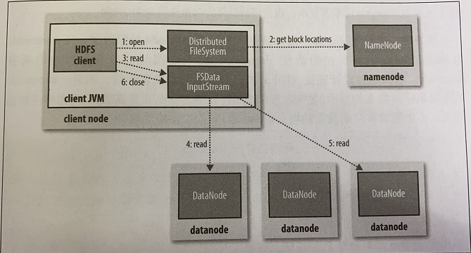
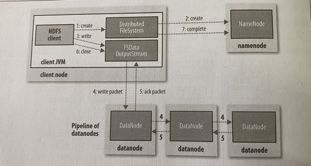

# 分布式文件系统 HDFS

## HDFS设计

## HDFS基本概念

## HDFS命令行接口

## Java接口

## 数据流

### 剖析文件读取

1. 步骤 1：客户端通过调用**FileSyste对象**的open()方法打开希望读取的文件。
   1. 在HDFS中这个对象是<u>DistributedFileSystem的一个实例</u>。
2. 步骤 2：DistributedFileSystem通过使用远程调用(RPC)来调用namenode，以确定文件的**起始块**位置。
   1. 对于每一个块，namenode 返回存有该块复本的datanode地址。
   2. 这些datanode根据它们与客户端的距离来排序(根据几群的网络拓扑)。
   3. 如果该客户端本身就是一个datanode（比如，在一个MapReduce任务中），那么客户端将会从保存有相应数据块复本的本地datanode读取数据。
3. DistributedFileSystem 返回 一个 `FSDataInpuStream` 对象（一个支持文件定位的输入流）给客户端以便读取数据。
   1. `FSDataInputStream`类转而封装DFSInputStream对象，该对象管理着datanode和namenode的I/O。
4. 步骤 3：客户端对输入流调用read()方法。
   1. 存储着**文件起始几个块**的datanode地址的DFSInputStream 随即连接<u>距离最近的文件中的第一个块</u>所在的datanode。
   2. 步骤 4：通过对数据流反复调用read()方法，可以将数据从datanode传输到客户端。
   3. 步骤 5：到达块末端时，DFSInputStream关闭与该datanode的连接，然后寻找下一个块的最佳datanode。
   4. 所有这些操作对客户端都是透明的，在客户端看来它一直在读取一个而连续的流。
5. 步骤 6 ：客户端从流中读取数据的时候，块是按照打开DFSInputStream 与 datanode 新建连接的顺序读取的。它也会根据需要询问namenode来检索下一批数据块的datanode的位置。<u>一旦客户端完成读取，就对`FSDataInputStream`调用close()方法</u>。
6. 在读取数据的时候，如果DFSInputStream在与datanode通信时遇到错误：
   1. 会尝试从这个块的另外一个最邻近datanode读取数据。
   2. 记住故障的datanode，以保证以后不会反复读取该节点上后续的块。
7. DFSInputStream会通过校验和确认datanode发来的数据是否完整。如果发现有损坏：
   1. DFSInputStream试图从其他datanode读取其复本。
   2. 将被损坏的块通知给namenode。

**设计重点**：

- 客户端可以直接连接到datanode检索数据，并且namenode告知客户端每块所在的最佳datanode。
  - 数据流分散在集群中的所有datanode，所以这种设计能使HDFS扩展到大量的并发客户端。
- namenode只需要相应相应块位置的请求（这些数据存储在内存中，非常高效），无需相应数据请求。

### 剖析文件写入

1. 步骤 1：客户端通过对DistributedFileSystem对象调用create()来新建文件。
2. 步骤 2：DistributedFileSystem对namenode创建一个RPC调用，在文件系统的命名空间中新建一个文件，此时文件还没有相应的数据块。
   - namenode执行各种不同的检查以确保这个文件不存在以及客户端有新建该文件的权限。
   - 如果各项检查均通过，namenode就会为创建新文件记录一条记录；否则，文件创建失败并向客户端抛出一个IOException异常。
3. DistributedFileSystem 向客户端返回一个FSDataOutputStream 对象，由此客户端可以开始写入数据。
   - FSDataOutputStream 封装一个 `DFSoutPutstream`对象。<u>该对象</u>负责处理datanode和namenode之间的通信。
4. 步骤 3：在客户端写入数据时：
   - `DFSoutPutstream`将它们分成一个个的数据包，并写入内部队列，称为“**数据队列**（data queue）”。
   - DataStreamer 处理数据队列，它的责任是 <u>负责挑选出适合存储**数据复本**的一组datanode</u>，并据此<u>要求namenode分配新的数据块</u>。
   - 这一组datanode构成一个管线（假设复本数为3，那么管线就有3个节点）。
     - 步骤 4：DataStreamer将数据包流式传输到管线中的第一个datanode，该datanode存储数据包并将它发送到管线中第二个datanode。同样，第二个datanode存储数据包并将它发送到第三个datanode（也是最后一个）。
5. 步骤 5：`DFSoutPutstream`维护着一个<u>内部数据包队列</u>来等待datanode的收到确认回执，称为“**确认队列**（ack queue）”。
   - 收到管道中所有datanode确认消息后，该数据包才会从确认队列删除。
6. 如果任何datanode 在数据写入期间发生故障，则执行一下步骤：
   - 首先关闭管线，确认把队列中的所有数据包都添加回数据队列的最前端，以确保故障节点下游datanode不会漏掉任何一个数据包。
   - 为存储在另一个正常datanode的当前数据块指定一个新的标识，并将该标识传递给namenode，以便故障的datanode在恢复后可以删除存储的部分数据块。
   - 从管线删除故障的datanode，基于两个正常的datanode构建一条新的管线。余下的数据块写入管线中正常的datanode。
   - namenode注意到复本块不足时，会在另一个节点上创建一个新的复本。后续的数据块，继续正常接受处理。
7. 

## 通过distcp并行复制