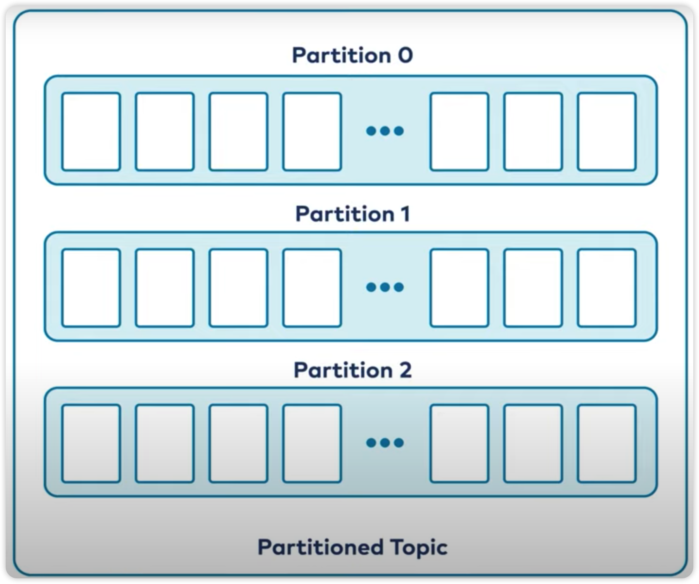
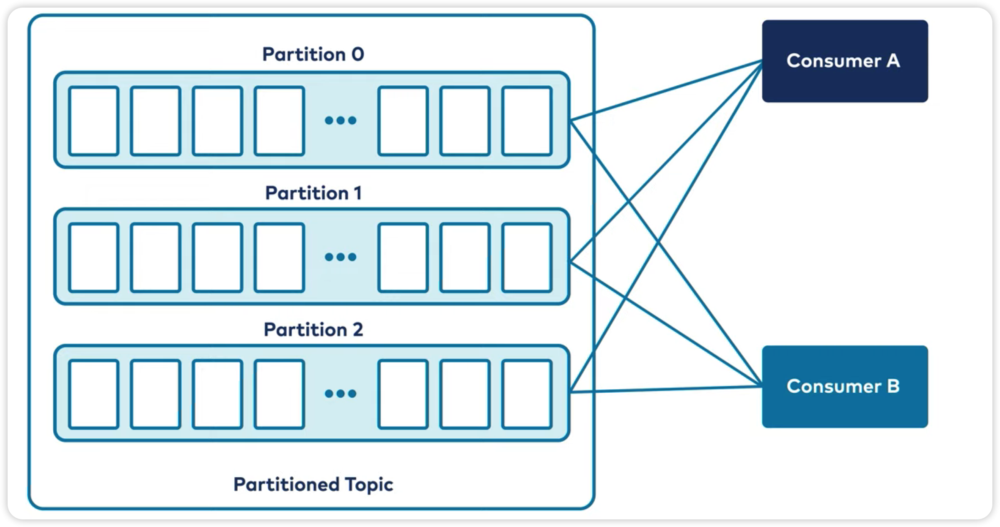
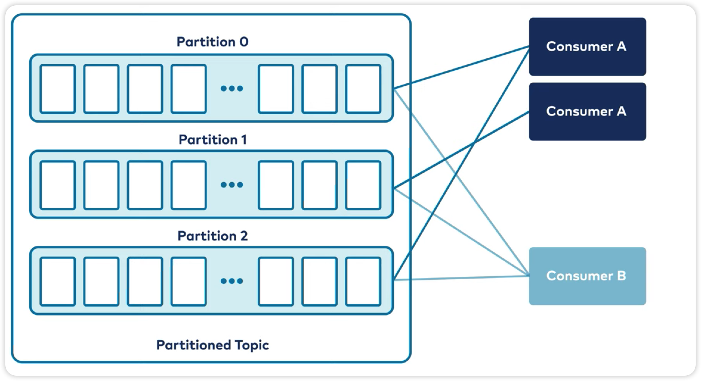

# Kafka 基础

## Topic 主题

- 主题是一系列事件的容器。
  - 系统可以包含多个主题。
  - 可以在主题之间复制数据。
- 主题是事件的日志。`LOG`
  - 事件数据是追加的。
  - 只能通过查找日志中的任意偏移量，然后顺序扫描日志、读取日志。（没有索引）
- 日志中的事件是不可变的。`immutable`
  - 复制更加容易。（因为事件不可变）
  - 性能影响更小。（事件不可变，不用考虑修改）

作为kafka主题基础的日志，它们是存储在磁盘上的文件。日志这种简单的数据结构和其内容的不变性是kafka取得成功的关键。

## partition 分区

kafka是一个分布式系统，分区可以让kafka容易扩展。（便于存储跨集群的多个节点）

  

- 首先，Kafka使用主题来组织数据，<u>每个主题可以被分为若干个**分区**</u>，每个分区可以有多个副本。
- 然后，写入的消息通过key来决定发送到哪个分区。
  - 没有key：将轮训的发送到各个分区。
  - 有key：通过散列函数计算最终发往得到的分区中。

**kafka保证相同key的消息，始终位于同一分区**。因此同一个key的数据在这个分区是始终是有序的。

因此可以通过控制key来控制某个事件的有序性。（读取该分区数据时，将会有序读取）

## brokers 代理

Kafka由一组称为Broker的机器网络组成。

- Broker是运行在一个物理服务器、云实例或容器上的kafka进程。
- 管理一组分区。
- 处理分区的读写请求。
- 处理分区之间的复制。

## Replication 副本

通过将分区数据复制到其他几个broker保证数据的安全。

-  数据副本用于容错。
- 有一个领导者副本和N-1个跟随者副本。
- 通常，生成数据到分区或从分区读取数据是与领导者副本在交互。（对使用者来说是一个看不见的过程）
- 可以调节写入的不同持久性保证。

## Producers 生产者

生产者将决定消息发往哪个分区。

要关心的东西很多：

- 客户端应用程序
- 管理 连接池
- 进行 网络缓冲
- 将消息放入主题
- 等待broker确认消息，以便释放缓冲空间
- 必要时，重新传输消息
- 其他等等细节

## Consumers 消费者

kafka消费者：

1. 读取消息不会破坏消息，其他消费者也可以读取消息。
2. 添加、删除消费者组实例时，kafka会触发平衡过程，调节消费情况。（调节消费者组id的参数）
   - 10个分区最多分配10个消费者组实例。（再多的消费者组实例将会空闲）
3. 在topic中，你可以通过分区保证数据的有序性，但是同时将会牺牲扩展消费者的能力。

要关心的东西很多：

- 客户端应用程序
- 从topics读取消息
- 连接线程池
- 网络缓冲
- 水平和弹性可扩展
- 大规模维护分区内的顺序

