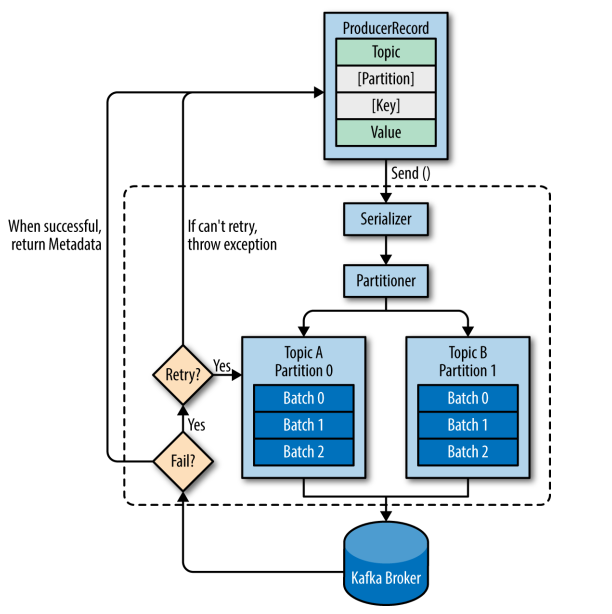

# Kafka生产者

## 一、生产者发送消息的过程

kafka生产者发送消息的过程:

- Kafka 会将发送消息包装为 ProducerRecord 对象， ProducerRecord 对象包含了目标主题和要发送的内容，同时还可以指定键和分区。在发送 ProducerRecord 对象前，生产者会先把键和值对象序列化成字节数组，这样它们才能够在网络上传输。
- 接下来，数据被传给分区器。如果之前已经在 ProducerRecord 对象里指定了分区，那么分区器就不会再做任何事情。如果没有指定分区 ，那么分区器会根据 ProducerRecord 对象的键来选择一个分区，紧接着，这条记录被添加到一个记录批次里，这个批次里的所有消息会被发送到相同的主题和分区上。有一个独立的线程负责把这些记录批次发送到相应的 broker 上。
- 服务器在收到这些消息时会返回一个响应。如果消息成功写入 Kafka，就返回一个 RecordMetaData 对象，它包含了主题和分区信息，以及记录在分区里的偏移量。如果写入失败，则会返回一个错误。生产者在收到错误之后会尝试重新发送消息，如果达到指定的重试次数后还没有成功，则直接抛出异常，不再重试。



## 二、创建生产者

### 3.1项目依赖

采用 Maven 构建，想要调用 Kafka 生产者 API，需要导入 `kafka-clients` 依赖，如下：

```
<dependency>
    <groupId>org.apache.kafka</groupId>
    <artifactId>kafka-clients</artifactId>
    <version>2.2.0</version>
</dependency>
```

### 3.2创建生产者

创建 Kafka 生产者时，以下三个属性是必须指定的：

- **bootstrap.servers** ：指定 broker 的地址清单，清单里不需要包含所有的 broker 地址，生产者会从给定的 broker 里查找 broker 的信息。不过建议至少要提供两个 broker 的信息作为容错；
- **key.serializer** ：指定键的序列化器；
- **value.serializer** ：指定值的序列化器。

```java
import org.apache.kafka.clients.producer.KafkaProducer;
import org.apache.kafka.clients.producer.Producer;
import org.apache.kafka.clients.producer.ProducerRecord;

import java.util.Properties;

public class SimpleProducer {
    public static void main(String[] args) {
        String topicName = "Hello-Kafka";
        Properties props = new Properties();
        props.put("bootstrap.servers", "hadoop01:9092");
        props.put("key.serializer", "org.apache.kafka.common.serialization.StringSerializer");
        props.put("value.serializer", "org.apache.kafka.common.serialization.StringSerializer");
        /*创建生产者*/
        Producer<String, String> producer001 = new KafkaProducer<String, String>(props);
        for(int i= 0;i<20;i++){
            ProducerRecord<String,String> record = new ProducerRecord<String, String>(topicName,"key"+i,"value"+i);
            producer001.send(record);
        }
        producer001.close();
    }
}
```


## 三、发送消息

`send` 方法发送消息后没有做任何操作，在这种情况下，我们没有办法知道消息发送的结果。想要知道消息发送的结果，可以使用同步发送或者异步发送来实现。

### 3.1同步发送

在调用 `send` 方法后可以接着调用 `get()` 方法，`send` 方法的返回值是一个 Future<RecordMetadata>对象，RecordMetadata 里面包含了发送消息的主题、分区、偏移量等信息。改写后的代码如下：

```java
        /*创建生产者*/
        Producer<String, String> producer001 = new KafkaProducer<String, String>(props);
        for(int i= 20;i<40;i++){
            ProducerRecord<String,String> record = new ProducerRecord<String, String>(topicName,"key"+i,"value"+i);
            try {
              //发送消息，并拿到返回值对象recordMatedata
                RecordMetadata recordMetadata = producer001.send(record).get();          		  								System.out.println(recordMetadata.topic()+"--"+recordMetadata.partition()+"--"+recordMetadata.offset());
            } catch (InterruptedException e) {
                e.printStackTrace();
            } catch (ExecutionException e) {
                e.printStackTrace();
            }
        }
```

### 3.2异步发送

通常我们并不关心发送成功的情况，更多关注的是失败的情况，因此 Kafka 提供了异步发送和回调函数。 代码如下：

```java
        for(int i= 100;i<200;i++){
            ProducerRecord<String,String> record = 
              new ProducerRecord<String, String>(topicName,"key"+i,"value"+i);
            producer001.send(record, new Callback() {
                public void onCompletion(RecordMetadata metadata, Exception exception) {
                    if(null != exception){
                        System.out.println("处理异常");
                    }else{
                        System.out.println(metadata.topic()+"--"+metadata.partition()+"--"+metadata.offset());

                    }
                }
            });
```

## 四、自定义分区器

Kafka 有着默认的分区机制：

- 如果键值为 null， 则使用轮询 (Round Robin) 算法将消息均衡地分布到各个分区上；
- 如果键值不为 null，那么 Kafka 会使用内置的散列算法对键进行散列，然后分布到各个分区上。

某些情况下，你可能有着自己的分区需求，这时候可以采用自定义分区器实现。这里给出一个自定义分区器的示例：

```java
/**
 * 自定义分区器
 */
public class CustomPartitioner implements Partitioner {

    private int passLine;

    @Override
    public void configure(Map<String, ?> configs) {
        /*从生产者配置中获取分数线*/
        passLine = (Integer) configs.get("pass.line");
    }

    @Override
    public int partition(String topic, Object key, byte[] keyBytes, Object value, 
                         byte[] valueBytes, Cluster cluster) {
        /*key 值为分数，当分数大于分数线时候，分配到 1 分区，否则分配到 0 分区*/
        return (Integer) key >= passLine ? 1 : 0;
    }

    @Override
    public void close() {
        System.out.println("分区器关闭");
    }
}
```

需要在创建生产者时指定分区器，和分区器所需要的配置参数：

```java
public class ProducerWithPartitioner {

    public static void main(String[] args) {

        String topicName = "Kafka-Partitioner-Test";

        Properties props = new Properties();
        props.put("bootstrap.servers", "hadoop001:9092");
        props.put("key.serializer", "org.apache.kafka.common.serialization.IntegerSerializer");
        props.put("value.serializer", "org.apache.kafka.common.serialization.StringSerializer");

        /*传递自定义分区器*/
        props.put("partitioner.class", "com.heibaiying.producers.partitioners.CustomPartitioner");
        /*传递分区器所需的参数*/
        props.put("pass.line", 6);

        Producer<Integer, String> producer = new KafkaProducer<>(props);

        for (int i = 0; i <= 10; i++) {
            String score = "score:" + i;
            ProducerRecord<Integer, String> record = new ProducerRecord<>(topicName, i, score);
            /*异步发送消息*/
            producer.send(record, (metadata, exception) ->
                    System.out.printf("%s, partition=%d, \n", score, metadata.partition()));
        }

        producer.close();
    }
}
```

## 五、生产者其他属性

### 1.acks

这个参数指定了必须要多个分区副本收到消息，生产者才认为消息是写入成功的。「对消息丢失的可能性有重要影响」

- 0

生产者在成功写入消息之前不会等待任何来自服务器的响应。

如果出现了问题，导致服务器没有收到消息，那么生产者也就无从得知，消息也就丢失了。

但是，因为不需要等待服务器响应，所以可以以网络能够支持的最大速度发送消息，从而达到很高的吞吐量。

- 1

只要集群的首领节点收到消息，生产者就会收到一个来自服务器的成功响应。

如果消息无法到达首领节点（比如首领节点崩溃）生产者就会收到一个错误响应，为了避免消息丢失，生产者会重发消息。不过如果一个没有收到消息的节点成为新首领，消息还是会丢失。

此时，吞吐量取决于使用的是同步发送还是异步发送。如果让客户端等待服务器响应，显然会增加延迟。如果让客户端使用回调，延迟问题就会得到缓解，但是还是会受到发送消息数量的限制。

- all

只有当所有参与复制的节点都受到消息时，生产者才会收到一个来自服务器的成功响应。

可以保证不止一个服务器收到消息，就算有服务器崩溃，整个集群仍然可以运行。但是延迟高，因为需要等待所有服务器接收消息。

### 2.buffer.memory

<u>设置生产者内存缓冲区大小，生产者用它缓冲要发送到服务器的消息。</u>

如果程序发送消息的速度超过发送到服务器的速度，会导致生产者内存不足。这个时候send()方法要么被阻塞，要么抛出异常，取决于如何设置block.no.buffer.full参数（在0.9.0.0被替换成了max.block.ms表示异常前可以阻塞一段时间）

### 3.compression.type

指定了发送消息给broker前使用哪一种压缩算法。可以设置为snappy、gzip、lz4。默认不会被压缩。

使用压缩可以降低网络传输开销和存储开销，这往往是向kafka发送消息的瓶颈所在。

### 4.retries

<u>决定了生产者可以重发消息的次数，如果达到这个次数，生产者会放弃重试并返回错误。</u>

可以通过设置retry.backoff.ms参数来改变这个时间间隔。

建议在设置重试次数和重试间隔前，先测试一下恢复一个崩溃节点需要多久（比如分区选举出首领需要多长时间）让总的尝试时间比kafka集群从崩溃中恢复时间长，否则生产者过早的放弃重试。

有些错误不是临时性错误，不能通过重试来解决，比如消息太大。

一般情况下，你只需要处理不可重试错误或者重试次数超过上限的情况，而那些可重试错误，生产者会自动进行重试。

### 5.batch.size

当有多个消息需要被发送到同一个分区时，生产者会把它们放在同一个批次里。

<u>参数指定了一个批次可以使用的内存大小，按照字节数计算（不是消息个数）。当批次被填满时，批次里的消息会被发送出去。</u>

不过，生产者不一定都会等到批次被填满才发送，半满的批次甚至包含一个消息的批次也会被发送。所以就算批次大小设置的很大，也不会造成延迟，只是会占用更多的内存而已。如果批次设置太小，因为生产者需要频繁的发送消息，会增加一些额外的开销。

### 6.linger.ms

<u>指定了生产者在发送批次前，等待更多消息加入批次的时间。</u>

KafkaProducer会在批次填满或linger.ms达到上限时把批次发送出去。

默认情况下，只要有可用的线程，生产者就会把批次发送出去，就算批次里只有一个消息。

把linger.ms设置成比0大大数，让生产者在发送批次前等待一会，使更多的消息加入到批次里，这样虽然增加了延迟，但是也会提升吞吐量（因为一次发送更多消息，每个消息的开销就变小了）

### 7.client.id

<u>服务器用这个来标识消息来源</u>，还可以用在日志和配额指标里。

该参数可以是任意字符串。

### 8.max.in.flight.requests.per.connection

<u>指定了生产者在收到服务器响应前可以发送多少消息</u>。

值越高，就会占用越多内存，不过也会提升吞吐量。

设置成1，可以保证消息是按照发送的顺序写入服务器的，即使发生了重试。

### 9.timeout.ms,request.timeout.ms & metadata.fetch.timeout.ms

- **timeout.ms**

指定了broker等待同步副本返回消息确认的时间，与acks的配置相匹配。

如果指定时间没有收到同步副本的确认，broker就会返回一个错误。

- **request.timeout.ms**

指定了生产者在发送数据时等待服务器返回响应的时间。

- **metadata.fetch.timeout.ms**

指定了生产者在获取元数据（比如目标分区首领是谁）时等待服务器返回响应的时间。

### 10.max.block.ms

<u>指定了在调用send()方法或者使用partitionsFor()方法获取元数据时生产者的阻塞时间。</u>

当生产者的发送缓冲区已满，或者没有可用元数据时，这些方法就会阻塞。在阻塞时间到达max.block.ms时，就会抛出超时异常。

### 11.max.request.size

控制生产者发送的请求大小。可以是发送单个消息的最大值，也可以指请求里所有消息的总大小。

比如设置为1MB，那么可以发送单个最大消息是1MB，或者生产者可以在单个请求里发送一个批次，该批次包含1000个消息，每个消息大小是1KB。

注意⚠️：broker对可接收的消息最大值也有自己的限制（message.max.bytes），所以两边配置最好可以匹配，避免生产者发送消息被broker拒绝。

### 12.receive.buffer.bytes & send.buffer.byte

分别指定TCP socket接收和发送数据包的缓冲区大小。如果它们被设置成-1，就是使用系统默认值。

如果生产者和消费者分别处在不同的数据处理中心，那么可以适当的增大这些值，因为跨数据中心往往有比较高的延迟和比较低的带宽。