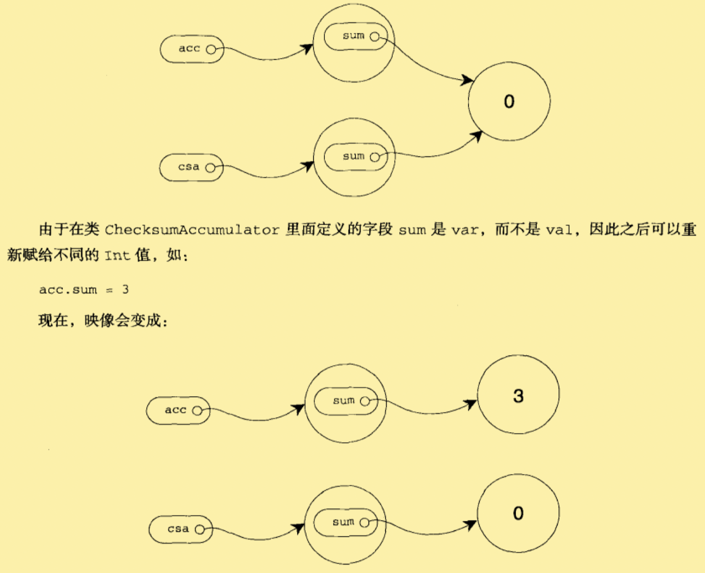

# 类与对象

## 类、字段和方法「class」

类是对象的蓝图。

- 一旦定义了类，就可以使用关键字new根据类的蓝图创建对象。
- 类的定义里，可以放置字段和方法，这些被笼统的成为成员（number）。
  - 字段，不管是val还是var定义的，都是指向对象的变量。
  - 方法，用def定义，包含了可执行的代码。
  - 字段保留了对象的状态或数据，而方法使用这些数据来执行对象的运算工作。

- 当类被实例化的时候，运行时环境会预留一些内存来保留对象的状态映像——即变量的内容。

```scala
class ChecksumAccmulator {
  var sum = 0
}
//定义ChecksumAccmulator类，并内置名为sum的var字段
val acc = new ChecksumAccmulator
val csa = new ChecksumAccmulator
//实例化了两次
```

在内存中是这样的：



注意：

1. acc是val的，所以不能再次赋值为其他对象。它始终指向初始化时候的CheaksumAccumulator对象。	

   ```scala
   //	val acc = new ChecksumAccmulator 定义的时候是val来定义的对象。
   acc = new ChecksumAccmulator
   //编译不通过，以为acc是val的
   ```

2. 但是内部包含的字段是可以改动的。

   ​	--如果方法内部的字段是val定义的，就不能改动。


**保持程序健壮性的重要方法之一就是保证对象的状态——也就是实例变量的值——在对象的整个生命周期中持续有效。**

- 将字段变为私有的（private）以阻止外界直接对它的访问，因为私有字段只能被定义成在同一个类里的方法访问，所有能跟新字段的代码将被锁在类里。

```scala
//定义类，类中的sum字段是private声明的
scala> class ChecksumAccmulator {
     | private var sum = 0
     | }
defined class ChecksumAccmulator

//创建ChecksumAccmulator对象accx
scala> val accx = new ChecksumAccmulator
accx: ChecksumAccmulator = ChecksumAccmulator@6ad5c04e

//从类ChecksumAccmulator外部访问sum,失败！ 因为sum是私有的（private）
scala> accx.sum = 5
<console>:15: error: variable sum in class ChecksumAccmulator cannot be accessed in ChecksumAccmulator
val $ires1 = accx.sum
                  ^
<console>:13: error: variable sum in class ChecksumAccmulator cannot be accessed in ChecksumAccmulator
       accx.sum = 5
            ^
// 唯一能访问sum的方法，都定义在类的内部。
```

- Scala的默认访问级别是Public。（即不显式的指定任何修饰符就代表成员公开）
- 传递给方法的任何参数都可以在方法内部使用。**它们（方法参数）都是val的**，如果你想在方法内部重新给参数赋值，会导致编译失败。

```scala
scala> class ChecksumAccmulator {
     |  private var sum = 0
     |	//注意！！！这里的参数b是val类型的。
     |  def add(b:Int):Unit = {
     |   sum += b
     |  }
     |  def checkSum():Int = {
     |   return sum
     |  }
     |  }
defined class ChecksumAccmulator

scala> val acc = new ChecksumAccmulator
acc: ChecksumAccmulator = ChecksumAccmulator@2ed94a8b

//外部直接访问，失败！
scala> acc.sum
<console>:14: error: variable sum in class ChecksumAccmulator cannot be accessed in ChecksumAccmulator
       acc.sum
           ^
//通过类方法访问，成功～
scala> acc.checkSum
res1: Int = 0

scala> acc.add(5)

scala> acc.checkSum
res3: Int = 5

/*******************************它们（方法参数）都是val的************************************************/
scala>  class ChecksumAccmulator {
     | private var sum = 0
     | def add(b:Int):Unit = {
     | 	//这里编译会失败，因为方法参数是val类型的不能重新赋值。
     |  b = 1	
     |  sum += b
     | }
     | def checkSum():Int = {
     |  return sum
     | }
     | }
<console>:14: error: reassignment to val
        b = 1
          ^
```

- 方法的推荐风格是避免使用返回语句，尤其是多条件返回。推荐把每个方法当作是创建返回值的表达式。将大的方法分解为小方法。

- 如果没有显式的返回语句，Scala方法将返回最后一次计算得到的值。

- 容易出错的地方：如果去掉了方法体前面的等号，那么方法的结果类型必定是Unit。
  
  ```scala
  //对于结果类型为Unit的方法来说，执行目的就是为了它的副作用。
  // add方法的副作用就是为sum重新赋了值。
  def add(b:Int):Unit = { sum += b }
  ------------------------
  //可以去掉 结果类型和等号，把方法体放在 花括号中。
  //这样方法看上去像一个过程，一种仅为了副作用而执行的方法。
  def add(b:Int) { sum += b }
  ```
  
  - 如果方法最后结果是String，但结果类型声明为Unit，那么String将被转变为Unit并丢弃原值。


## 分号推断

**Scala中，语句末尾的分号通常是可选的。不过，如果一行包含多条语句时，分号则是必须的。**

```scala
scala> val m = "why" ; println(m)
why
m: String = why
```

### 分号推断的规则：

除非以下情况的一种成立，否则行尾被认为是一个分号：

1. 疑问行由一个不能合法作为语句结尾的字结束，如句点或中缀操作符。
2. 下一行开始于不能作为语句开头的词。
3. 行结束于括号(...)或方框[...]内部，因为这些符号不可能容纳多个语句。


## Singleton对象「object」

Scala比Java更为面向对象的特点之一是**Scala不能定义静态成员**，而代之以定义`单例对象（singleton object）`。

**可以把单例对象当作是Java中可能会用到的静态方法工具类。**

- 除了用object关键字替换了class关键字以外，单例对象的定义看上去于类的定义一致。
- **当单例对象与某个类共享同一个名称时，它就被称为这个<u>类的伴生对象</u>。**
  - 类和它的伴生对象必须定义在同一个源文件里。
  - 类被称为单例对象的伴生类。
  - 类和它的伴生对象可以互相访问其私有成员。
- new关键字只能用来实例化类，所以`val a = new A`创造的是A类的一个实例，而不是同名的单例对象。
- 单例对象并没有定义类型。
  - 单例对象的类型是由单例对象的伴生类定义的。
- 类和单例对象的差别是：
  - 单例对象不带参数，而类可以。因为单例对象不使用new关键字来实例化的，所以没机会传递给它实例化参数。
  - 每个单例对象都被实现为虚构类的实例，并指向静态的变量，因此它们与Java静态类有着相同的初始化语义。
  - 单例对象在第一次被访问的时候才会被初始化。
- 不与伴生类共享名称的单例对象被称为`独立对象`。
  - 可以作为相关方法的工具类
  - 可以定义Scala应用的入口

### Scala程序

为了编写能够独立运行的Scala程序，就必须创建**有main方法**（仅带一个参数Array[String],且结果类型为Unit）的**单例对象**。

```scala
object echo{
  def main(args:Array[String]){
    //代码
  }
}
```


## Application特质

Scala提供了特质`scala.Application`，可以减少一些输入工作。

​	--scala 2.9 之后废弃了Application而使用App

```scala
scala> object Test2 extends App {
     | val value = "scala 使用App代替了Application"
     | println(value)
     | }
defined object Test2
```


### 缺点：

1. 如果想访问命令行参数就不能用它，因为args数组不可访问。
2. 因为某些JVM线程模型里的局限，对于多线程的程序需要自行编写main方法。
3. 某些JVM的实现没有优化被Application特质执行的对象的初始化代码。

**因此，只有程序相对简单并且是单线程的情况下，才可以继承Application特质。**