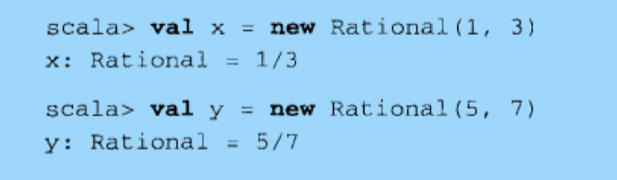

# 函数式对象

**不具有任何可改变状态的对象的类。**

创建有理数（rational）作为不可变对象来建模的类版本，去说明函数式对象。

## 类Rational的说明

​	`有理数`是一种可以表达为比率的数字，分母不为0；和浮点数相比，有理数能够将小数部分完全表达，没有舍入或估算。数学上，有理数不具有可变状态，有理数可以相加，但结果是新的有理数，原来的数不会改变。

​	要求：设计的类必须建模有理数的行为，包括允许加、减、乘、除运算。

## 创建Rational

如果我们要求Rational对象是不可变的，我们将需要在创建实例的时候就提供所有的数据（对有理数来说，是分子和分母）。

```scala
class Rational(n:Int,d:Int)
```

1. 如果类没有主体，我们可以不指定一对空的花括号。
2. 类名后面的括号里的n、d被称为**`类参数`**。
3. 编译器会收集这两个类参数并创造出带同样的两个参数的**`主构造器`**。

- 与Java的不同
  - Scala的类可以直接带参数。
  - Java的类是通过带参数的构造器实现的。
- Scala编译器将类内部的任何既不是字段也不是方法定义的代码编译至主构造器中。

```scala
class Rational(n:Int,d:Int){
  println("Created "+n+"/"+d)
}
//Scala会将println调用放进Rational的主构造器中。
//因此，每次创建新的Rational实例时候，都会调用println并打印。
```

- 不可变对象的权衡（62）

## 重新实现toString方法

​	默认情况下，Rational类继承了java.lang.Object类的toString实现，只会打印类名、@符号和十六进制数。

​	toString的结果主要可以用在除错打印语句、日志消息、测试错误报告，经由解释器或除错器输出的信息，以辅助程序员分析问题。

​	为了能够打印出Rational的有效信息（分子和分母），我们可以`重载（override）`Rational类的toString方法实现。

```scala
class Rational(n:Int,d:Int){
  override def toString = n+"/"+d
}
```



## 检查先决条件

​	我们说过，对于有理数来说，分母不能为0。然而现在主构造器会接受0并传递给d。

```scala
new Rational(5,0)
//通过，结果为5/0
```

​	**我们需要保证创建对象时候，数据的有效性（由于0对于有理数来说是无效的，那么我们需要保证0传递给d的时候，不能让Rational被构造出来）。**

​	解决办法：

为构造器定义**`先决条件`**。

先决条件是对传递给方法或者构造器值的限制，是调用者必须满足的需求。这里使用**`require方法`**。

```scala
class Rational(n:Int,d:Int){
  require(d!=0)
  override def toString = n+"/"+d
}
//require方法：
//带一个布尔型参数，如果参数为true，require将正常返回；如果参数为false，reuqire将抛出IllegalArgumentException阻止对象被构造。
```

## 添加字段

为Rational添加加法功能的实现。

```scala
class Rational(n:Int,d:Int){//编译器会报错！！！
  require(d!=0)
  override def toString = n +"/"+ d
  def add(that:Rational):Rational={
    new Rational(n*that.d+that.n*d,d*that.d)
  }
}
```

**编译器会报错：**

1. add方法只能访问调用对象自身的值。因此当add访问n、d的时候，编译器能够提供这些类参数值。但是对于that.n、that.d则无法访问，因为taht不是调用add的Rational对象。

**解决办法：**

1. 如果想要访问that的n、d，需要把它们放在字段中！

```scala
class Rational(n:Int,d:Int){//成功编译！
  require(d!=0)
  val numer:Int = n
  val denom:Int = d
  //添加了两个字段，并用类参数n、d初始化
  override def toString = numer +"/"+ denom
  def add(that:Rational):Rational={
    new Rational(
      numer*that.denom + that.numer*denom,
      denom*that.denom
    )
  }
}
//toString和add方法使用字段，而不是类参数，成功编译！！
```

- toString和add方法使用字段，而不是类参数，成功编译！！

- 将类参数交给字段之后，便可以在对象外部直接访问它们。

## 自指向

​	**`关键字this`**指向当前执行方法被调用的对象的实例，或者如果在构造器里的话，就是正在被构造的对象实例。有时候可以省略。

一个不能省略的例子：

```scala
def max(that:Rational) = if(this.lessThan(that)) that else this
//最后的this不能省略，省略了就什么都不返回
```

## 辅助构造器

​	有时候一个类里需要多个构造器。Scala里主构造器之外的构造器被称为`辅助构造器`

```scala
class Rational(n:Int,d:Int){
  require(d!=0)
  val numer:Int = n
  val denom:Int = d
  
  def this(n:Int) = this(n,1)
  //辅助构造器！！！
  
  override def toString = numer +"/"+ denom
  def add(that:Rational):Rational={
    new Rational(
      numer*that.denom + that.numer*denom,
      denom*that.denom
    )
  }
}
```

- 辅助构造器定于开始于`def this()`。
- Scala里每一个辅助构造器的<u>第一个动作都是调用同类的别的构造器</u>，换句话说，每个Scala类的每个辅助构造器都是以`this(...)`形式开头的。
- 被调用的构造器既可以是主构造器也可以是源文件中早于调用构造器定义的其他辅助构造器。不过<u>最终将结束于主构造器</u>。
- 因此，**主构造器是类的唯一入口点**。

## 私有字段和方法

```scala
class Rational(n:Int,d:Int){
  require(d!=0)
  private val g = gcd(n.abs,d.abs)
  //私有字段：获取最大公约数
  val numer:Int = n/g
  val denom:Int = d/g
  //分子分母同时除以最大公约数
  def this(n:Int) = this(n,1)
  override def toString = numer +"/"+ denom
  def add(that:Rational):Rational={
    new Rational(
      numer*that.denom + that.numer*denom,
      denom*that.denom
    )
  }
  private def gcd(a:Int,b:Int):Int=
  	if(b==0) a else gcd (b,a%b)
  //私有方法：求最大公约数
}
```

## 定义操作符

为了进一步优化代码，让它们更加接近自然的本质。

- 第一步用通常的数学符号替换add方法。（Scala中+是合法的标识符，所以我们可以使用+来定义方法名）
- 注意Scala中操作符的优先级

```scala
class Rational(n:Int,d:Int){
  require(d!=0)
  private val g = gcd(n.abs,d.abs)
  //私有字段：获取最大公约数
  val numer:Int = n/g
  val denom:Int = d/g
  //分子分母同时除以最大公约数
  def this(n:Int) = this(n,1)
  override def toString = numer +"/"+ denom
  def +(that:Rational):Rational={
    //注意这里的方法名为+
    new Rational(
      numer*that.denom + that.numer*denom,
      denom*that.denom
    )
  }
  private def gcd(a:Int,b:Int):Int=
  	if(b==0) a else gcd (b,a%b)
  //私有方法：求最大公约数
}
```

于是：

```scala
//可以进行如下操作
val x = new Rational(1,2)
//x:Rational=1/2
val y = new Rational(2,3)
//x:Rational=2/3
x+y
//res0:Rational=7/6
```

## Scala的标识符

- 字母数字标识符
  - 字母下划线开头，之后跟字母、数字、下划线。（尽量避免下划线使用）
  - `$`也被当作字母，但是被保留为Scala编译器产生的标识符之用。
  - 遵循驼峰式标识符习惯。
  - 常量习惯将第一个字母大写。（constant并不等同于val）
- 操作符标识符
  - 由一个或者多个操作符组成。
  - 操作符字符是一些如+，:，?，～，#的可打印的ASCII字符。
  - +、++、:::、<?>、:、->
- 混合标识符
  - 字母数字组成，后面跟着下划线和一个操作符标识符。
- 字面量标识符
  - 用反引号包含任意字符串(\`...\`)。

## 方法重载

​	Scala分辨重载方法的过程与Java极为相似。任何情况下，被选中的重载版本都是最符合参数静态类型的那个。如果有多个符合的版本，就会抛出“参考模糊”的错误。

```scala
  def +(that:Rational):Rational={
    new Rational(
      numer*that.denom + that.numer*denom,
      denom*that.denom
    )
    //原方法
  def +(i:Int):Rational={
    new Rational(numer+i*denom,denom)
  }
    //重载的方法
```

- +这个名字的方法分别被带Rational参数和另一个带Int参数的方法使用。
- 方法调用的时候，，编译器会提炼出正确匹配了参数类型的重来方法版本。

## 隐式转换

隐式转换是把库变得更加灵活和方便的非常强大的技术。

**问题：**

​	我们可以使用`r+2`，但是却不能使用`2+r`。因为2+r等同于2.+(r)。但是Int类没有带Rational参数的乘法——因为类Rational还不是Scala库的标准类库。

**解决：**

1. 创建在需要的时候自动把整数转换为有理数的隐式转换。
2. `implicit def intToRational(x:Int) = new Rational(x)`
3. 要让隐式转换起作用，需要定义在作用范围之内。
   1. 如果定义在类之中，就不能再解释器中起作用。