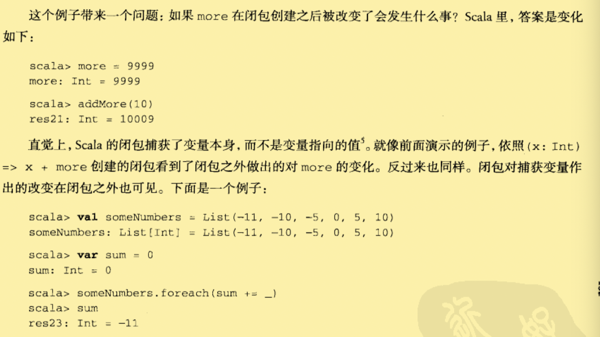

# 函数与闭包

## 方法

定义函数最通用的方法是作为某个对象的成员。这种函数被称为方法(method)。

```scala	
//带私有的processLine方法的LongLines对象
object LongLines{
  def processFile(filename:String,width:Int){
    val source = Source.fromFile(filename)
    for(line <- source.getLines)
    	porcessLine(filename,width,line)
  }
  private def processLine(filename:String,width:Int,line:String){
    if(line.length>width)
    	println(filename+":"+line.trim)
  }
}
```

## 本地函数

前提：

​	我们希望可以将函数打包成可复用的类和对象，最好让类的使用者不可见。并且如果之后用其他方式重写类的话，也希望能确保足以删掉这些帮助方法的灵活度。


解决：

- ​	在Java中我们通过私有方法来实现这个功能。Scala中也可以这样。

- ​	**除此之外，我们可以把函数定义在别的函数之内。**就好像本地变量一样，这种本地函数仅仅在包含它的代码块可见。

```scala
def processFile(filename:String,width:Int){
  //本地函数（定义在函数processFile内部的函数processLine）
  def processLine(filename:String,width:Int,line:String){
    if(line.length>width)
    	print(filename+":"+line)
  }
  val source = Source.fromFile(filename)
  for(line <- source.getLines){
    processLine(filename,width,line)
  }
}
```

1. 去掉了私有方法的private修饰符，它仅能应用于方法（并且只能被方法需要）。
2. 定义在另一个函数内部，作为本地函数，外部无法访问。
3. 本地函数可以访问包含其函数的参数！所以，我们可以进一步改善代码。

```scala
def processFile(filename:String,width:Int){
  def processLine(line:String){//这里不必声明三个参数，前两个直接使用外部函数的参数即可
    if(line.length>width)
    	print(filename+":"+line)
  }
  val source = Source.fromFile(filename)
  for(line <- source.getLines){
    processLine(line)//于是这里传入一个参数即可。
  }
}
```

## 头等函数

Scala的函数是头等函数。

你不仅可以定义和调用函数，还可以把它们写入匿名的字面量(literal)，并把它们作为值(value)传递。

```scala
(x:Int) => x + 1
//对数进行自增操作的函数字面量的简单操作。
val increase = (x:Int) => x+1
//函数值是对象，我们可以将它存入变量。它们也是函数，我们可以使用通常的括号函数调用。
increase(1)
//得到res0=2
```

- 函数字面量可以包含多条语句，使用花括号包住函数体，一行放一条语句，这样就组成了代码块。

## 占位符语法

让函数字面量更加简洁！可以把下划线当作一个或更多参数的占位符，只要每个参数在函数字面量仅出现一次。

```scala
scala> val someNumbers = List(-11,-10,-5,0,5,10)
//someNumbers 代表一个包含6个数字的列表
scala> someNumbers.filter(_>0)
//res1:List[Int] = List(5,10)
```

- 有时候，使用下划线当作占位符，编译器可能无法推断出缺失的参数类型。例如，`val f = _+_`，此时我们可以使用冒号指定类型，`val f = (_:Int)+(_:Int)`
  - \_+\_将扩展成带两个参数的函数字面量。（多个下划线代表多个参数，而不是单个参数的重复使用）

## 部分应用函数

部分应用函数是一种表达式，你不需要提供函数所需要的所有参数。

```scala
scala> def sum(a:Int,b:Int,c:Int) = a + b + c
//定义了一个函数，计算传入三个参数的和。
scala> sum(1,2,3)
//调用函数sum，得到结果6
scala> val a = sum _
//部分应用函数，只需要放一个下划线，这个下划线代表的是整个参数列表。
//注意：函数名 和 _ 之间要带有空格。
scala> a(1,1,1)
//实际是调用了 a.apply(1,2,3)
scala> val b = sum(1,_:Int,3)
//scala编译器会生成一个新的函数类，其apply方法带一个参数，调用的时候，这个产生的函数的apply方法调用sum，传入1，参数，3.
```

## 闭包

**依照函数字面量，在运行时创建的函数值（对象**）被称为`闭包`。

​	通过“捕获”自由变量的绑定，从而对函数字面量执行“关闭”行动。

**由于函数值是关闭这个开放项的行动的最终产物，因此被称为闭包。**

- 直觉上，Scala的闭包是捕获了变量本身，而不是变量指向的值。反过来也是一样的，闭包对捕获变量作出的改变在闭包之外也是可见的。「p97」



## 重复参数

你可以指定函数的最后一个参数是重复的。从而允许客户向函数传入**可变长度参数列表。在参数类型之后放一个星号即可。**

```scala
scala> def echo(args:String*) = 
					for(arg <- args) println(arg)
//编译器结果：(String*)Unit
scala> ("one")
//结果：one
scala> ("one","two")
//结果：one
//		 two
```

- 如果有一个合适类型的数组

```scala
val arr = Array("what's","up","doc?")

scala> echo(arr)//会报错！！！
//提示类型不匹配。

scala> echo(arr: _*)
//在数组后面加上 冒号 和一个 _*符号。（意思是告诉编译器，把arr每个元素当作参数，而不是单一参数传递给echo）
//结果：what's
//		 up
//		 doc?
```

## 尾递归