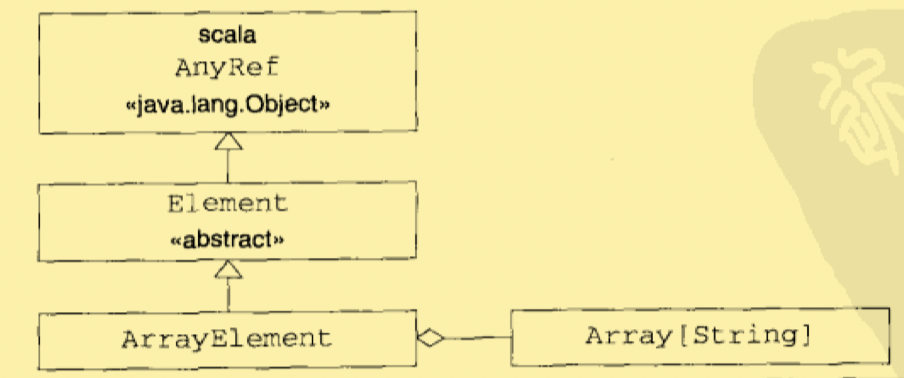

# 组合与继承

##  抽象类

```SCALA
abstract class Element{//抽象类
  def contents:Array[String]//没有实现的方法
}
```

- contents方法是Element类的抽象成员。
- 具有抽象成员的类本身必须被声明为抽象的，只要在class关键字之前加上abstract修饰符即可。
- 不能实例化一个抽象类！因为abstract说明类可能有未实现的成员。
- 在Scala中，一个方法只要没有实现（即没有等号或方法体），他就是抽象的。<u>不像Java，Scala方法的声明不需要也不允许有抽象修饰符！</u>
- 注意区分：`声明---declaration` 和 `定义---definition` 的区别.

## 定义无参数方法

```scala
abstract class Element {
  def contents:Array[String]
  def height:Int = contents.length
  def width:Int = if(height == 0) 0 else contents(0).length
}
```

以上是三个方法`contents`、`height`、`width`都没有参数列表，甚至空列表都没有。（方法的定义中没有括号，eg：`def width()：Int`）

- 只要方法中没有参数 并且 方法仅能通过读取所包含对象的属性去访问可变状态（特指方法不能改变可变状态），那么就使用无参数方法。

- **`统一访问原则`**，客户代码不应该由属性是通过字段实现还是方法实现而受到影响。

​	例如，我们可以把无参数方法def改为字段val：

```SCALA
abstract class Element {
  def contents:Array[String]
  val height:Int = contents.length//
  val width:Int = if(height == 0) 0 else contents(0).length//
}
```

1. 字段**访问比方法快**，因为字段值在类初始化的时候被预计算，而方法每次调用都要计算。
2. 使用字段，需要为类的每一个对象分配**更多的内存空间**。
3. 使用哪种，需要根据类的使用情况来定；不过，无论哪种，类的客户不应该在其内部改变的时候受到影响。

- 总结：

如果函数执行了操作就使用括号，如果仅提供了对某个属性的访问，那么省略括号。

## 扩展类

```SCALA
class ArrayElement(conts:Array[String]) extends Element {
  def contents:Array[String] = conts
}
```

- 使用extends来实现扩展。
  - 使ArrayElement类继承了Element类的所有非私有的成员，并让ArrayElement类型成为Element类型的子类型。
  - 被继承的称为父类、超类；继承的被称为子类。
- 如果省略extends子句，Scala编译器将隐式的扩展`scala.AnyRef`，这与Java的`java.lang.Object`相同。



- **`继承`**表示超类的所有成员也是子类的成员，但是以下两种情况除外：

1. 超类的私有成员不会被子类继承。
2. 超类中的成员如果与子类中实现的成员有相同的名称和参数，则不会被子类继承。
   1. 我们称之为，子类成员重写了超类的成员；
   2. 如果子类成员是具体的而超类是抽象的，我们说具体的成员实现了抽象的成员。

**`子类型化`**:子类的值可以在任何需要其超类的值的地方使用。

```scala
val e:Element = new ArrayElement(Array("hello"))
//子类的对象赋值给父类变量。
//e被定义为Element，实际上初始化值的类型为ArrayElement。
```

## 重写方法和字段

- Scala中，字段val和方法def属于相同的命名空间。这让字段可以重写无参数方法。（无需修改超类中的抽象方法定义。）

- ```SCALA
  //原貌：
  class ArrayElement(conts:Array[String]) extends Element {
    def contents:Array[String] = conts
  }
  //重写！
  class ArrayElement(conts:Array[String]) extends Element {
    val contents:Array[String] = conts//注意这里是val
  }
  ```

- Scala中，禁止在同一个类里面用同样的名称定义字段val和方法def。

```SCALA
class WordCount{
  private var f = 0
  def f = 1 //会报错，因为字段与方法重名！！！
}
```

1. 因为java有四个命名空间`字段`、`方法`、`类型`、`包`；但是Scala只有两个`值（字段、方法、单利对象）`、`类型（类与特质）`。
2. 这样做的原因是，可以使用val重写无参数方法。（Java就不行！）

## 定义参数化字段

```scala
//原貌：
class ArrayElement(conts:Array[String]) extends Element {
  val contents:Array[String] = conts
}
//参数化字段：
class ArrayElement(
	val contents:Array[String]
) extends Element
```

- 定义参数化字段，避免了代码中不必要的累赘和重复！
- 类的参数同样可以使用var做前缀。
  - 这时候，相应的字段可以被重新赋值。
- 与其他类成员相同，参数化字段可以添加private、protected、override这类的修饰符。

## 调用超类构造器

要调用超类的构造器，只需要把传递的参数或参数列表放在超类名之后的括号里即可。

```scala
class LineElement(s:String) extends ArrayElement(Array(s)){
  //ArrayElement的构造器带一个参数(Array[String])
  override def width = s.length
  override def height = 1
}
```

## 使用override修饰符

- 如果子类成员重写了父类的<u>具体成员</u>则必须带上override修饰符。

- 如果子类成员实现的是抽象的成员时，override是可选的。
- 如果成员并未重写或实现什么其他父类里的成员，那么禁止使用override。

- **`脆基类`**：如果在类的层次结构中，为基类添加了新的成员，你会有破坏客户代码的风险！
  - 虽然存在脆基类问题，但是相比于Java已经有所改善。
  - 例如，客户定义了hidden方法，那么客户的原始实现不会有override修饰；此时，你为类添加量hidden方法，那么在编译的时候，编译器会提示你`needs ‘override’ modifier`

## 多态与动态绑定

- `父类类型的变量`可以指向`子类类型的对象`这种现象叫做**多态**。

- 变量和表达式上的方法调用是基于`动态绑定`的，这意味着:

  - 被调用的实际方法实现取决于运行期对象基于的类，而不是变量或表达式的类型。

  - ```scala
    abstract class Element {
      def demo() {
        println("Element's implementation invoked")
      }
    }
    class ArrayElement extends Element{
      override def demo(){
        println("ArrayElement's implementation invoked")
      }
    }
    class LineElement extends Element{
      override def demo(){
        println("LineElement's implementation invoked")
      }
    }
    class UniformElement extends Element
    
    //invokeDemo方法，传入Element对象参数，将会执行Element.demo()方法。
    def invokeDemo(e:Element){
      e.demo()
    }
    
    
    
    scala> invokeDemo(new ArrayElement)
    //ArrayElement's implementation invoked
    scala> invokeDemo(new LineElement)
    //LineElement's implementation invoked
    ```

## 定义final成员

- 有时候，在设计继承层次的时候，我们希望，确保一个成员不被子类所重写。可以给成员添加final修饰符来实现。
- 有时候，我们希望，整个类没有子类。可以在类的声明上添加final修饰符。

## 使用组合与继承

继承与组合是利用现有类定义新类的两个方法。

- 优先使用组合。
- 继承关系是：is-a
- 组合关系是：has-a