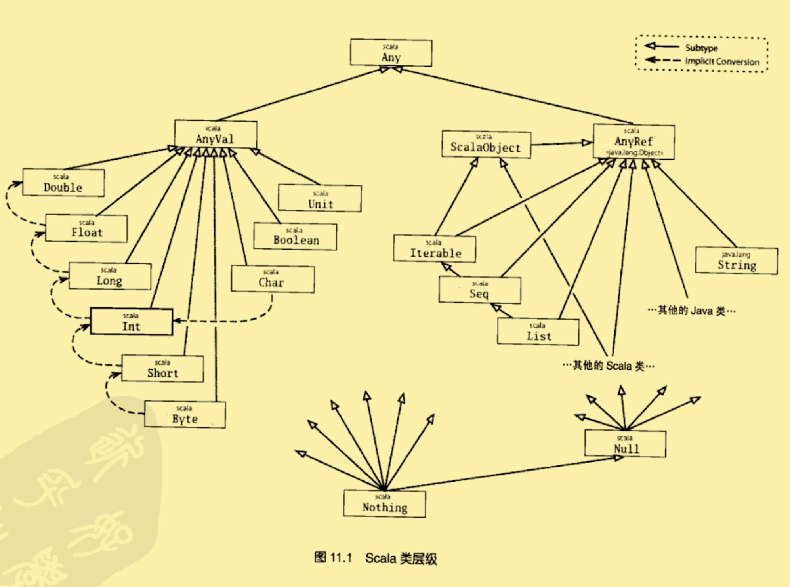

# Scala层级

## Any

Scala的类层级大纲中，顶端是Any类；定义了如下方法：

```scala
final def == (that:Any):Boolean
final def != (that:Any):Boolean
//==和！=被定义为final，因此他们不能在子类中被重写！
def equals(that:Any):Boolean
def hashCode: Int
def toString: String
```

- 因为每个类都继承自Any，所以程序里的每个对象都能用==、！=或equals比较，用hashCode做散列，以及用toString格式化。



### AnyVal

Scala里，每个内建值类的父类。

- Byte、Short、Char、Int、Long、Float、Double、Boolean和Unit。
  - 前八个都有对应的Java基本类型。
  - 值类被定义为即是抽象的又是final的。所以`new Int`是错误的。
  - Unit，对应Java的void类型；只有一个实例值写作`（）`

### AnyRef

所有引用类的基类。

## 底层类型

`scala.Null`和`scala.Nothing`处理Scala面向对象类型系统的某些边界情况的特殊类型。

### Null

是null引用对象的类型，它是每个引用类（AnyRef）的子类，不兼容值类型。

```scala
val i:Int = null//会报错！！！
```

### Nothing

层级的最底端。它是任何类型的子类型。然而根本没有这个类型的任何值。

- 用法：用来表明不正常的终止。

```SCALA
//error的返回值就是Nothing
def error(message:String):Nothing = 
	throw new RuntimeException(message)
```

