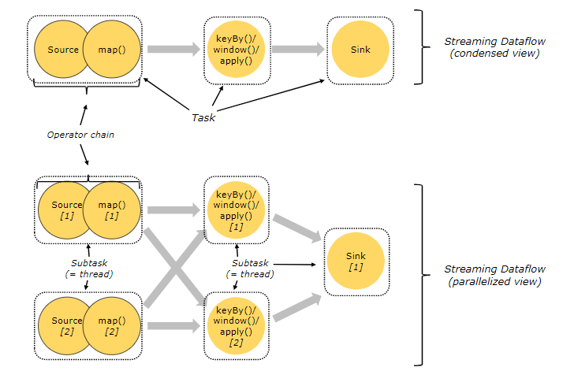

# flink核心概念

## 简介

分布式流处理框架，能够对有界和无界的数据进行高效的处理。

流式 & 批式

## 核心架构


- api & libraries 层

编程API，顶级类库。

- Runtime核心层

核心实现层，包括作业转换，任务调度，资源分配，任务执行等。

- 物理部署层

不同平台(本地、集群【standalone/yarn】、云【GCE/EC2】)部署flink应用。

## flink集群架构

### 1 核心组件：

**Runtime层**

采用标准的 **Master - Slave** 结构。


#### Master：

- **Dispatcher**

  负责接收客户端提交的执行程序，并传递给JobManager。除此之外，还提供了WEB UI界面，用于监控作业执行情况。

- **ResourceManager**

  负责管理 slots 并协调集群资源。ResourceManager 接收来自 JobManager 的资源请求，并将存在空闲 slots 的 TaskManagers 分配给 JobManager 执行任务。Flink 基于不同的部署平台，如 YARN , Mesos，K8s 等提供了不同的资源管理器，当 TaskManagers 没有足够的 slots 来执行任务时，它会向第三方平台发起会话来请求额外的资源。

- **JobManager**

  称为masters。接收Dispatcher传递过来的<u>执行程序</u>（包含：作业图 (JobGraph)，逻辑数据流图 (logical dataflow graph) 及其所有的 classes 文件以及第三方类库 (libraries) 等等 ），紧接着 JobManagers 会将 JobGraph 转换为执行图 (ExecutionGraph)，然后向 ResourceManager 申请资源来执行该任务，一旦申请到资源，就将执行图分发给对应的 TaskManagers 。因此每个作业 (Job) 至少有一个 JobManager；高可用部署下可以有多个 JobManagers，其中一个作为 *leader*，其余的则处于 *standby* 状态。

#### Slave：

- **TaskManager**

  称为workers。TaskManagers 负责实际的子任务 (subtasks) 的执行，每个 TaskManagers 都拥有一定数量的 slots。Slot 是一组固定大小的资源的合集 (如计算能力，存储空间)。TaskManagers 启动后，会将其所拥有的 slots 注册到 ResourceManager 上，由 ResourceManager 进行统一管理。

### 2 Task & SubTask

TaskManagers 实际执行的是 SubTask，而不是 Task，这里解释一下两者的区别：

在执行分布式计算时，**Flink 将可以链接的操作 (operators) 链接到一起，这就是 Task**。之所以这样做， 是为了减少线程间切换和缓冲而导致的开销，在降低延迟的同时可以提高整体的吞吐量。 但不是所有的 operator 都可以被链接，如下 keyBy 等操作会导致网络 shuffle 和重分区，因此其就不能被链接，只能被单独作为一个 Task。 简单来说，一个 Task 就是一个可以链接的最小的操作链 (Operator Chains) 。如下图，source 和 map 算子被链接到一块，因此整个作业就只有三个 Task：



**SubTask，其准确的翻译是： *A subtask is one parallel slice of a task*，即一个 Task 可以按照其并行度拆分为多个 SubTask。**如上图，source & map 具有两个并行度，KeyBy 具有两个并行度，Sink 具有一个并行度，因此整个虽然只有 3 个 Task，但是却有 5 个 SubTask。Jobmanager 负责定义和拆分这些 SubTask，并将其交给 Taskmanagers 来执行，每个 SubTask 都是一个单独的线程。

### 3 资源管理

理解了 SubTasks ，我们再来看看其与 **Slots** 的对应情况。一种可能的分配情况如下：


这时每个 SubTask 线程运行在一个独立的 <u>TaskSlot， 它们共享所属的 TaskManager 进程的TCP 连接（通过多路复用技术）和心跳信息 (heartbeat messages)，从而可以降低整体的性能开销。</u>此时看似是最好的情况，但是每个操作需要的资源都是不尽相同的，这里假设该作业 keyBy 操作所需资源的数量比 Sink 多很多 ，那么此时 Sink 所在 Slot 的资源就没有得到有效的利用。

基于这个原因，**Flink 允许多个 subtasks 共享 slots，即使它们是不同 tasks 的 subtasks，但只要它们来自同一个 Job 就可以。**

假设上面 souce & map 和 keyBy 的并行度调整为 6，而 Slot 的数量不变，此时情况如下：


可以看到一个 Task Slot 中运行了多个 SubTask 子任务，此时每个子任务仍然在一个独立的线程中执行，只不过共享一组 Sot 资源而已。

**那么 Flink 到底如何确定一个 Job 至少需要多少个 Slot 呢？Flink 对于这个问题的处理很简单，默认情况一个 Job 所需要的 Slot 的数量就等于其 Operation 操作的最高并行度。**如下， A，B，D 操作的并行度为 4，而 C，E 操作的并行度为 2，那么此时整个 Job 就需要至少四个 Slots 来完成。通过这个机制，Flink 就可以不必去关心一个 Job 到底会被拆分为多少个 Tasks 和 SubTasks。


### 4 组件通讯

**Flink 的所有组件都基于 Actor System 来进行通讯。**Actor system是多种角色的 actor 的容器，它提供调度，配置，日志记录等多种服务，并包含一个可以启动所有 actor 的线程池，<u>如果 actor 是本地的，则消息通过共享内存进行共享，但如果 actor 是远程的，则通过 RPC 的调用来传递消息。</u>


# Flink Data Source

## 内置 Data Source

**Flink Data Source 用于定义 Flink 程序的数据来源**，Flink 官方提供了多种数据获取方法，用于帮助开发者简单快速地构建输入流，具体如下：

### 1 基于文件构建

**1. readTextFile(path)**：按照 TextInputFormat 格式读取文本文件，并将其内容以字符串的形式返回。示例如下：

```scala
final StreamExecutionEnvironment env = StreamExecutionEnvironment.getExecutionEnvironment();
DataStreamSource<String> fileDataStreamSource = env.readTextFile("file:///Users/zhangyanbo/zookeeper.out");
fileDataStreamSource.print();

env.execute("FlinkSourceFile");
```

**2. readFile(fileInputFormat, path)** ：按照指定格式读取文件。

**3. readFile(inputFormat, filePath, watchType, interval, typeInformation)**：按照指定格式周期性的读取文件。其中各个参数的含义如下：

- **inputFormat**：数据流的输入格式。
- **filePath**：文件路径，可以是本地文件系统上的路径，也可以是 HDFS 上的文件路径。
- **watchType**：读取方式，它有两个可选值，分别是 `FileProcessingMode.PROCESS_ONCE` 和 `FileProcessingMode.PROCESS_CONTINUOUSLY`：前者表示对指定路径上的数据只读取一次，然后退出；后者表示对路径进行定期地扫描和读取。需要注意的是如果 watchType 被设置为 `PROCESS_CONTINUOUSLY`，那么当文件被修改时，其所有的内容 (包含原有的内容和新增的内容) 都将被重新处理，因此这会打破 Flink 的 *exactly-once* 语义。
- **interval**：定期扫描的时间间隔。
- **typeInformation**：输入流中元素的类型。

```scala

```

### 2基于集合的构建

### 3基于Socket构建

## 自定义Data Source


## Streaming Connectors

**内置连接器：**

flink内置多种连接器。满足大多数数据收集场景。

- ###### 1Kafka（source 和 sink）

- ###### 2Hadoop FileSystem（sink)

- ###### 3Elasticsearch（sink）

### 整合kafka(source)

1. 核对版本，确定依赖。

   | Maven 依赖                      | Flink 版本 | Consumer and Producer 类的名称              | Kafka 版本 |
   | ------------------------------- | ---------- | ------------------------------------------- | ---------- |
   | flink-connector-kafka-0.8_2.11  | 1.0.0 +    | FlinkKafkaConsumer08 FlinkKafkaProducer08   | 0.8.x      |
   | flink-connector-kafka-0.9_2.11  | 1.0.0 +    | FlinkKafkaConsumer09 FlinkKafkaProducer09   | 0.9.x      |
   | flink-connector-kafka-0.10_2.11 | 1.2.0 +    | FlinkKafkaConsumer010 FlinkKafkaProducer010 | 0.10.x     |
   | flink-connector-kafka-0.11_2.11 | 1.4.0 +    | FlinkKafkaConsumer011 FlinkKafkaProducer011 | 0.11.x     |
   | flink-connector-kafka_2.11      | 1.7.0 +    | FlinkKafkaConsumer FlinkKafkaProducer       | >= 1.0.0   |

   ```xml
   <dependency>
     <groupId>org.apache.flink</groupId>
     <artifactId>flink-connector-kafka-0.11_2.11</artifactId>
     <version>${flink.kafka.version}</version>
   </dependency>
   ```

2. 代码开发

```java
public class FlinkSourceKafka {
  public static void main(String[] args) throws Exception {
    final StreamExecutionEnvironment env = StreamExecutionEnvironment.getExecutionEnvironment();
    Properties properties = new Properties();
    properties.setProperty("bootstrap.servers","hadoop01:9092");
    DataStreamSource<String> stream = env.addSource(
      new FlinkKafkaConsumer011<String>("flink-stream-in-topic", new SimpleStringSchema(), properties)
    );
    stream.print();
    env.execute("flink streaming");
  }
}
```


# Flink Sink

## Data Sinks


## Streaming Connectors


### 整合Kafka Sink

- Flink 提供了 addSink方法来调用自定义Sink或者第三方连接器。

```java
//定义Flink Kafka生产者---多种实现方式1-----------------------------------------
FlinkKafkaProducer011<String> kafkaProducer =
  new FlinkKafkaProducer011<String>(
  "flink-stream-out-topic",
  new KeyedSerializationSchema<String>() {
    public byte[] serializeKey(String element) {
      return element.getBytes();
    }
    public byte[] serializeValue(String element) {
      return element.getBytes();
    }
    public String getTargetTopic(String element) {
      return null;
    }
  },
  properties,
  FlinkKafkaProducer011.Semantic.EXACTLY_ONCE
);

stream.addSink(kafkaProducer);
env.execute("flink streaming");


//定义Flink Kafka生产者---多种实现方式2-----------------------------------------
FlinkKafkaProducer011 kafkaproducer11x = 
  new FlinkKafkaProducer011(
        "localhost:9092","flink-stream-out-topic",new SimpleStringSchema()
	);

stream.addSink(kafkaproducer11x);
env.execute("flink streaming");
```

