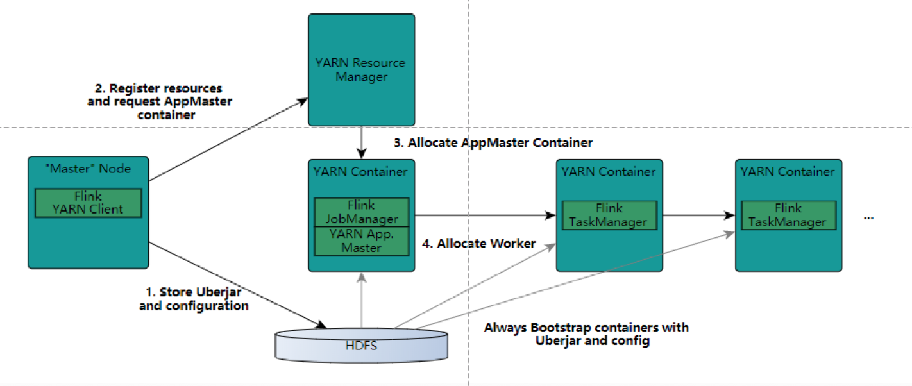
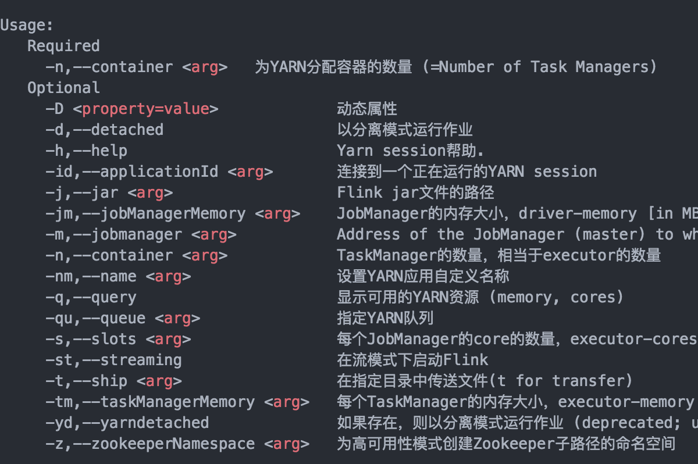

## 简介

YARN -- Yet Another Resource Negotiator

hadoop2.0引入的集群资源管理系统。

## YARN架构


### 1、ResourceManager（RM）

通常在独立的机器上以后台进程形式运行；它是**整个集群资源的主要协调者和管理者**。

负责给用户提交的所有应用程序分配资源，根据应用程序优先级、队列容量、ACLs、数据位置等信息，做出决策，然后以共享的、安全的、多租户的方式制定分配策略，调度集群资源。

### 2、NodeManager（NM）

是YARN集群中每个具体节点的管理者。主要负责该节点内所有容器的生命周期的管理，监视资源和跟踪节点健康。

​	启动时候，向ResourceManager注册并定时发送心跳，等待ResourceManager的指令。

​	维护Container的生命周期，监控Container的资源使用情况。

​	管理任务运行时的相关依赖，根据ApplicationMaster的需要，在启动Container之前将需要的程序以及依赖拷贝到本地。

### 3、ApplicationMaster（AM）

在用户提交一个应用程序的时候，YARN会启动一个轻量级进程ApplicationMaster。ApplicationMaster负责协调来自ResourceManager的资源，并通过NodeManager监视容器内资源的使用情况，同时还负责任务的监控与容错。

​	根据应用的运行状态来决定动态计算资源需求。

​	向ResourceManager申请资源，监控申请资源的使用情况。

​	跟踪任务状态和进度，报告资源的使用情况和应用的进度信息。

​	负责任务容错。

### 4、Contain

是YARN中的资源抽象，它封装了某个节点上的多维度资源，如内存、cpu、磁盘、网络等。当AM向RM申请资源时，RM为AM返回的资源是用Container表示的。

YARN会为每个任务分配一个Container，该任务只能使用该Container中描述的资源。

ApplicationMaster可在Container内运行任何类型的任务。例如，MapReduce ApplicationMaster 请求一个容器来启动map或者reduce任务，而Giraph ApplicationMaster 请求一个容器来运行Giraph任务。

## YARN工作原理简述


1. Client 提交作业到 YARN 上。
2. ResourceManager 选择一个NodeManager，启动一个Container并运行ApplicationMaster实例。
3. ApplicationMaster 根据实际需要向ResourceManager申请更多的Container资源（如果作业很小，应用管理器会选择在自己的JVM中运行任务）。
4. ApplicationMaster 通过获取到的 Container资源执行分布式计算。

## YARN工作原理详述


1. 作业提交

   client 调用 job.waitForCompletion 方法，向整个集群提交 MapReduce 作业 (第 1 步) 。新的作业 ID(应用 ID) 由资源管理器分配 (第 2 步)。作业的 client 核实作业的输出, 计算输入的 split, 将作业的资源 (包括 Jar 包，配置文件, split 信息) 拷贝给 HDFS(第 3 步)。 最后, 通过调用资源管理器的 submitApplication() 来提交作业 (第 4 步)。

2. 作业初始化

   当资源管理器收到 submitApplciation() 的请求时, 就将该请求发给调度器 (scheduler), 调度器分配 container, 然后资源管理器在该 container 内启动应用管理器进程, 由节点管理器监控 (第 5 步)。

   MapReduce 作业的应用管理器是一个主类为 MRAppMaster 的 Java 应用，其通过创造一些 bookkeeping 对象来监控作业的进度, 得到任务的进度和完成报告 (第 6 步)。然后其通过分布式文件系统得到由客户端计算好的输入 split(第 7 步)，然后为每个输入 split 创建一个 map 任务, 根据 mapreduce.job.reduces 创建 reduce 任务对象。

3. 任务分配

   如果作业很小, 应用管理器会选择在其自己的 JVM 中运行任务。

   如果不是小作业, 那么应用管理器向资源管理器请求 container 来运行所有的 map 和 reduce 任务 (第 8 步)。这些请求是通过心跳来传输的, 包括每个 map 任务的数据位置，比如存放输入 split 的主机名和机架 (rack)，调度器利用这些信息来调度任务，尽量将任务分配给存储数据的节点, 或者分配给和存放输入 split 的节点相同机架的节点。

4. 任务运行

   当一个任务由资源管理器的调度器分配给一个 container 后，应用管理器通过联系节点管理器来启动 container(第 9 步)。任务由一个主类为 YarnChild 的 Java 应用执行， 在运行任务之前首先本地化任务需要的资源，比如作业配置，JAR 文件, 以及分布式缓存的所有文件 (第 10 步。 最后, 运行 map 或 reduce 任务 (第 11 步)。

   YarnChild 运行在一个专用的 JVM 中, 但是 YARN 不支持 JVM 重用。

5. 进度和状态更新

   YARN 中的任务将其进度和状态 (包括 counter) 返回给应用管理器, 客户端每秒 (通 mapreduce.client.progressmonitor.pollinterval 设置) 向应用管理器请求进度更新, 展示给用户。

6. 作业完成

   除了向应用管理器请求作业进度外, 客户端每 5 分钟都会通过调用 waitForCompletion() 来检查作业是否完成，时间间隔可以通过 mapreduce.client.completion.pollinterval 来设置。作业完成之后, 应用管理器和 container 会清理工作状态， OutputCommiter 的作业清理方法也会被调用。作业的信息会被作业历史服务器存储以备之后用户核查。

## 提交作业到YARN上运行

提交格式：hadoop jar jar包路径 主类名 主类参数

```sh
hadoop jar hadoop-mapreduce-eamples-2.6.0-cdh5.15.2.jar pi 3 3
```

# Flink on yarn



## Flink on yarn 集群启动步骤

- 步骤1　用户向YARN中提交应用程序，其中包括ApplicationMaster程序、启动ApplicationMaster的命令、用户程序等。
- 步骤2　ResourceManager为该应用程序分配第一个Container，并与对应的Node-Manager通信，要求它在这个Container中启动应用程序的ApplicationMaster。
- 步骤3　ApplicationMaster首先向ResourceManager注册，这样用户可以直接通过ResourceManager查看应用程序的运行状态，然后它将为各个任务申请资源，并监控它的运行状态，直到运行结束，即重复步骤4~7。
- 步骤4　ApplicationMaster采用轮询的方式通过RPC协议向ResourceManager申请和领取资源。
- 步骤5　一旦ApplicationMaster申请到资源后，便与对应的NodeManager通信，要求它启动任务。
- 步骤6　NodeManager为任务设置好运行环境（包括环境变量、JAR包、二进制程序等）后，将任务启动命令写到一个脚本中，并通过运行该脚本启动任务。
- 步骤7　各个任务通过某个RPC协议向ApplicationMaster汇报自己的状态和进度，以让ApplicationMaster随时掌握各个任务的运行状态，从而可以在任务失败时重新启动任务。 在应用程序运行过程中，用户可随时通过RPC向ApplicationMaster查询应用程序的当前运行状态。
- 步骤8　应用程序运行完成后，ApplicationMaster向ResourceManager注销并关闭自己

## on yarn 集群部署

### 设置hadoop环境变量

```shell
vim ~/bash_profile
export HADOOP_CONF_DIR=/Users/zhangyanbo/apps/hadoop-2.10.0 #hadoop 路径
```


### bin/yarn-session.sh 使用方法

```shell
Usage:
   Required
     -n,--container <arg>   Number of YARN container to allocate (=Number of Task Managers)
   Optional
     -D <arg>                        Dynamic properties
     -d,--detached                   Start detached
     -f6,--flip6                     Specify this option to start a Flip-6 Yarn session cluster.
     -id,--applicationId <arg>       Attach to running YARN session
     -j,--jar <arg>                  Path to Flink jar file
     -jm,--jobManagerMemory <arg>    Memory for JobManager Container [in MB]
     -n,--container <arg>            Number of YARN container to allocate (=Number of Task Managers)
     -nm,--name <arg>                Set a custom name for the application on YARN
     -q,--query                      Display available YARN resources (memory, cores)
     -qu,--queue <arg>               Specify YARN queue.
     -s,--slots <arg>                Number of slots per TaskManager
     -st,--streaming                 Start Flink in streaming mode
     -t,--ship <arg>                 Ship files in the specified directory (t for transfer)
     -tm,--taskManagerMemory <arg>   Memory per TaskManager Container [in MB]
     -z,--zookeeperNamespace <arg>   Namespace to create the Zookeeper sub-paths for high availability mode
```



- 可以指定TaskManager个数以及内存（内存默认1G）。
- JobManager个数只能是一个，但是可以指定内存。

### 启动YARN session之后，可以使用bin/flink启动作业。

```shell
./bin/flink run -c com.demo.WordCount flink-demo-1.0.jar --port 9000
```

#### flink run 用法

```
用法：run [OPTIONS] <jar-file> <arguments>
run 操作参数：
	-c,--class <classname>				如果没有在jar包中指定入口类，则需在这里通过这个参数指定。
	-m,--jobmanager <host:port>		指定需要连接的jobmanager（主节点）地址。
	-p,--parallelism <parallelism>指定程序的并行度，可以覆盖配置文件中的默认值。
```

**YARN session 是在Hadoop YARN环境下启动的一个Flink cluster集群，里面的资源是可以共享给其他flink作业的。**


- 我们还可以在YARN上启动一个Flink作业。这里我们还是使用./bin/flink，但是不需要事先启动YARN session：

```shell
./bin/flink run -m yarn-cluster -yn 2 ./examples/batch/WordCount.jar      \
          --input hdfs://user/hadoop/input.txt                            \
          --output hdfs://user/hadoop/output.txt
# -yn 指定TaskManager个数，必须要指定。
# 同样会启动一个YARN session启动的页面。
```


- 后台运行 yarn session

使用 -d 或者 --detached ; 这种情况下，flink yarn client 将会只提交任务，然后关闭自己。

此时，flink无法停止yarn session。必须使用 yarn 工具来停止yarn session。

```shell
yarn application -kill <applicationId>
```

- 日志文件查看

设置 yarn-site.xml 中 yarn.log-aggregation-enable 属性为 true。

一旦启用了，用户可以通过命令查看yarn session所有详细日志。

```shell
yarn logs -applicationId <application ID>
```

- flink on yarn 的故障恢复

设置参数来控制容器故障恢复。

​	可以通过conf/flink-conf.yaml 或者 在启动yarn session的时候通过 -D参数来指定。

​		yarn.reallocate-failed：这个参数控制了flink是否应该重新分配失败的taskmanager容器。默认是true。

​		yarn.maximum-failed-containers：applicationMaster可以接受的容器最大失败次数，达到这个参数，就会认为yarn session失败。默认这个次数和初始化请求的taskmanager数量相等(-n 参数指定的)。

​		yarn.application-attempts：applicationMaster重试的次数。如果这个值被设置为1(默认就是1)，当application master失败的时候，yarn session也会失败。设置一个比较大的值的话，yarn会尝试重启applicationMaster。