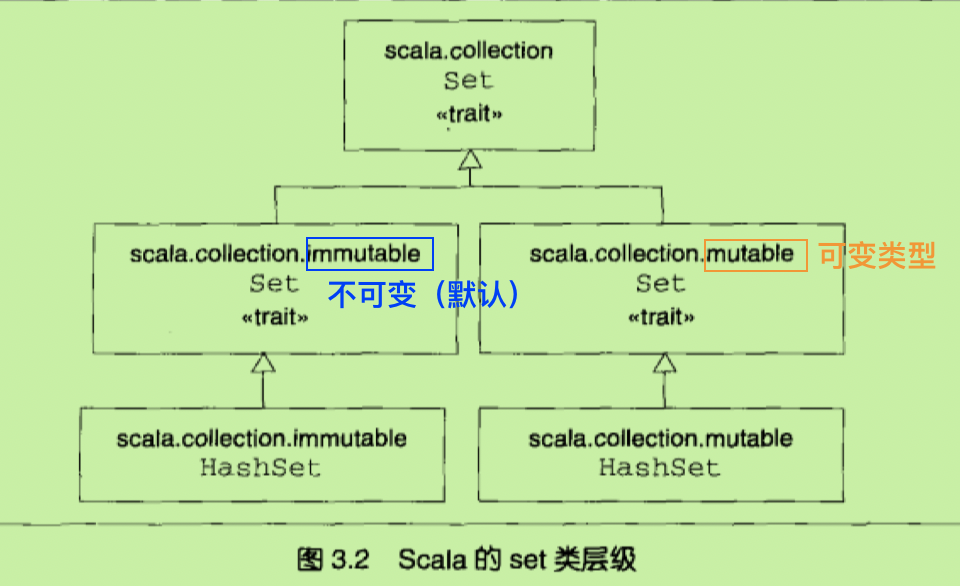
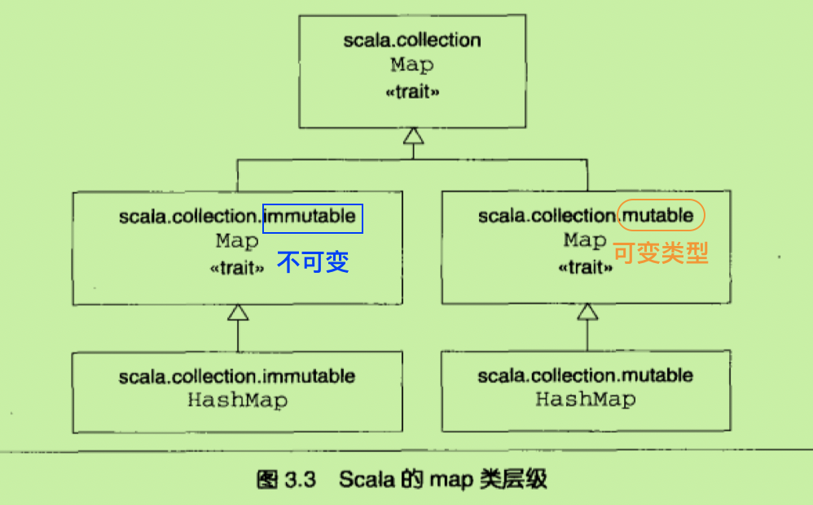

# Scala入门
## scala解释器
命令行中，输入`scala`，即可打开scala交互式Shell。  
输入表达式，如1+2，并回车之后：  
解释器会输出： res0:Int=3  
**输出的信息以此为：**  
1. 自动生成的或者用户定义的名称说明计算的值（例如res0，表示结果0）
2. 冒号（：）以及表达式的类型（Int）
3. 等号（=）
4. 表达式经计算得到的结果（3）
  

已经被定义的`识别符`在后续还能被继续引用：
```
res0*3
//得到结果9（res1：Int = 9）
```
## 定义变量
`变量`有两种：
1. val
2. var  

`val`类似于Java中的final变量。一旦初始化，val就不能在被赋值。

  相反，`var`等同于Java中的非final变量，可以在整个生命周期中多次被赋值。  

`类型推断：`一般来说，我们在定义scala变量的时候，很少指定它的类型。这是因为有scala的类型推断能力，它可以让Scala自动理解你忽略的类型。
**不过，写明定义的类型，不但可以保证Scala编译器使用到你需要的类型，还有助于之后的代码阅读**  

`跨行输入语句与取消：`如果需要在编译器中跨行输入，只需要一行行写入即可。  
如果行为还没有结束，解释器将在下一行回应一个竖线。  
**如果你发现了错误，而编译器仍然在等待输入，你可以连续回车两次取消掉。**  
## 函数的定义
`函数的定义：`以def开始，然后是函数名，跟着是带括号的参数列表（函数的每个参数都必须带有前缀冒号的类型标注；因为scala不能推断函数的参数类型），在参数列表的括号之后有“：函数返回值类型”这个是函数的结果类型定义，跟在结果类型定义后面是一个等号和一对包含了函数体的花括号。  


**退出scala命令行：**输入：quit或者：q（注意冒号）

## 编写Scala脚本

`脚本`就是一种经常会被执行的放在文件中的句子序列。

假设有一个hello.scala的文件，文件中有一行代码“println("hello, world. from a Scala!")”

那么我们可以使用<u>scala hello.scala</u>运行这个Scala脚本。

## while做循环；if做判断

```scala
var i = 0
while(i<args.length){
  if(i!=0)
  print(" ")
  print(args(i))
  i+=1
}
println()
```

将程序写入echo.scala中，

然后在命令行中输入`scala echo.scala hello this is my scala`

得到结果：

```
hello this is my scala
```

## foreach和for做枚举

函数式编程的主要特征之一就是，函数是头等结构，而这也是Scala的主要特征。

`函数字面量的语法构成`


### foreach

一个简洁的打印命令行参数的方法：

```scala
args.foreach(arg=>println(arg))
//args调用foreach方法，并把函数（println函数）作为参数传入
```

更加明确的表达：

```scala
args.foreach((arg:String)=>println(arg))
//可以明确的指出数组的元素类型
```

更为紧凑的写法：

```scala
args.foreach(println)
//如果函数字面量只有一行语句并只有一个参数！！！
//甚至连代指参数都不需要
```

### for

我们只举一个简单的例子来说明：

```scala
for(arg <- args){
  println(arg)
}
//注意<-的右侧是args数组，左侧是val类型的名称。
//注意左侧是val类型，因为他不能在for表达式中被重新赋值。
```

## 使用类型 <u>参数化 数组（Array）</u>

Scala中使用new来实例化对象（或者叫类实例）。

```scala
val greetStrings = new Array[String](3)
//完整定义为：
//val greetStrings:Array[String] = new Array[String](3)
greetStrings(0)="hello"
greetStrings(1)=","
greetStrings(2)="world!\n"
for(i <- 0 to 2){
  print(greetStrings(i))
  //注意：scala的数组是通过索引值加上圆括号 而不是方括号！！！
}
//这并不是Scala创建和初始化数组的推荐方案
```

注意：

1. scala的数组是通过**索引值加上圆括号** 而不是~~方括号~~！！！

2. **我们说`val`定义的变量不能被重新赋值，但变量指向的对象内部却仍然可以改变！！！**

   也就是说，greetStrings对象不能被重新赋值成其他数组，它永远指向初始化的那个Array[String]实例；但是Array[String]内部元素始终可以被更改，因此数组本身是可变的。

3. 我们说过方法如果只有一个参数，那么调用的时候，可以省略**点**以及**括号**。

   因此，0 to 2 中的to实际上是一个仅带有一个Int参数的方法。

   ```scala
   0 to 2
   //等价于
   (0).to(2)
   //注意，这个语法只有在明确指定方法调用的接受者时，才有效。
   //不能写成 println 10
   //可以写成 console println 10
   ```

**Scala没有操作符重载，因为它没有传统意义上的操作符。**

​	取而代之，诸如+、-、*、/ 这样的字符，可以用来做方法名。

```scala
1+2
//实际上转化为了
(1).+(2)
//所以我们说，Scala中的所有操作符都是方法调用
```

**数组也只是类的实例**

​	用括号传递给变量一个或多个值参数时，Scala会将其转化为apply方法的调用。

```scala
greetStrings(i)
//实际上被转化为了：
greetStrings.apply(i)
//所以Scala访问数组元素，只不过是方法的调用。
```

这个原则不是只对于数组：任何对于对象的值参数应用都将被转换为apply方法的调用。（前提是这个类型实际定义过apply方法）[注意：这是通用法则]

​	于是，当对带有括号并包括一到多个参数的变量赋值时候，编译器将使用对象的update方法对括号里的参数（索引值）和等号右边的对象执行调用。

```scala
greetStrings(0) = "hello"
//实际上被转化为了：
greetStrings.update(0,"hello")
```

**更简洁的数组创建**

```scala
//创建并初始化对象
val numNames = Array("one","two","three")
//实际上是调用了apply的工厂方法
//apply方法可以有不定个数的参数，定义在Array的伴生对象中。
```

## 使用列表（List）

`方法`没有副作用是函数式编程的重要理念，计算并返回值应该是方法唯一的目的。这样做的好处是：

1. 方法之间的耦合度降低，更可靠和复用；
2. （静态类型语言中）方法的参数和返回值都经过类型检查器的检查，可以轻易的根据类型错误推断出其中隐含的逻辑错误。

Scala的`数组`是<u>可变的同类对象序列</u>。


至于**不可变的同类对象序列**，Scala的`列表类（List）`才是。

- List[String]仅包含String。但是于Java不同，Scala的List一旦创建就不可改变。

  - 对某个列表调用方法时，似乎改变了列表，实际上只是新的值重建了列表然后返回。

- Scala的泪表是为了实现函数式编程而设计的。

- "::"操作符，发音为：“cons”。

  - 将新元素整合到现有列表的最前端，然后返回执行结果的新列表。

- ":::"操作符，叠加功能。

- Nil是空列表的简写，可以使用cons操作符将所有元素连接起来，最后以Nil结尾来定义新列表。

  ```scala
  val a = List(1,2,3)
  //常用定义
  val b = 1::2::3::Nil
  //等价方式（使用cons操作符+Nil空列表结尾）
  ```

- 不支持添加操作（append）！！！【在后面添加元素】
  - 因为随着列表的增长，append的耗时将呈现线性增长，而使用::前缀则仅耗时固定时间。
    - 使用cons添加元素，最后使用reverse反转列表。
    - 使用ListBuffer，一种提供append操作的可变列表，完成之后调用toList。

| 方法名                                                       | 方法作用 |
| ------------------------------------------------------------ | -------- |
| List()或者Nil                                                |          |
| List("a","b","c")                                            |          |
| Val thrill = "a"::"b"::"c"::Nil                              |          |
| List(1,2):::List(3,4)                                        |          |
| thrill(2)                                                    |          |
| thrill.count(s=>s.length==2)                                 |          |
| thrill.drop(2)                                               |          |
| thrill.dropRight(2)                                          |          |
| thrill.exists(s=>s=="c")                                     |          |
| thrill.filter(s=>s.length==1)                                |          |
| thrill.forall(s=>s.endsWith("1"))                            |          |
| thrill.foreach(println)                                      |          |
| thrill.head                                                  |          |
| thrill.init                                                  |          |
| thrill.isEmpty                                               |          |
| thrill.last                                                  |          |
| thrill.length                                                |          |
| thrill.map(s=>s+"y")                                         |          |
| thrill.mkString(",")                                         |          |
| thrill.remove(s=>s.length==4)                                |          |
| thrill.reverse                                               |          |
| thrill.sort((s,t)=>s.charAt(0).toLowerCase<t.charAt(0).toLowerCase) |          |
| thrill.tail                                                  |          |

## 使用元组(Tuple)

元组是一种很有用的容器对象。

- 元组是不可变的
- 可以用于在方法中返回多个对象
  - Java中是使用JavaBean以及包含多个返回值
  - Scala可以仅返回元组

```scala
val pair = (99,"people")
//类型为：Tuple2[Int,String]
//例如，("a","b","hello",1,2)是Tuple5[char,char,String,Int,Int]
println(pair._1)
println(pair._2)
//输出结果为：
//99
//people
```

**为什么不能使用访问列表的方法来访问元组？**

1. 因为列表的apply方法始终返回的是同一种类型，但是元组包含的类型不尽相同。\_1的结果类型可能与\_2的结果类型不一致，这样两者访问的方法也不同。
2. \_N的索引是基于1开始的（不是从0开始），因为对于拥有静态类型元组的其他语言，从1开始是传统设定。（例如Haskell和ML）

## 使用集（Set）和映射（map）

Scala致力于充分利用函数式和指令式风格两方面好处，因此，它的**集合库分为可变类型和不可变类型。**

对于set和map，Scala同样存在可变的和不可变的，不过并非各提供两种类型，而是**通过类继承将可变的差异蕴含其中。**

Scala的API包含了set的基本特质（trait），特质的概念接近于Java的接口（interface）。

### set

- Scala提供了set基本特质，提供了两个子特质，分为可变set和不可变set。
  - 三个特质共享相同的简化名，set。然而全程不一样，每个特质都包含在不同的包里。
  - 在使用的时候，根据自己的需要选择可变和不可变的类型。



```scala
var jetSet = Set("hello","yangyang")
jetSet += "Hi"
println(jetSet.contains("yber"))
```

1. 第一行定义了jdtSet的新变量，并初始化为包含两个字符串“hello”、“yangyang”的不可变集。
   1. 通过调用Set伴生对象的apply工厂方法。
   2. 例子中，对scala.collection.immutable.Set的伴生对象调用了apply方法，返回了默认的Set实例。Scala编译器推断类型为不可变Set[String]
2. 加入新变量，对jetSet调用+，并传入新的元素。
   1. 可变的和不可变的集都提供了+方法，但结果不同。可变的集将元素加入自身，不可变的集则创建并返回包含了添加元素的新集。
   2. jetSet += “Hi” 实际上是 jetSet = jetSet+“Hi” 的简写。
3. 如果需要调用可变的集，则需要导入scala.collection.immutable.HashSet，编译器就可以使用可变的集。
   1. 对于可变的集，+=才是真正意义上的+=。可以写成 `jetSet.+=("Hi")`

### Map

- 和set类似，使用工厂方法构造和初始化。



```scala
import scala.collection.mutable.Map

val treasureMap = Map[Int,String]()
treasureMap += (1 -> "go to island.")
treasureMap += (2 -> "find big X on ground.")
treasureMap += (3 -> "dig.")
println(treasureMap(2))
```

1. 引用了可变的Map。
2. 初始化以整数为键和以字符串为值的可变Map。因为没有像工厂方法传递任何参数，所以此时结果为：“Map[Int,String]\(\)” ，即map为空。
3. 之后的三行用 -> 和+= 方法向Map添加键值对。
   1. 表达式 `1 -> "hello"` 会被转化为 `(1).->("hello")`;因此相当于对Int值1调用->方法，并传入String值“hello”
4. 对于不可变Map来说，不必引用任何类，因为不可变Map是默认的。


- **Scala任何对象都能调用`->`方法，并返回包含键值对的二元组。**


## 学习识别函数式风格

Scala允许指令式编程风格，但是鼓励采用函数式的风格。

大致可以说，如果代码包含了var变量，拿它可能就是指令式的风格。如果代码没有var——就是说仅仅包含val——那它或许是函数式风格。**因此函数式风格转变方式之一，就是尝试不用任何var编程。**


指令式风格：

```scala
def printArgs(args:Array[String]):Unit = {
  var i = 0
  while(i < args.length){
    println(args(i))
    i += 1
  }
}
```

去掉var将代码变得更函数式：

```scala
def printArgs(args:Array[String]):Unit = {
  for(arg <- args)
  	println(arg)
}
//或者：
def printArgs(args:Array[String]):Unit = {
  args.foreach(println)
}
```


这个例子说明了减少使用var的一个好处。**重构后**（更函数式）的代码比原来（更指令式）的代码**更简洁、明白，也更加少有机会犯错**。


**识别函数是否有副作用的地方就在于结果类型是不是Unit。**

​	<u>如果某个函数不返回任何有用的值，也就是说返回结果类型为Unit，那么这个函数唯一能够产生作用就只能是通过某种副作用。</u>

​	函数式风格的打印应该是定义对需要打印的arg进行格式化方法，不过仅返回格式化之后对字符产。

上述代码进一步修改：

```scala
def formatArgs(args:Array[String]) = args.mkString("\n")
```


每个有用的程序都会有某种形式的副作用，否则就不会向程序之外提供任何有价值的东西。我们提倡无副作用的方法是为了鼓励你尽量设计出没有副作用代码的程序。这样的好处是帮助你程序更好的测试。

​	举例来说，对于有副作用的printArgs方法，你需要重新定义println，捕获输出，再检查结果；相反对于formatArgs来说，你可以直接检查它的返回结果。


## 从文件里读取文本行

一个简单的脚本例子：

```scala
import scala.io.Source
//引用scala.io的Source类。
if(args.length>0){
  //检查命令行至少包含一个参数
  //如果是，第一个参数被解释为要打开和处理的文件名。
  for(line <- Source.fromFile(args(0)).getLines)
  //表达式Source.fromFile(args(0))尝试打开指定文件并返回Source对象。之后调用getLines函数，返回Iterator[String]。枚举每次提供一行文本，包括行结束符。
  	print(line.lenth+" "+line)
}
else
//如果命令行没有参数，则在标准错误流中输出错误信息。
	Console.err.println("Please enter filename")
```

