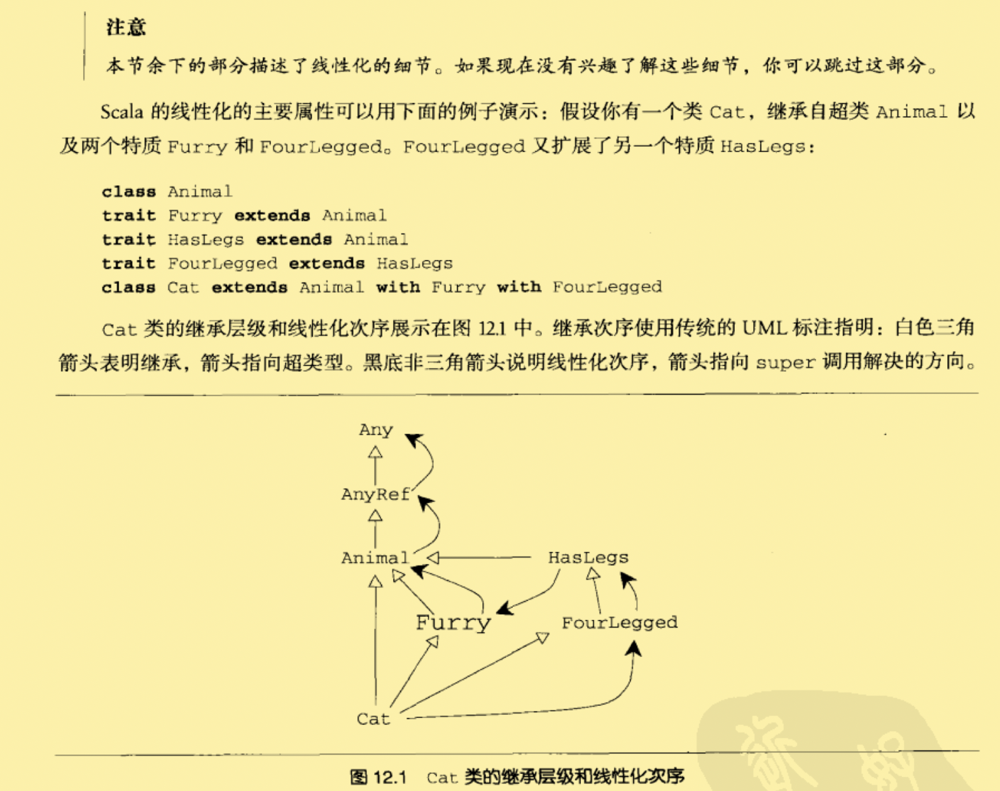

# 特质trait

## 特质基本原理

特质是Scala中代码复用的基础单元。特质封装了方法和字段的定义，并可以通过混入 到类中重用它们。类可以混入任意多个特质。

```scala
trait Philosophicla {//特质的定义
  def philosophize(){
    println("I consume memory, therefore I am!")
  }
}
```

- 特质没有声明超类，但是和类一样，它有一个默认的超类AnyRef。

- 一旦特质被定义了，就可以使用extends或with关键字，把它混入类中。

- ```scala
  class Frog extends Philosophical{//将特质混入Forg中。
    override def toString = "green"
  }
  //使用extends关键字混入特质，这种情况下，隐式的继承了特质的超类！
  
  
  scala> val frog = new Forg
  //frog:Frog = green
  scala> frog.philosophize()
  //I consume memory, therefore I am!
  ```

- 特质也是类型。

  - 可以将<u>子类对象</u>赋值给**特质类型的变量**

  - ```SCALA
    //phil的类型是Philosophical！！！
    
    scala> val phil: Philosophical = frog
    //phil : Philosophical = green
    scala> phil.philosophize()
    //I consume memory, therefore I am!
    ```

- 使用with混入特质

- ```SCALA
  class Animal
  
  class Frog extends Animal with Philosophical {
    ...
  }
  ```

- 混入多个特质(**多个with**)

- ```scala
  class Animal
  trait HasLegs
  class Frog extends Animal with Philosophical with HasLegs {
    ...
  }
  ```

- 总结

1. 特质就像是带有具体方法的Java接口！

2. 你可以用特质的定义做任何用类能做的事。

3. 特质不能有任何”类“ 的参数，即传递给主构造器的参数。

4. 无论在类的哪一个角落，super的调用都是静态绑定的。但是在特质中，super的调用是动态绑定的。「p139」

5. ```SCALA
   trait NoPoint(x:Int,y:Int)//错误的！！！
   ```

## 瘦接口对阵胖接口

特质可以根据类已有方法自动为类添加方法。也就是说，特质可以丰富一个瘦接口，把它变成胖接口。

- Scala中，为特质添加具体方法是一次性劳动！你只要在特质中实现一次方法，而不需要在每个混入特质的方法中重新实现它。
- 少量抽象方法（瘦部分）+潜在的大量具体方法

## Ordered特质

用来便捷的比较两个排序对象。

- 让你可以通过仅仅实现一个方法，compare，使你的类具有了全套的比较方法。
  - 第一步，为比较的类混入Ordered特质，注意，需要设定参数类型。（Ordered[C]）
  - 第二步，定义compare方法来比较两个对象。能够比较方法的接收者this，和当做方法参数的传入的对象。相同返回0，this小于参数返回负数，如果this大于参数返回正数。
- 注意：Ordered没有为你定义equals方法。

## 用来做可堆叠的改变

特质让你改变类的方法，通过堆叠这些改动的方式来做到这一点。

```scala
abstract class IntQueue{
  def get():Int
  def put(x:Int)
}
//一个抽象类


class BasicIntQueue extends IntQueue{
  private val buf = new ArrayBuffer[Int]
  def get() = buf.remove(0)//get方法从左边移除成员
  def put(x:Int) {buf += x}//put方法从右边添加成员
}
//基本的实现（定义了具体的方法）


scala> val queue = new BasicIntQueue
scala> queue.put(10)
scala> queue.put(20)
scala> queue.get()
//res0:Int = 10
scala> queue.get()
//res1:Int = 20
```


```scala
trait Doubling extends IntQueue {
  abstract override def put(x:Int) { super.put(2*x) }
}
//定义Doubling可堆叠改动特质
```

- 特质Doubling定义了超类，意味着该特质只能混入扩展了IntQueue的类中。
- 特质在声明为抽象的方法中有一个super调用。
  - 这对普通类来说是非法的。
  - 对特质来说，super是动态绑定的。super的调用直到被混入另一个特质或类之后，有了具体的方法定义时才工作。
- `abstract override`是为了说明实现可堆叠改动的特质。尽在特质成员定义中被认可。意味着，特质必须被混入某个具有期待方法的具体定义的类中。

```scala
class MyQueue extends BasicIntQueue with Doubling

scala> val queue = new MyQueue
scala> queue.put(10)
scala> queue.get()
//res0: Int = 20
```

- 如果只是简单的指明了一个类并混入了一个特质。我们可以直接new出来！

  - 也就是说，new实例化的时候混入特质。

- ```scala
  val queue = new BasicIntQueue with Doubling
  ```

- 混入特质的次序非常重要！
  - 当你调用带混入类的方法的时候，最右侧特质的方法首先被调用。
  - 如果方法调用了super，它会调用左侧特质的方法，以此类推。

## 为什么不使用多继承？

简单来说，多继承中，同名方法的调用会有问题；但是特质能够解决这个问题。

`线性化`当你new实例化一个类的时候，Scala把这个类和所有它继承的类还有特质以线性的次序放在一起。当你一个类中调用super，被调用的方法就是方法链的下一节。

线性化的主旨：在任何线性化中，某个类总是被线性化在其所有超类和混入特质之前。



## 何时使用特质

- 如果行为不会被重用，做成具体类。
- 如果再多个不相干的类中重用，做成特质。
- 如果希望从Java代码中继承它，使用抽象类。
- 如果希望编译之后发布它，并希望外部组织编写一些继承自它的类，倾向于抽象类。
- 如果效率重要，倾向于使用类。

